# Current status of RISC OS 64 components

## Summary

This document is based on the planned phases of development (described in
[Phases](Phases.md) and the current status (as reported in the
[README](../README.md). The document shows the current status of each
component which is meant to be delivered within a phase. The completion
of a given status implies that all the statuses before have been
completed.

As with the Phases described, this progress only shows information on the
ROM modules.

This document is automatically generated.

<!-- Charts go here -->

## Phase 1: Simple modules and stubs

```mermaid
---
    # Frontmatter config, YAML comments
    displayMode: compact
    config:
        theme: forest
        themeCSS: |
            #automated { fill: #903498; }
            #automated_started { fill: #903498; opacity: 72%; }
            #automated_none { fill: #903498; opacity: 33%;}
            #automated_none-text { fill: none;}
            #built { fill: #90BC1A; }
            #built_started { fill: #90BC1A; opacity: 72%; }
            #built_none { fill: #90BC1A; opacity: 33%;}
            #built_none-text { fill: none;}
            #complete { fill: #21B534; }
            #complete_started { fill: #21B534; opacity: 72%; }
            #complete_none { fill: #21B534; opacity: 33%;}
            #complete_none-text { fill: none;}
            #functional { fill: #0095AC; }
            #functional_started { fill: #0095AC; opacity: 72%; }
            #functional_none { fill: #0095AC; opacity: 33%;}
            #functional_none-text { fill: none;}
            #internals { fill: #1F64AD; }
            #internals_started { fill: #1F64AD; opacity: 72%; }
            #internals_none { fill: #1F64AD; opacity: 33%;}
            #internals_none-text { fill: none;}
            #investigate { fill: #E03524; }
            #investigate_started { fill: #E03524; opacity: 72%; }
            #investigate_none { fill: #E03524; opacity: 33%;}
            #investigate_none-text { fill: none;}
            #prototype { fill: #FFC200; }
            #prototype_started { fill: #FFC200; opacity: 72%; }
            #prototype_none { fill: #FFC200; opacity: 33%;}
            #prototype_none-text { fill: none;}
            #stub { fill: #F07C12; }
            #stub_started { fill: #F07C12; opacity: 72%; }
            #stub_none { fill: #F07C12; opacity: 33%;}
            #stub_none-text { fill: none;}
            #tested { fill: #4040A0; }
            #tested_started { fill: #4040A0; opacity: 72%; }
            #tested_none { fill: #4040A0; opacity: 33%;}
            #tested_none-text { fill: none;}

            .grid text { text-anchor: start !important;}
            g text.sectionTitle:first-child { font-style: italic; }
            #heading { rx: 0px; stroke: #487e3a; stroke-width: 1px; }

            .section0 { fill: #ffffff }
        gantt:
            useWidth: 800
            rightPadding: 0
            leftPadding: 150
            topAxis: true  #false
            numberSectionStyles: 2
---
gantt
    title Phase 1: Simple modules and stubs
    dateFormat YYYY
    axisFormat  
    tickInterval 12month

    section Components / Status
    Investigate         : investigate,      1901, 1y
    Stub                : stub,             1902, 1y
    Prototype           : prototype,        1903, 1y
    Built               : built,            1904, 1y
    Internals           : internals,        1905, 1y
    Functional          : functional,       1906, 1y
    Complete            : complete,         1907, 1y
    Tested              : tested,           1908, 1y
    Automated           : automated,        1909, 1y

    section ARM
    ...    : investigate_none  , 1901, 1y
    ...    : stub_none         , 1902, 1y

    section BootCommands
    ...    : investigate_none  , 1901, 1y
    ...    : stub_none         , 1902, 1y
    ...    : prototype_none    , 1903, 1y
    ...    : built_none        , 1904, 1y
    ...    : internals_none    , 1905, 1y

    section BufferManager
    ✔      : investigate       , 1901, 1y
    ✔      : stub              , 1902, 1y
    ...    : prototype_none    , 1903, 1y
    ...    : built_none        , 1904, 1y
    ...    : internals_none    , 1905, 1y
    ...    : functional_none   , 1906, 1y

    section CLIV
    ...    : investigate_none  , 1901, 1y
    ...    : stub_none         , 1902, 1y
    ...    : prototype_none    , 1903, 1y
    ...    : built_none        , 1904, 1y
    ...    : internals_none    , 1905, 1y
    ...    : functional_none   , 1906, 1y

    section Conversions
    ...    : investigate_none  , 1901, 1y
    ...    : stub_none         , 1902, 1y

    section Debugger
    ✔      : investigate       , 1901, 1y
    ✔      : stub              , 1902, 1y
    ✔      : prototype         , 1903, 1y
    ✔      : built             , 1904, 1y
    ✔      : internals         , 1905, 1y
    ✔      : functional        , 1906, 1y

    section ErrorLog
    ✔      : investigate       , 1901, 1y
    ✔      : stub              , 1902, 1y
    ✔      : prototype         , 1903, 1y
    ✔      : built             , 1904, 1y
    ...    : internals_none    , 1905, 1y
    ...    : functional_none   , 1906, 1y

    section EvaluateExpression
    ...    : investigate_none  , 1901, 1y
    ...    : stub_none         , 1902, 1y

    section FSCommands
    ...    : investigate_none  , 1901, 1y
    ...    : stub_none         , 1902, 1y
    ...    : prototype_none    , 1903, 1y
    ...    : built_none        , 1904, 1y
    ...    : internals_none    , 1905, 1y
    ...    : functional_none   , 1906, 1y

    section FileTypes
    ✔      : investigate       , 1901, 1y
    ✔      : stub              , 1902, 1y
    ✔      : prototype         , 1903, 1y
    ✔      : built             , 1904, 1y
    ✔      : internals         , 1905, 1y
    ✔      : functional        , 1906, 1y

    section Hourglass
    ...    : investigate_none  , 1901, 1y
    ...    : stub_none         , 1902, 1y
    ...    : prototype_none    , 1903, 1y
    ...    : built_none        , 1904, 1y
    ...    : internals_none    , 1905, 1y
    ...    : functional_none   , 1906, 1y

    section IIC
    ...    : investigate_none  , 1901, 1y
    ...    : stub_none         , 1902, 1y

    section LibraryHelp
    ✔      : investigate       , 1901, 1y
    ✔      : stub              , 1902, 1y
    ✔      : prototype         , 1903, 1y
    ✔      : built             , 1904, 1y
    ✔      : internals         , 1905, 1y
    ✔      : functional        , 1906, 1y

    section MessageTrans
    ✔      : investigate       , 1901, 1y
    ✔      : stub              , 1902, 1y
    ✔      : prototype         , 1903, 1y
    ✔      : built             , 1904, 1y
    ✔      : internals         , 1905, 1y
    ✔      : functional        , 1906, 1y

    section ModuleCommands
    ✔      : investigate       , 1901, 1y
    ✔      : stub              , 1902, 1y
    ✔      : prototype         , 1903, 1y
    ✔      : built             , 1904, 1y
    ✔      : internals         , 1905, 1y
    ✔      : functional        , 1906, 1y

    section NVRAMHW
    ...    : investigate_none  , 1901, 1y
    ...    : stub_none         , 1902, 1y
    ...    : prototype_none    , 1903, 1y

    section OSCommands
    ✔      : investigate       , 1901, 1y
    ✔      : stub              , 1902, 1y
    ...    : prototype_none    , 1903, 1y
    ...    : built_none        , 1904, 1y
    ...    : internals_none    , 1905, 1y
    ...    : functional_none   , 1906, 1y

    section OSPointer
    ...    : investigate_none  , 1901, 1y
    ...    : stub_none         , 1902, 1y

    section PathUtils
    ✔      : investigate       , 1901, 1y
    ✔      : stub              , 1902, 1y
    ✔      : prototype         , 1903, 1y
    ✔      : built             , 1904, 1y
    ✔      : internals         , 1905, 1y
    ✔      : functional        , 1906, 1y

    section Portable
    ✔      : investigate       , 1901, 1y
    ✔      : stub              , 1902, 1y
    ✔      : prototype         , 1903, 1y

    section PrinterBuffer
    ✔      : investigate       , 1901, 1y
    ✔      : stub              , 1902, 1y
    ✔      : prototype         , 1903, 1y
    ✔      : built             , 1904, 1y
    ✔      : internals         , 1905, 1y
    ✔      : functional        , 1906, 1y

    section RTC
    ✔      : investigate       , 1901, 1y
    ✔      : stub              , 1902, 1y
    ✔      : prototype         , 1903, 1y
    ✔      : built             , 1904, 1y
    ✔      : internals         , 1905, 1y

    section ReadLine
    ✔      : investigate       , 1901, 1y
    ✔      : stub              , 1902, 1y
    ✔      : prototype         , 1903, 1y
    ✔      : built             , 1904, 1y
    ✔      : internals         , 1905, 1y
    ...    : functional_none   , 1906, 1y

    section RemotePrinterSupport
    ...    : investigate_none  , 1901, 1y
    ...    : stub_none         , 1902, 1y

    section ResourceFS
    ...    : investigate_none  , 1901, 1y
    ...    : stub_none         , 1902, 1y
    ...    : prototype_none    , 1903, 1y
    ...    : built_none        , 1904, 1y
    ...    : internals_none    , 1905, 1y

    section ScreenBlanker
    ...    : investigate_none  , 1901, 1y
    ...    : stub_none         , 1902, 1y

    section SpriteUtils
    ✔      : investigate       , 1901, 1y
    ✔      : stub              , 1902, 1y

    section SystemBell
    ✔      : investigate       , 1901, 1y
    ✔      : stub              , 1902, 1y
    ✔      : prototype         , 1903, 1y
    ✔      : built             , 1904, 1y
    ✔      : internals         , 1905, 1y
    ✔      : functional        , 1906, 1y

    section SystemVars
    ...    : investigate_none  , 1901, 1y
    ...    : stub_none         , 1902, 1y
    ...    : prototype_none    , 1903, 1y
    ...    : built_none        , 1904, 1y
    ...    : internals_none    , 1905, 1y

    section TimerManager
    ...    : investigate_none  , 1901, 1y
    ...    : stub_none         , 1902, 1y
    ...    : prototype_none    , 1903, 1y
    ...    : built_none        , 1904, 1y
    ...    : internals_none    , 1905, 1y

    section UtilityModule
    ...    : investigate_none  , 1901, 1y
    ...    : stub_none         , 1902, 1y
    ...    : prototype_none    , 1903, 1y
    ...    : built_none        , 1904, 1y
    ...    : internals_none    , 1905, 1y
    ...    : functional_none   , 1906, 1y

    section VideoGuard
    ...    : investigate_none  , 1901, 1y
    ...    : stub_none         , 1902, 1y

    section VideoSW
    ...    : investigate_none  , 1901, 1y
    ...    : stub_none         , 1902, 1y

    section VideoTTX
    ...    : investigate_none  , 1901, 1y
    ...    : stub_none         , 1902, 1y
    ...    : prototype_none    , 1903, 1y
    ...    : built_none        , 1904, 1y
    ...    : internals_none    , 1905, 1y
    ...    : functional_none   , 1906, 1y

    section Wimp:Templates
    ...    : investigate_none  , 1901, 1y
    ...    : stub_none         , 1902, 1y
    ...    : prototype_none    , 1903, 1y
    ...    : built_none        , 1904, 1y
    ...    : internals_none    , 1905, 1y
```




## Phase 2: Stub implemented / advancing functionality

```mermaid
---
    # Frontmatter config, YAML comments
    displayMode: compact
    config:
        theme: forest
        themeCSS: |
            #automated { fill: #903498; }
            #automated_started { fill: #903498; opacity: 72%; }
            #automated_none { fill: #903498; opacity: 33%;}
            #automated_none-text { fill: none;}
            #built { fill: #90BC1A; }
            #built_started { fill: #90BC1A; opacity: 72%; }
            #built_none { fill: #90BC1A; opacity: 33%;}
            #built_none-text { fill: none;}
            #complete { fill: #21B534; }
            #complete_started { fill: #21B534; opacity: 72%; }
            #complete_none { fill: #21B534; opacity: 33%;}
            #complete_none-text { fill: none;}
            #functional { fill: #0095AC; }
            #functional_started { fill: #0095AC; opacity: 72%; }
            #functional_none { fill: #0095AC; opacity: 33%;}
            #functional_none-text { fill: none;}
            #internals { fill: #1F64AD; }
            #internals_started { fill: #1F64AD; opacity: 72%; }
            #internals_none { fill: #1F64AD; opacity: 33%;}
            #internals_none-text { fill: none;}
            #investigate { fill: #E03524; }
            #investigate_started { fill: #E03524; opacity: 72%; }
            #investigate_none { fill: #E03524; opacity: 33%;}
            #investigate_none-text { fill: none;}
            #prototype { fill: #FFC200; }
            #prototype_started { fill: #FFC200; opacity: 72%; }
            #prototype_none { fill: #FFC200; opacity: 33%;}
            #prototype_none-text { fill: none;}
            #stub { fill: #F07C12; }
            #stub_started { fill: #F07C12; opacity: 72%; }
            #stub_none { fill: #F07C12; opacity: 33%;}
            #stub_none-text { fill: none;}
            #tested { fill: #4040A0; }
            #tested_started { fill: #4040A0; opacity: 72%; }
            #tested_none { fill: #4040A0; opacity: 33%;}
            #tested_none-text { fill: none;}

            .grid text { text-anchor: start !important;}
            g text.sectionTitle:first-child { font-style: italic; }
            #heading { rx: 0px; stroke: #487e3a; stroke-width: 1px; }

            .section0 { fill: #ffffff }
        gantt:
            useWidth: 800
            rightPadding: 0
            leftPadding: 150
            topAxis: true  #false
            numberSectionStyles: 2
---
gantt
    title Phase 2: Stub implemented / advancing functionality
    dateFormat YYYY
    axisFormat  
    tickInterval 12month

    section Components / Status
    Investigate         : investigate,      1901, 1y
    Stub                : stub,             1902, 1y
    Prototype           : prototype,        1903, 1y
    Built               : built,            1904, 1y
    Internals           : internals,        1905, 1y
    Functional          : functional,       1906, 1y
    Complete            : complete,         1907, 1y
    Tested              : tested,           1908, 1y
    Automated           : automated,        1909, 1y

    section ARM
    ...    : investigate_none  , 1901, 1y
    ...    : stub_none         , 1902, 1y

    section AUNMsgs
    ...    : investigate_none  , 1901, 1y
    ...    : stub_none         , 1902, 1y

    section BASIC
    ...    : investigate_none  , 1901, 1y
    ...    : stub_none         , 1902, 1y
    ...    : prototype_none    , 1903, 1y
    ...    : built_none        , 1904, 1y
    ...    : internals_none    , 1905, 1y
    ...    : functional_none   , 1906, 1y

    section BlockDevices
    ...    : investigate_none  , 1901, 1y
    ...    : stub_none         , 1902, 1y
    ...    : prototype_none    , 1903, 1y
    ...    : built_none        , 1904, 1y
    ...    : internals_none    , 1905, 1y
    ...    : functional_none   , 1906, 1y

    section BootCommands
    ...    : investigate_none  , 1901, 1y
    ...    : stub_none         , 1902, 1y
    ...    : prototype_none    , 1903, 1y
    ...    : built_none        , 1904, 1y
    ...    : internals_none    , 1905, 1y

    section BootNet
    ...    : investigate_none  , 1901, 1y

    section BufferManager
    ✔      : investigate       , 1901, 1y
    ✔      : stub              , 1902, 1y
    ...    : prototype_none    , 1903, 1y
    ...    : built_none        , 1904, 1y
    ...    : internals_none    , 1905, 1y
    ...    : functional_none   , 1906, 1y

    section CDFS
    ...    : investigate_none  , 1901, 1y
    ...    : stub_none         , 1902, 1y
    ...    : prototype_none    , 1903, 1y
    ...    : built_none        , 1904, 1y
    ...    : internals_none    , 1905, 1y

    section CDFSResources
    ...    : investigate_none  , 1901, 1y
    ...    : stub_none         , 1902, 1y

    section CLIV
    ...    : investigate_none  , 1901, 1y
    ...    : stub_none         , 1902, 1y
    ...    : prototype_none    , 1903, 1y
    ...    : built_none        , 1904, 1y
    ...    : internals_none    , 1905, 1y
    ...    : functional_none   , 1906, 1y

    section ColourTrans
    ...    : investigate_none  , 1901, 1y
    ...    : stub_none         , 1902, 1y

    section Conversions
    ...    : investigate_none  , 1901, 1y
    ...    : stub_none         , 1902, 1y
    ...    : prototype_none    , 1903, 1y
    ...    : built_none        , 1904, 1y
    ...    : internals_none    , 1905, 1y
    ...    : functional_none   , 1906, 1y

    section DDEUtils
    ...    : investigate_none  , 1901, 1y
    ...    : stub_none         , 1902, 1y
    ...    : prototype_none    , 1903, 1y
    ...    : built_none        , 1904, 1y
    ...    : internals_none    , 1905, 1y
    ...    : functional_none   , 1906, 1y

    section Debugger
    ✔      : investigate       , 1901, 1y
    ✔      : stub              , 1902, 1y
    ✔      : prototype         , 1903, 1y
    ✔      : built             , 1904, 1y
    ✔      : internals         , 1905, 1y
    ✔      : functional        , 1906, 1y

    section Desktop
    ...    : investigate_none  , 1901, 1y
    ...    : stub_none         , 1902, 1y
    ...    : prototype_none    , 1903, 1y
    ...    : built_none        , 1904, 1y
    ...    : internals_none    , 1905, 1y

    section DisplayManager
    ...    : investigate_none  , 1901, 1y
    ...    : stub_none         , 1902, 1y
    ...    : prototype_none    , 1903, 1y
    ...    : built_none        , 1904, 1y
    ...    : internals_none    , 1905, 1y

    section DragASprite
    ...    : investigate_none  , 1901, 1y
    ...    : stub_none         , 1902, 1y
    ...    : prototype_none    , 1903, 1y
    ...    : built_none        , 1904, 1y
    ...    : internals_none    , 1905, 1y

    section Draw
    ...    : investigate_none  , 1901, 1y
    ...    : stub_none         , 1902, 1y

    section DrawFile
    ...    : investigate_none  , 1901, 1y
    ...    : stub_none         , 1902, 1y

    section Econet
    ...    : investigate_none  , 1901, 1y
    ...    : stub_none         , 1902, 1y

    section ErrorLog
    ✔      : investigate       , 1901, 1y
    ✔      : stub              , 1902, 1y
    ✔      : prototype         , 1903, 1y
    ✔      : built             , 1904, 1y
    ...    : internals_none    , 1905, 1y
    ...    : functional_none   , 1906, 1y

    section EvaluateExpression
    ...    : investigate_none  , 1901, 1y
    ...    : stub_none         , 1902, 1y
    ...    : prototype_none    , 1903, 1y
    ...    : built_none        , 1904, 1y
    ...    : internals_none    , 1905, 1y
    ...    : functional_none   , 1906, 1y

    section FSCommands
    ...    : investigate_none  , 1901, 1y
    ...    : stub_none         , 1902, 1y
    ...    : prototype_none    , 1903, 1y
    ...    : built_none        , 1904, 1y
    ...    : internals_none    , 1905, 1y
    ...    : functional_none   , 1906, 1y

    section FileSwitch
    ...    : investigate_none  , 1901, 1y
    ...    : stub_none         , 1902, 1y

    section FileTypes
    ✔      : investigate       , 1901, 1y
    ✔      : stub              , 1902, 1y
    ✔      : prototype         , 1903, 1y
    ✔      : built             , 1904, 1y
    ✔      : internals         , 1905, 1y
    ✔      : functional        , 1906, 1y

    section FontManager
    ...    : investigate_none  , 1901, 1y
    ...    : stub_none         , 1902, 1y

    section Free
    ...    : investigate_none  , 1901, 1y
    ...    : stub_none         , 1902, 1y

    section Freeway
    ...    : investigate_none  , 1901, 1y
    ...    : stub_none         , 1902, 1y
    ...    : prototype_none    , 1903, 1y
    ...    : built_none        , 1904, 1y
    ...    : internals_none    , 1905, 1y
    ...    : functional_none   , 1906, 1y

    section FreewayHosts
    ...    : investigate_none  , 1901, 1y
    ...    : stub_none         , 1902, 1y
    ...    : prototype_none    , 1903, 1y
    ...    : built_none        , 1904, 1y
    ...    : internals_none    , 1905, 1y
    ...    : functional_none   , 1906, 1y

    section GameModes
    ...    : investigate_none  , 1901, 1y
    ...    : stub_none         , 1902, 1y
    ...    : prototype_none    , 1903, 1y
    ...    : built_none        , 1904, 1y
    ...    : internals_none    , 1905, 1y
    ...    : functional_none   , 1906, 1y

    section Hourglass
    ...    : investigate_none  , 1901, 1y
    ...    : stub_none         , 1902, 1y
    ...    : prototype_none    , 1903, 1y
    ...    : built_none        , 1904, 1y
    ...    : internals_none    , 1905, 1y
    ...    : functional_none   , 1906, 1y

    section IIC
    ...    : investigate_none  , 1901, 1y
    ...    : stub_none         , 1902, 1y

    section International
    ...    : investigate_none  , 1901, 1y
    ...    : stub_none         , 1902, 1y

    section Joystick
    ...    : investigate_none  , 1901, 1y
    ...    : stub_none         , 1902, 1y
    ...    : prototype_none    , 1903, 1y

    section Kernel:Introspection
    ...    : investigate_none  , 1901, 1y
    ...    : stub_none         , 1902, 1y

    section Kernel:Mode
    ...    : investigate_none  , 1901, 1y
    ...    : stub_none         , 1902, 1y

    section Kernel:Modules
    ...    : investigate_none  , 1901, 1y
    ...    : stub_none         , 1902, 1y
    ...    : prototype_none    , 1903, 1y
    ...    : built_none        , 1904, 1y
    ...    : internals_none    , 1905, 1y

    section Kernel:SWIs
    ...    : investigate_none  , 1901, 1y
    ...    : stub_none         , 1902, 1y
    ...    : prototype_none    , 1903, 1y
    ...    : built_none        , 1904, 1y
    ...    : internals_none    , 1905, 1y

    section Kernel:Sprites
    ...    : investigate_none  , 1901, 1y
    ...    : stub_none         , 1902, 1y

    section Kernel:Vectors
    ...    : investigate_none  , 1901, 1y
    ...    : stub_none         , 1902, 1y
    ...    : prototype_none    , 1903, 1y
    ...    : built_none        , 1904, 1y
    ...    : internals_none    , 1905, 1y

    section LibraryHelp
    ✔      : investigate       , 1901, 1y
    ✔      : stub              , 1902, 1y
    ✔      : prototype         , 1903, 1y
    ✔      : built             , 1904, 1y
    ✔      : internals         , 1905, 1y
    ✔      : functional        , 1906, 1y

    section MessageTrans
    ✔      : investigate       , 1901, 1y
    ✔      : stub              , 1902, 1y
    ✔      : prototype         , 1903, 1y
    ✔      : built             , 1904, 1y
    ✔      : internals         , 1905, 1y
    ✔      : functional        , 1906, 1y

    section Messages
    ...    : investigate_none  , 1901, 1y
    ...    : stub_none         , 1902, 1y

    section MimeMap
    ...    : investigate_none  , 1901, 1y
    ...    : stub_none         , 1902, 1y
    ...    : prototype_none    , 1903, 1y
    ...    : built_none        , 1904, 1y
    ...    : internals_none    , 1905, 1y
    ...    : functional_none   , 1906, 1y

    section ModuleCommands
    ✔      : investigate       , 1901, 1y
    ✔      : stub              , 1902, 1y
    ✔      : prototype         , 1903, 1y
    ✔      : built             , 1904, 1y
    ✔      : internals         , 1905, 1y
    ✔      : functional        , 1906, 1y

    section NVRAMHW
    ...    : investigate_none  , 1901, 1y
    ...    : stub_none         , 1902, 1y
    ...    : prototype_none    , 1903, 1y

    section NetI
    ...    : investigate_none  , 1901, 1y

    section NetStatus
    ...    : investigate_none  , 1901, 1y
    ...    : stub_none         , 1902, 1y
    ...    : prototype_none    , 1903, 1y
    ...    : built_none        , 1904, 1y
    ...    : internals_none    , 1905, 1y
    ...    : functional_none   , 1906, 1y

    section OSCommands
    ✔      : investigate       , 1901, 1y
    ✔      : stub              , 1902, 1y
    ...    : prototype_none    , 1903, 1y
    ...    : built_none        , 1904, 1y
    ...    : internals_none    , 1905, 1y
    ...    : functional_none   , 1906, 1y

    section OSPointer
    ...    : investigate_none  , 1901, 1y
    ...    : stub_none         , 1902, 1y

    section OSSWIs
    ...    : investigate_none  , 1901, 1y
    ...    : stub_none         , 1902, 1y

    section Obey
    ...    : investigate_none  , 1901, 1y
    ...    : stub_none         , 1902, 1y
    ...    : prototype_none    , 1903, 1y
    ...    : built_none        , 1904, 1y
    ...    : internals_none    , 1905, 1y
    ...    : functional_none   , 1906, 1y

    section OwnerBanner
    ✔      : investigate       , 1901, 1y
    ✔      : stub              , 1902, 1y
    ✔      : prototype         , 1903, 1y
    ✔      : built             , 1904, 1y
    ✔      : internals         , 1905, 1y
    ✔      : functional        , 1906, 1y

    section PathUtils
    ✔      : investigate       , 1901, 1y
    ✔      : stub              , 1902, 1y
    ✔      : prototype         , 1903, 1y
    ✔      : built             , 1904, 1y
    ✔      : internals         , 1905, 1y
    ✔      : functional        , 1906, 1y

    section Percussion
    ...    : investigate_none  , 1901, 1y

    section Portable
    ✔      : investigate       , 1901, 1y
    ✔      : stub              , 1902, 1y
    ✔      : prototype         , 1903, 1y

    section PrinterBuffer
    ✔      : investigate       , 1901, 1y
    ✔      : stub              , 1902, 1y
    ✔      : prototype         , 1903, 1y
    ✔      : built             , 1904, 1y
    ✔      : internals         , 1905, 1y
    ✔      : functional        , 1906, 1y

    section ROMFonts
    ...    : investigate_none  , 1901, 1y
    ...    : stub_none         , 1902, 1y

    section RTC
    ✔      : investigate       , 1901, 1y
    ✔      : stub              , 1902, 1y
    ✔      : prototype         , 1903, 1y
    ✔      : built             , 1904, 1y
    ✔      : internals         , 1905, 1y

    section ReadLine
    ✔      : investigate       , 1901, 1y
    ✔      : stub              , 1902, 1y
    ✔      : prototype         , 1903, 1y
    ✔      : built             , 1904, 1y
    ✔      : internals         , 1905, 1y
    ...    : functional_none   , 1906, 1y

    section RemotePrinterMessages
    ...    : investigate_none  , 1901, 1y
    ...    : stub_none         , 1902, 1y

    section RemotePrinterSupport
    ...    : investigate_none  , 1901, 1y
    ...    : stub_none         , 1902, 1y

    section ResourceFS
    ...    : investigate_none  , 1901, 1y
    ...    : stub_none         , 1902, 1y
    ...    : prototype_none    , 1903, 1y
    ...    : built_none        , 1904, 1y
    ...    : internals_none    , 1905, 1y

    section ScreenBlanker
    ...    : investigate_none  , 1901, 1y
    ...    : stub_none         , 1902, 1y

    section ScreenModes
    ...    : investigate_none  , 1901, 1y

    section SharedSound
    ...    : investigate_none  , 1901, 1y
    ...    : stub_none         , 1902, 1y

    section SoundChannels
    ...    : investigate_none  , 1901, 1y
    ...    : stub_none         , 1902, 1y
    ...    : prototype_none    , 1903, 1y
    ...    : built_none        , 1904, 1y
    ...    : internals_none    , 1905, 1y

    section SoundDMA
    ...    : investigate_none  , 1901, 1y
    ...    : stub_none         , 1902, 1y

    section SoundScheduler
    ...    : investigate_none  , 1901, 1y
    ...    : stub_none         , 1902, 1y

    section SpriteExtend:JPEG
    ...    : investigate_none  , 1901, 1y
    ...    : stub_none         , 1902, 1y

    section SpriteExtend:Scaling
    ...    : investigate_none  , 1901, 1y
    ...    : stub_none         , 1902, 1y

    section SpriteExtend:Transforms
    ...    : investigate_none  , 1901, 1y
    ...    : stub_none         , 1902, 1y

    section SpriteUtils
    ✔      : investigate       , 1901, 1y
    ✔      : stub              , 1902, 1y

    section StringLib
    ...    : investigate_none  , 1901, 1y

    section SystemBell
    ✔      : investigate       , 1901, 1y
    ✔      : stub              , 1902, 1y
    ✔      : prototype         , 1903, 1y
    ✔      : built             , 1904, 1y
    ✔      : internals         , 1905, 1y
    ✔      : functional        , 1906, 1y

    section SystemDevices
    ...    : investigate_none  , 1901, 1y
    ...    : stub_none         , 1902, 1y
    ...    : prototype_none    , 1903, 1y
    ...    : built_none        , 1904, 1y
    ...    : internals_none    , 1905, 1y

    section SystemVars
    ...    : investigate_none  , 1901, 1y
    ...    : stub_none         , 1902, 1y
    ...    : prototype_none    , 1903, 1y
    ...    : built_none        , 1904, 1y
    ...    : internals_none    , 1905, 1y
    ...    : functional_none   , 1906, 1y

    section TaskManager
    ...    : investigate_none  , 1901, 1y
    ...    : stub_none         , 1902, 1y
    ...    : prototype_none    , 1903, 1y
    ...    : built_none        , 1904, 1y
    ...    : internals_none    , 1905, 1y

    section TerritoryManager
    ...    : investigate_none  , 1901, 1y
    ...    : stub_none         , 1902, 1y

    section TimerManager
    ...    : investigate_none  , 1901, 1y
    ...    : stub_none         , 1902, 1y
    ...    : prototype_none    , 1903, 1y
    ...    : built_none        , 1904, 1y
    ...    : internals_none    , 1905, 1y

    section UK
    ...    : investigate_none  , 1901, 1y
    ...    : stub_none         , 1902, 1y
    ...    : prototype_none    , 1903, 1y

    section UtilityModule
    ...    : investigate_none  , 1901, 1y
    ...    : stub_none         , 1902, 1y
    ...    : prototype_none    , 1903, 1y
    ...    : built_none        , 1904, 1y
    ...    : internals_none    , 1905, 1y
    ...    : functional_none   , 1906, 1y

    section VideoGuard
    ...    : investigate_none  , 1901, 1y
    ...    : stub_none         , 1902, 1y

    section VideoSW
    ...    : investigate_none  , 1901, 1y
    ...    : stub_none         , 1902, 1y
    ...    : prototype_none    , 1903, 1y
    ...    : built_none        , 1904, 1y
    ...    : internals_none    , 1905, 1y
    ...    : functional_none   , 1906, 1y

    section VideoTTX
    ...    : investigate_none  , 1901, 1y
    ...    : stub_none         , 1902, 1y
    ...    : prototype_none    , 1903, 1y
    ...    : built_none        , 1904, 1y
    ...    : internals_none    , 1905, 1y
    ...    : functional_none   , 1906, 1y

    section WaveSynth
    ...    : investigate_none  , 1901, 1y

    section Wimp:Introspection
    ...    : investigate_none  , 1901, 1y
    ...    : stub_none         , 1902, 1y

    section Wimp:SWIs
    ...    : investigate_none  , 1901, 1y
    ...    : stub_none         , 1902, 1y

    section Wimp:Templates
    ...    : investigate_none  , 1901, 1y
    ...    : stub_none         , 1902, 1y
    ...    : prototype_none    , 1903, 1y
    ...    : built_none        , 1904, 1y
    ...    : internals_none    , 1905, 1y

    section Wimp:TextRender
    ...    : investigate_none  , 1901, 1y
    ...    : stub_none         , 1902, 1y
```


## Phase 3: Stack wiring / advancing functionality

```mermaid
---
    # Frontmatter config, YAML comments
    displayMode: compact
    config:
        theme: forest
        themeCSS: |
            #automated { fill: #903498; }
            #automated_started { fill: #903498; opacity: 72%; }
            #automated_none { fill: #903498; opacity: 33%;}
            #automated_none-text { fill: none;}
            #built { fill: #90BC1A; }
            #built_started { fill: #90BC1A; opacity: 72%; }
            #built_none { fill: #90BC1A; opacity: 33%;}
            #built_none-text { fill: none;}
            #complete { fill: #21B534; }
            #complete_started { fill: #21B534; opacity: 72%; }
            #complete_none { fill: #21B534; opacity: 33%;}
            #complete_none-text { fill: none;}
            #functional { fill: #0095AC; }
            #functional_started { fill: #0095AC; opacity: 72%; }
            #functional_none { fill: #0095AC; opacity: 33%;}
            #functional_none-text { fill: none;}
            #internals { fill: #1F64AD; }
            #internals_started { fill: #1F64AD; opacity: 72%; }
            #internals_none { fill: #1F64AD; opacity: 33%;}
            #internals_none-text { fill: none;}
            #investigate { fill: #E03524; }
            #investigate_started { fill: #E03524; opacity: 72%; }
            #investigate_none { fill: #E03524; opacity: 33%;}
            #investigate_none-text { fill: none;}
            #prototype { fill: #FFC200; }
            #prototype_started { fill: #FFC200; opacity: 72%; }
            #prototype_none { fill: #FFC200; opacity: 33%;}
            #prototype_none-text { fill: none;}
            #stub { fill: #F07C12; }
            #stub_started { fill: #F07C12; opacity: 72%; }
            #stub_none { fill: #F07C12; opacity: 33%;}
            #stub_none-text { fill: none;}
            #tested { fill: #4040A0; }
            #tested_started { fill: #4040A0; opacity: 72%; }
            #tested_none { fill: #4040A0; opacity: 33%;}
            #tested_none-text { fill: none;}

            .grid text { text-anchor: start !important;}
            g text.sectionTitle:first-child { font-style: italic; }
            #heading { rx: 0px; stroke: #487e3a; stroke-width: 1px; }

            .section0 { fill: #ffffff }
        gantt:
            useWidth: 800
            rightPadding: 0
            leftPadding: 150
            topAxis: true  #false
            numberSectionStyles: 2
---
gantt
    title Phase 3: Stack wiring / advancing functionality
    dateFormat YYYY
    axisFormat  
    tickInterval 12month

    section Components / Status
    Investigate         : investigate,      1901, 1y
    Stub                : stub,             1902, 1y
    Prototype           : prototype,        1903, 1y
    Built               : built,            1904, 1y
    Internals           : internals,        1905, 1y
    Functional          : functional,       1906, 1y
    Complete            : complete,         1907, 1y
    Tested              : tested,           1908, 1y
    Automated           : automated,        1909, 1y

    section AIF
    ...    : investigate_none  , 1901, 1y
    ...    : stub_none         , 1902, 1y
    ...    : prototype_none    , 1903, 1y
    ...    : built_none        , 1904, 1y
    ...    : internals_none    , 1905, 1y
    ...    : functional_none   , 1906, 1y

    section ARM
    ...    : investigate_none  , 1901, 1y
    ...    : stub_none         , 1902, 1y

    section AUNMsgs
    ...    : investigate_none  , 1901, 1y
    ...    : stub_none         , 1902, 1y
    ...    : prototype_none    , 1903, 1y
    ...    : built_none        , 1904, 1y
    ...    : internals_none    , 1905, 1y
    ...    : functional_none   , 1906, 1y

    section BASIC
    ...    : investigate_none  , 1901, 1y
    ...    : stub_none         , 1902, 1y
    ...    : prototype_none    , 1903, 1y
    ...    : built_none        , 1904, 1y
    ...    : internals_none    , 1905, 1y
    ...    : functional_none   , 1906, 1y

    section BlockDevices
    ...    : investigate_none  , 1901, 1y
    ...    : stub_none         , 1902, 1y
    ...    : prototype_none    , 1903, 1y
    ...    : built_none        , 1904, 1y
    ...    : internals_none    , 1905, 1y
    ...    : functional_none   , 1906, 1y

    section BootCommands
    ...    : investigate_none  , 1901, 1y
    ...    : stub_none         , 1902, 1y
    ...    : prototype_none    , 1903, 1y
    ...    : built_none        , 1904, 1y
    ...    : internals_none    , 1905, 1y
    ...    : functional_none   , 1906, 1y

    section BootNet
    ...    : investigate_none  , 1901, 1y

    section BufferManager
    ✔      : investigate       , 1901, 1y
    ✔      : stub              , 1902, 1y
    ...    : prototype_none    , 1903, 1y
    ...    : built_none        , 1904, 1y
    ...    : internals_none    , 1905, 1y
    ...    : functional_none   , 1906, 1y

    section CDFS
    ...    : investigate_none  , 1901, 1y
    ...    : stub_none         , 1902, 1y
    ...    : prototype_none    , 1903, 1y
    ...    : built_none        , 1904, 1y
    ...    : internals_none    , 1905, 1y
    ...    : functional_none   , 1906, 1y

    section CDFSResources
    ...    : investigate_none  , 1901, 1y
    ...    : stub_none         , 1902, 1y

    section CDFSdriver
    ...    : investigate_none  , 1901, 1y
    ...    : stub_none         , 1902, 1y

    section CLIV
    ...    : investigate_none  , 1901, 1y
    ...    : stub_none         , 1902, 1y
    ...    : prototype_none    , 1903, 1y
    ...    : built_none        , 1904, 1y
    ...    : internals_none    , 1905, 1y
    ...    : functional_none   , 1906, 1y

    section ColourTrans
    ...    : investigate_none  , 1901, 1y
    ...    : stub_none         , 1902, 1y
    ...    : prototype_none    , 1903, 1y
    ...    : built_none        , 1904, 1y
    ...    : internals_none    , 1905, 1y

    section Conversions
    ...    : investigate_none  , 1901, 1y
    ...    : stub_none         , 1902, 1y
    ...    : prototype_none    , 1903, 1y
    ...    : built_none        , 1904, 1y
    ...    : internals_none    , 1905, 1y
    ...    : functional_none   , 1906, 1y

    section DDEUtils
    ...    : investigate_none  , 1901, 1y
    ...    : stub_none         , 1902, 1y
    ...    : prototype_none    , 1903, 1y
    ...    : built_none        , 1904, 1y
    ...    : internals_none    , 1905, 1y
    ...    : functional_none   , 1906, 1y

    section DOSFS
    ...    : investigate_none  , 1901, 1y
    ...    : stub_none         , 1902, 1y
    ...    : prototype_none    , 1903, 1y
    ...    : built_none        , 1904, 1y
    ...    : internals_none    , 1905, 1y
    ...    : functional_none   , 1906, 1y

    section Debugger
    ✔      : investigate       , 1901, 1y
    ✔      : stub              , 1902, 1y
    ✔      : prototype         , 1903, 1y
    ✔      : built             , 1904, 1y
    ✔      : internals         , 1905, 1y
    ✔      : functional        , 1906, 1y

    section Desktop
    ...    : investigate_none  , 1901, 1y
    ...    : stub_none         , 1902, 1y
    ...    : prototype_none    , 1903, 1y
    ...    : built_none        , 1904, 1y
    ...    : internals_none    , 1905, 1y

    section DeviceFS
    ...    : investigate_none  , 1901, 1y
    ...    : stub_none         , 1902, 1y
    ...    : prototype_none    , 1903, 1y
    ...    : built_none        , 1904, 1y
    ...    : internals_none    , 1905, 1y

    section DisplayManager
    ...    : investigate_none  , 1901, 1y
    ...    : stub_none         , 1902, 1y
    ...    : prototype_none    , 1903, 1y
    ...    : built_none        , 1904, 1y
    ...    : internals_none    , 1905, 1y

    section DragASprite
    ...    : investigate_none  , 1901, 1y
    ...    : stub_none         , 1902, 1y
    ...    : prototype_none    , 1903, 1y
    ...    : built_none        , 1904, 1y
    ...    : internals_none    , 1905, 1y

    section Draw
    ...    : investigate_none  , 1901, 1y
    ...    : stub_none         , 1902, 1y
    ...    : prototype_none    , 1903, 1y
    ...    : built_none        , 1904, 1y
    ...    : internals_none    , 1905, 1y
    ...    : functional_none   , 1906, 1y

    section DrawFile
    ...    : investigate_none  , 1901, 1y
    ...    : stub_none         , 1902, 1y
    ...    : prototype_none    , 1903, 1y
    ...    : built_none        , 1904, 1y
    ...    : internals_none    , 1905, 1y
    ...    : functional_none   , 1906, 1y

    section Econet
    ...    : investigate_none  , 1901, 1y
    ...    : stub_none         , 1902, 1y

    section ErrorLog
    ✔      : investigate       , 1901, 1y
    ✔      : stub              , 1902, 1y
    ✔      : prototype         , 1903, 1y
    ✔      : built             , 1904, 1y
    ...    : internals_none    , 1905, 1y
    ...    : functional_none   , 1906, 1y

    section EvaluateExpression
    ...    : investigate_none  , 1901, 1y
    ...    : stub_none         , 1902, 1y
    ...    : prototype_none    , 1903, 1y
    ...    : built_none        , 1904, 1y
    ...    : internals_none    , 1905, 1y
    ...    : functional_none   , 1906, 1y

    section FSCommands
    ...    : investigate_none  , 1901, 1y
    ...    : stub_none         , 1902, 1y
    ...    : prototype_none    , 1903, 1y
    ...    : built_none        , 1904, 1y
    ...    : internals_none    , 1905, 1y
    ...    : functional_none   , 1906, 1y

    section FSLock
    ...    : investigate_none  , 1901, 1y
    ...    : stub_none         , 1902, 1y
    ...    : prototype_none    , 1903, 1y
    ...    : built_none        , 1904, 1y
    ...    : internals_none    , 1905, 1y
    ...    : functional_none   , 1906, 1y

    section FileCore
    ...    : investigate_none  , 1901, 1y

    section FileSwitch
    ...    : investigate_none  , 1901, 1y
    ...    : stub_none         , 1902, 1y

    section FileTypes
    ✔      : investigate       , 1901, 1y
    ✔      : stub              , 1902, 1y
    ✔      : prototype         , 1903, 1y
    ✔      : built             , 1904, 1y
    ✔      : internals         , 1905, 1y
    ✔      : functional        , 1906, 1y

    section Filer
    ...    : investigate_none  , 1901, 1y
    ...    : stub_none         , 1902, 1y
    ...    : prototype_none    , 1903, 1y
    ...    : built_none        , 1904, 1y
    ...    : internals_none    , 1905, 1y

    section FilerSWIs
    ...    : investigate_none  , 1901, 1y
    ...    : stub_none         , 1902, 1y
    ...    : prototype_none    , 1903, 1y
    ...    : built_none        , 1904, 1y
    ...    : internals_none    , 1905, 1y
    ...    : functional_none   , 1906, 1y

    section FontManager
    ...    : investigate_none  , 1901, 1y
    ...    : stub_none         , 1902, 1y
    ...    : prototype_none    , 1903, 1y
    ...    : built_none        , 1904, 1y
    ...    : internals_none    , 1905, 1y
    ...    : functional_none   , 1906, 1y

    section Free
    ...    : investigate_none  , 1901, 1y
    ...    : stub_none         , 1902, 1y
    ...    : prototype_none    , 1903, 1y
    ...    : built_none        , 1904, 1y
    ...    : internals_none    , 1905, 1y

    section Freeway
    ...    : investigate_none  , 1901, 1y
    ...    : stub_none         , 1902, 1y
    ...    : prototype_none    , 1903, 1y
    ...    : built_none        , 1904, 1y
    ...    : internals_none    , 1905, 1y
    ...    : functional_none   , 1906, 1y

    section FreewayHosts
    ...    : investigate_none  , 1901, 1y
    ...    : stub_none         , 1902, 1y
    ...    : prototype_none    , 1903, 1y
    ...    : built_none        , 1904, 1y
    ...    : internals_none    , 1905, 1y
    ...    : functional_none   , 1906, 1y

    section GameModes
    ...    : investigate_none  , 1901, 1y
    ...    : stub_none         , 1902, 1y
    ...    : prototype_none    , 1903, 1y
    ...    : built_none        , 1904, 1y
    ...    : internals_none    , 1905, 1y
    ...    : functional_none   , 1906, 1y

    section Hourglass
    ...    : investigate_none  , 1901, 1y
    ...    : stub_none         , 1902, 1y
    ...    : prototype_none    , 1903, 1y
    ...    : built_none        , 1904, 1y
    ...    : internals_none    , 1905, 1y
    ...    : functional_none   , 1906, 1y

    section IIC
    ...    : investigate_none  , 1901, 1y
    ...    : stub_none         , 1902, 1y

    section International
    ...    : investigate_none  , 1901, 1y
    ...    : stub_none         , 1902, 1y
    ...    : prototype_none    , 1903, 1y
    ...    : built_none        , 1904, 1y
    ...    : internals_none    , 1905, 1y

    section InternationalKeyboard
    ...    : investigate_none  , 1901, 1y
    ...    : stub_none         , 1902, 1y

    section Joystick
    ...    : investigate_none  , 1901, 1y
    ...    : stub_none         , 1902, 1y
    ...    : prototype_none    , 1903, 1y

    section Kernel:DAs
    ...    : investigate_none  , 1901, 1y
    ...    : stub_none         , 1902, 1y
    ...    : prototype_none    , 1903, 1y
    ...    : built_none        , 1904, 1y
    ...    : internals_none    , 1905, 1y

    section Kernel:Heap
    ...    : investigate_none  , 1901, 1y
    ...    : stub_none         , 1902, 1y
    ...    : prototype_none    , 1903, 1y
    ...    : built_none        , 1904, 1y
    ...    : internals_none    , 1905, 1y
    ...    : functional_none   , 1906, 1y

    section Kernel:Introspection
    ...    : investigate_none  , 1901, 1y
    ...    : stub_none         , 1902, 1y

    section Kernel:Mode
    ...    : investigate_none  , 1901, 1y
    ...    : stub_none         , 1902, 1y

    section Kernel:Modules
    ...    : investigate_none  , 1901, 1y
    ...    : stub_none         , 1902, 1y
    ...    : prototype_none    , 1903, 1y
    ...    : built_none        , 1904, 1y
    ...    : internals_none    , 1905, 1y
    ...    : functional_none   , 1906, 1y

    section Kernel:OSByte
    ...    : investigate_none  , 1901, 1y
    ...    : stub_none         , 1902, 1y
    ...    : prototype_none    , 1903, 1y
    ...    : built_none        , 1904, 1y
    ...    : internals_none    , 1905, 1y
    ...    : functional_none   , 1906, 1y

    section Kernel:OSWord
    ...    : investigate_none  , 1901, 1y
    ...    : stub_none         , 1902, 1y
    ...    : prototype_none    , 1903, 1y
    ...    : built_none        , 1904, 1y
    ...    : internals_none    , 1905, 1y
    ...    : functional_none   , 1906, 1y

    section Kernel:SWIs
    ...    : investigate_none  , 1901, 1y
    ...    : stub_none         , 1902, 1y
    ...    : prototype_none    , 1903, 1y
    ...    : built_none        , 1904, 1y
    ...    : internals_none    , 1905, 1y

    section Kernel:Sprites
    ...    : investigate_none  , 1901, 1y
    ...    : stub_none         , 1902, 1y

    section Kernel:VDU
    ...    : investigate_none  , 1901, 1y
    ...    : stub_none         , 1902, 1y

    section Kernel:Vectors
    ...    : investigate_none  , 1901, 1y
    ...    : stub_none         , 1902, 1y
    ...    : prototype_none    , 1903, 1y
    ...    : built_none        , 1904, 1y
    ...    : internals_none    , 1905, 1y
    ...    : functional_none   , 1906, 1y

    section KeyInput
    ✔      : investigate       , 1901, 1y
    ✔      : stub              , 1902, 1y
    ✔      : prototype         , 1903, 1y
    ✔      : built             , 1904, 1y
    ...    : internals_none    , 1905, 1y
    ...    : functional_none   , 1906, 1y

    section LibraryHelp
    ✔      : investigate       , 1901, 1y
    ✔      : stub              , 1902, 1y
    ✔      : prototype         , 1903, 1y
    ✔      : built             , 1904, 1y
    ✔      : internals         , 1905, 1y
    ✔      : functional        , 1906, 1y

    section MessageTrans
    ✔      : investigate       , 1901, 1y
    ✔      : stub              , 1902, 1y
    ✔      : prototype         , 1903, 1y
    ✔      : built             , 1904, 1y
    ✔      : internals         , 1905, 1y
    ✔      : functional        , 1906, 1y

    section Messages
    ...    : investigate_none  , 1901, 1y
    ...    : stub_none         , 1902, 1y
    ...    : prototype_none    , 1903, 1y
    ...    : built_none        , 1904, 1y
    ...    : internals_none    , 1905, 1y
    ...    : functional_none   , 1906, 1y

    section MimeMap
    ...    : investigate_none  , 1901, 1y
    ...    : stub_none         , 1902, 1y
    ...    : prototype_none    , 1903, 1y
    ...    : built_none        , 1904, 1y
    ...    : internals_none    , 1905, 1y
    ...    : functional_none   , 1906, 1y

    section ModuleCommands
    ✔      : investigate       , 1901, 1y
    ✔      : stub              , 1902, 1y
    ✔      : prototype         , 1903, 1y
    ✔      : built             , 1904, 1y
    ✔      : internals         , 1905, 1y
    ✔      : functional        , 1906, 1y

    section NVRAMHW
    ...    : investigate_none  , 1901, 1y
    ...    : stub_none         , 1902, 1y
    ...    : prototype_none    , 1903, 1y

    section NetFS
    ...    : investigate_none  , 1901, 1y
    ...    : stub_none         , 1902, 1y
    ...    : prototype_none    , 1903, 1y
    ...    : built_none        , 1904, 1y
    ...    : internals_none    , 1905, 1y

    section NetI
    ...    : investigate_none  , 1901, 1y

    section NetStatus
    ...    : investigate_none  , 1901, 1y
    ...    : stub_none         , 1902, 1y
    ...    : prototype_none    , 1903, 1y
    ...    : built_none        , 1904, 1y
    ...    : internals_none    , 1905, 1y
    ...    : functional_none   , 1906, 1y

    section OSCommands
    ✔      : investigate       , 1901, 1y
    ✔      : stub              , 1902, 1y
    ...    : prototype_none    , 1903, 1y
    ...    : built_none        , 1904, 1y
    ...    : internals_none    , 1905, 1y
    ...    : functional_none   , 1906, 1y

    section OSPointer
    ...    : investigate_none  , 1901, 1y
    ...    : stub_none         , 1902, 1y

    section OSSWIs
    ...    : investigate_none  , 1901, 1y
    ...    : stub_none         , 1902, 1y
    ...    : prototype_none    , 1903, 1y
    ...    : built_none        , 1904, 1y
    ...    : internals_none    , 1905, 1y
    ...    : functional_none   , 1906, 1y

    section Obey
    ...    : investigate_none  , 1901, 1y
    ...    : stub_none         , 1902, 1y
    ...    : prototype_none    , 1903, 1y
    ...    : built_none        , 1904, 1y
    ...    : internals_none    , 1905, 1y
    ...    : functional_none   , 1906, 1y

    section OwnerBanner
    ✔      : investigate       , 1901, 1y
    ✔      : stub              , 1902, 1y
    ✔      : prototype         , 1903, 1y
    ✔      : built             , 1904, 1y
    ✔      : internals         , 1905, 1y
    ✔      : functional        , 1906, 1y

    section PathUtils
    ✔      : investigate       , 1901, 1y
    ✔      : stub              , 1902, 1y
    ✔      : prototype         , 1903, 1y
    ✔      : built             , 1904, 1y
    ✔      : internals         , 1905, 1y
    ✔      : functional        , 1906, 1y

    section Percussion
    ...    : investigate_none  , 1901, 1y

    section PipeFS
    ...    : investigate_none  , 1901, 1y
    ...    : stub_none         , 1902, 1y
    ...    : prototype_none    , 1903, 1y
    ...    : built_none        , 1904, 1y
    ...    : internals_none    , 1905, 1y

    section Portable
    ✔      : investigate       , 1901, 1y
    ✔      : stub              , 1902, 1y
    ✔      : prototype         , 1903, 1y

    section PrinterBuffer
    ✔      : investigate       , 1901, 1y
    ✔      : stub              , 1902, 1y
    ✔      : prototype         , 1903, 1y
    ✔      : built             , 1904, 1y
    ✔      : internals         , 1905, 1y
    ✔      : functional        , 1906, 1y

    section ROMFonts
    ...    : investigate_none  , 1901, 1y
    ...    : stub_none         , 1902, 1y

    section RTC
    ✔      : investigate       , 1901, 1y
    ✔      : stub              , 1902, 1y
    ✔      : prototype         , 1903, 1y
    ✔      : built             , 1904, 1y
    ✔      : internals         , 1905, 1y
    ...    : functional_none   , 1906, 1y

    section RamFS
    ...    : investigate_none  , 1901, 1y
    ...    : stub_none         , 1902, 1y
    ...    : prototype_none    , 1903, 1y
    ...    : built_none        , 1904, 1y
    ...    : internals_none    , 1905, 1y
    ...    : functional_none   , 1906, 1y

    section ReadLine
    ✔      : investigate       , 1901, 1y
    ✔      : stub              , 1902, 1y
    ✔      : prototype         , 1903, 1y
    ✔      : built             , 1904, 1y
    ✔      : internals         , 1905, 1y
    ...    : functional_none   , 1906, 1y

    section RemotePrinterMessages
    ...    : investigate_none  , 1901, 1y
    ...    : stub_none         , 1902, 1y

    section RemotePrinterSupport
    ...    : investigate_none  , 1901, 1y
    ...    : stub_none         , 1902, 1y

    section ResourceFS
    ...    : investigate_none  , 1901, 1y
    ...    : stub_none         , 1902, 1y
    ...    : prototype_none    , 1903, 1y
    ...    : built_none        , 1904, 1y
    ...    : internals_none    , 1905, 1y
    ...    : functional_none   , 1906, 1y

    section ScreenBlanker
    ...    : investigate_none  , 1901, 1y
    ...    : stub_none         , 1902, 1y
    ...    : prototype_none    , 1903, 1y
    ...    : built_none        , 1904, 1y
    ...    : internals_none    , 1905, 1y
    ...    : functional_none   , 1906, 1y

    section ScreenModes
    ...    : investigate_none  , 1901, 1y

    section SharedSound
    ...    : investigate_none  , 1901, 1y
    ...    : stub_none         , 1902, 1y

    section SoundChannels
    ...    : investigate_none  , 1901, 1y
    ...    : stub_none         , 1902, 1y
    ...    : prototype_none    , 1903, 1y
    ...    : built_none        , 1904, 1y
    ...    : internals_none    , 1905, 1y
    ...    : functional_none   , 1906, 1y

    section SoundDMA
    ...    : investigate_none  , 1901, 1y
    ...    : stub_none         , 1902, 1y
    ...    : prototype_none    , 1903, 1y
    ...    : built_none        , 1904, 1y
    ...    : internals_none    , 1905, 1y

    section SoundScheduler
    ...    : investigate_none  , 1901, 1y
    ...    : stub_none         , 1902, 1y
    ...    : prototype_none    , 1903, 1y
    ...    : built_none        , 1904, 1y
    ...    : internals_none    , 1905, 1y
    ...    : functional_none   , 1906, 1y

    section SpriteExtend:JPEG
    ...    : investigate_none  , 1901, 1y
    ...    : stub_none         , 1902, 1y

    section SpriteExtend:Scaling
    ...    : investigate_none  , 1901, 1y
    ...    : stub_none         , 1902, 1y
    ...    : prototype_none    , 1903, 1y
    ...    : built_none        , 1904, 1y
    ...    : internals_none    , 1905, 1y
    ...    : functional_none   , 1906, 1y

    section SpriteExtend:Transforms
    ...    : investigate_none  , 1901, 1y
    ...    : stub_none         , 1902, 1y

    section SpriteUtils
    ✔      : investigate       , 1901, 1y
    ✔      : stub              , 1902, 1y

    section Squash
    ...    : investigate_none  , 1901, 1y
    ...    : stub_none         , 1902, 1y
    ...    : prototype_none    , 1903, 1y
    ...    : built_none        , 1904, 1y
    ...    : internals_none    , 1905, 1y
    ...    : functional_none   , 1906, 1y

    section StringLib
    ...    : investigate_none  , 1901, 1y

    section SystemBell
    ✔      : investigate       , 1901, 1y
    ✔      : stub              , 1902, 1y
    ✔      : prototype         , 1903, 1y
    ✔      : built             , 1904, 1y
    ✔      : internals         , 1905, 1y
    ✔      : functional        , 1906, 1y

    section SystemDevices
    ...    : investigate_none  , 1901, 1y
    ...    : stub_none         , 1902, 1y
    ...    : prototype_none    , 1903, 1y
    ...    : built_none        , 1904, 1y
    ...    : internals_none    , 1905, 1y
    ...    : functional_none   , 1906, 1y

    section SystemVars
    ...    : investigate_none  , 1901, 1y
    ...    : stub_none         , 1902, 1y
    ...    : prototype_none    , 1903, 1y
    ...    : built_none        , 1904, 1y
    ...    : internals_none    , 1905, 1y
    ...    : functional_none   , 1906, 1y

    section TaskManager
    ...    : investigate_none  , 1901, 1y
    ...    : stub_none         , 1902, 1y
    ...    : prototype_none    , 1903, 1y
    ...    : built_none        , 1904, 1y
    ...    : internals_none    , 1905, 1y

    section TerritoryManager
    ...    : investigate_none  , 1901, 1y
    ...    : stub_none         , 1902, 1y

    section TimerManager
    ...    : investigate_none  , 1901, 1y
    ...    : stub_none         , 1902, 1y
    ...    : prototype_none    , 1903, 1y
    ...    : built_none        , 1904, 1y
    ...    : internals_none    , 1905, 1y
    ...    : functional_none   , 1906, 1y

    section TransientUtility
    ...    : investigate_none  , 1901, 1y
    ...    : stub_none         , 1902, 1y
    ...    : prototype_none    , 1903, 1y
    ...    : built_none        , 1904, 1y
    ...    : internals_none    , 1905, 1y
    ...    : functional_none   , 1906, 1y

    section UK
    ...    : investigate_none  , 1901, 1y
    ...    : stub_none         , 1902, 1y
    ...    : prototype_none    , 1903, 1y

    section UtilityModule
    ...    : investigate_none  , 1901, 1y
    ...    : stub_none         , 1902, 1y
    ...    : prototype_none    , 1903, 1y
    ...    : built_none        , 1904, 1y
    ...    : internals_none    , 1905, 1y
    ...    : functional_none   , 1906, 1y

    section VideoGuard
    ...    : investigate_none  , 1901, 1y
    ...    : stub_none         , 1902, 1y

    section VideoSW
    ...    : investigate_none  , 1901, 1y
    ...    : stub_none         , 1902, 1y
    ...    : prototype_none    , 1903, 1y
    ...    : built_none        , 1904, 1y
    ...    : internals_none    , 1905, 1y
    ...    : functional_none   , 1906, 1y

    section VideoTTX
    ...    : investigate_none  , 1901, 1y
    ...    : stub_none         , 1902, 1y
    ...    : prototype_none    , 1903, 1y
    ...    : built_none        , 1904, 1y
    ...    : internals_none    , 1905, 1y
    ...    : functional_none   , 1906, 1y

    section WaveSynth
    ...    : investigate_none  , 1901, 1y

    section Wimp:Fonts
    ...    : investigate_none  , 1901, 1y
    ...    : stub_none         , 1902, 1y
    ...    : prototype_none    , 1903, 1y
    ...    : built_none        , 1904, 1y
    ...    : internals_none    , 1905, 1y

    section Wimp:IconRender
    ...    : investigate_none  , 1901, 1y
    ...    : stub_none         , 1902, 1y
    ...    : prototype_none    , 1903, 1y
    ...    : built_none        , 1904, 1y
    ...    : internals_none    , 1905, 1y

    section Wimp:Introspection
    ...    : investigate_none  , 1901, 1y
    ...    : stub_none         , 1902, 1y

    section Wimp:Memory
    ...    : investigate_none  , 1901, 1y
    ...    : stub_none         , 1902, 1y
    ...    : prototype_none    , 1903, 1y
    ...    : built_none        , 1904, 1y
    ...    : internals_none    , 1905, 1y

    section Wimp:SWIs
    ...    : investigate_none  , 1901, 1y
    ...    : stub_none         , 1902, 1y

    section Wimp:SpritePools
    ...    : investigate_none  , 1901, 1y
    ...    : stub_none         , 1902, 1y
    ...    : prototype_none    , 1903, 1y
    ...    : built_none        , 1904, 1y
    ...    : internals_none    , 1905, 1y

    section Wimp:SpriteRender
    ...    : investigate_none  , 1901, 1y
    ...    : stub_none         , 1902, 1y
    ...    : prototype_none    , 1903, 1y
    ...    : built_none        , 1904, 1y
    ...    : internals_none    , 1905, 1y

    section Wimp:TaskManagement
    ...    : investigate_none  , 1901, 1y
    ...    : stub_none         , 1902, 1y
    ...    : prototype_none    , 1903, 1y
    ...    : built_none        , 1904, 1y
    ...    : internals_none    , 1905, 1y

    section Wimp:Templates
    ...    : investigate_none  , 1901, 1y
    ...    : stub_none         , 1902, 1y
    ...    : prototype_none    , 1903, 1y
    ...    : built_none        , 1904, 1y
    ...    : internals_none    , 1905, 1y

    section Wimp:TextRender
    ...    : investigate_none  , 1901, 1y
    ...    : stub_none         , 1902, 1y
    ...    : prototype_none    , 1903, 1y
    ...    : built_none        , 1904, 1y
    ...    : internals_none    , 1905, 1y
    ...    : functional_none   , 1906, 1y

    section Wimp:Tiling
    ...    : investigate_none  , 1901, 1y
    ...    : stub_none         , 1902, 1y
    ...    : prototype_none    , 1903, 1y
    ...    : built_none        , 1904, 1y
    ...    : internals_none    , 1905, 1y

    section Wimp:WindowRender
    ...    : investigate_none  , 1901, 1y
    ...    : stub_none         , 1902, 1y
    ...    : prototype_none    , 1903, 1y
    ...    : built_none        , 1904, 1y
    ...    : internals_none    , 1905, 1y
```


## Phase 4: Desktop / Networking / advancing functionality

```mermaid
---
    # Frontmatter config, YAML comments
    displayMode: compact
    config:
        theme: forest
        themeCSS: |
            #automated { fill: #903498; }
            #automated_started { fill: #903498; opacity: 72%; }
            #automated_none { fill: #903498; opacity: 33%;}
            #automated_none-text { fill: none;}
            #built { fill: #90BC1A; }
            #built_started { fill: #90BC1A; opacity: 72%; }
            #built_none { fill: #90BC1A; opacity: 33%;}
            #built_none-text { fill: none;}
            #complete { fill: #21B534; }
            #complete_started { fill: #21B534; opacity: 72%; }
            #complete_none { fill: #21B534; opacity: 33%;}
            #complete_none-text { fill: none;}
            #functional { fill: #0095AC; }
            #functional_started { fill: #0095AC; opacity: 72%; }
            #functional_none { fill: #0095AC; opacity: 33%;}
            #functional_none-text { fill: none;}
            #internals { fill: #1F64AD; }
            #internals_started { fill: #1F64AD; opacity: 72%; }
            #internals_none { fill: #1F64AD; opacity: 33%;}
            #internals_none-text { fill: none;}
            #investigate { fill: #E03524; }
            #investigate_started { fill: #E03524; opacity: 72%; }
            #investigate_none { fill: #E03524; opacity: 33%;}
            #investigate_none-text { fill: none;}
            #prototype { fill: #FFC200; }
            #prototype_started { fill: #FFC200; opacity: 72%; }
            #prototype_none { fill: #FFC200; opacity: 33%;}
            #prototype_none-text { fill: none;}
            #stub { fill: #F07C12; }
            #stub_started { fill: #F07C12; opacity: 72%; }
            #stub_none { fill: #F07C12; opacity: 33%;}
            #stub_none-text { fill: none;}
            #tested { fill: #4040A0; }
            #tested_started { fill: #4040A0; opacity: 72%; }
            #tested_none { fill: #4040A0; opacity: 33%;}
            #tested_none-text { fill: none;}

            .grid text { text-anchor: start !important;}
            g text.sectionTitle:first-child { font-style: italic; }
            #heading { rx: 0px; stroke: #487e3a; stroke-width: 1px; }

            .section0 { fill: #ffffff }
        gantt:
            useWidth: 800
            rightPadding: 0
            leftPadding: 150
            topAxis: true  #false
            numberSectionStyles: 2
---
gantt
    title Phase 4: Desktop / Networking / advancing functionality
    dateFormat YYYY
    axisFormat  
    tickInterval 12month

    section Components / Status
    Investigate         : investigate,      1901, 1y
    Stub                : stub,             1902, 1y
    Prototype           : prototype,        1903, 1y
    Built               : built,            1904, 1y
    Internals           : internals,        1905, 1y
    Functional          : functional,       1906, 1y
    Complete            : complete,         1907, 1y
    Tested              : tested,           1908, 1y
    Automated           : automated,        1909, 1y

    section AIF
    ...    : investigate_none  , 1901, 1y
    ...    : stub_none         , 1902, 1y
    ...    : prototype_none    , 1903, 1y
    ...    : built_none        , 1904, 1y
    ...    : internals_none    , 1905, 1y
    ...    : functional_none   , 1906, 1y

    section ARM
    ...    : investigate_none  , 1901, 1y
    ...    : stub_none         , 1902, 1y

    section AUNMsgs
    ...    : investigate_none  , 1901, 1y
    ...    : stub_none         , 1902, 1y
    ...    : prototype_none    , 1903, 1y
    ...    : built_none        , 1904, 1y
    ...    : internals_none    , 1905, 1y
    ...    : functional_none   , 1906, 1y

    section BASIC
    ...    : investigate_none  , 1901, 1y
    ...    : stub_none         , 1902, 1y
    ...    : prototype_none    , 1903, 1y
    ...    : built_none        , 1904, 1y
    ...    : internals_none    , 1905, 1y
    ...    : functional_none   , 1906, 1y

    section BlockDevices
    ...    : investigate_none  , 1901, 1y
    ...    : stub_none         , 1902, 1y
    ...    : prototype_none    , 1903, 1y
    ...    : built_none        , 1904, 1y
    ...    : internals_none    , 1905, 1y
    ...    : functional_none   , 1906, 1y

    section BootCommands
    ...    : investigate_none  , 1901, 1y
    ...    : stub_none         , 1902, 1y
    ...    : prototype_none    , 1903, 1y
    ...    : built_none        , 1904, 1y
    ...    : internals_none    , 1905, 1y
    ...    : functional_none   , 1906, 1y

    section BootNet
    ...    : investigate_none  , 1901, 1y

    section BufferManager
    ✔      : investigate       , 1901, 1y
    ✔      : stub              , 1902, 1y
    ...    : prototype_none    , 1903, 1y
    ...    : built_none        , 1904, 1y
    ...    : internals_none    , 1905, 1y
    ...    : functional_none   , 1906, 1y

    section CDFS
    ...    : investigate_none  , 1901, 1y
    ...    : stub_none         , 1902, 1y
    ...    : prototype_none    , 1903, 1y
    ...    : built_none        , 1904, 1y
    ...    : internals_none    , 1905, 1y
    ...    : functional_none   , 1906, 1y

    section CDFSResources
    ...    : investigate_none  , 1901, 1y
    ...    : stub_none         , 1902, 1y

    section CDFSdriver
    ...    : investigate_none  , 1901, 1y
    ...    : stub_none         , 1902, 1y

    section CLIV
    ...    : investigate_none  , 1901, 1y
    ...    : stub_none         , 1902, 1y
    ...    : prototype_none    , 1903, 1y
    ...    : built_none        , 1904, 1y
    ...    : internals_none    , 1905, 1y
    ...    : functional_none   , 1906, 1y

    section ColourTrans
    ...    : investigate_none  , 1901, 1y
    ...    : stub_none         , 1902, 1y
    ...    : prototype_none    , 1903, 1y
    ...    : built_none        , 1904, 1y
    ...    : internals_none    , 1905, 1y
    ...    : functional_none   , 1906, 1y

    section Conversions
    ...    : investigate_none  , 1901, 1y
    ...    : stub_none         , 1902, 1y
    ...    : prototype_none    , 1903, 1y
    ...    : built_none        , 1904, 1y
    ...    : internals_none    , 1905, 1y
    ...    : functional_none   , 1906, 1y

    section DDEUtils
    ...    : investigate_none  , 1901, 1y
    ...    : stub_none         , 1902, 1y
    ...    : prototype_none    , 1903, 1y
    ...    : built_none        , 1904, 1y
    ...    : internals_none    , 1905, 1y
    ...    : functional_none   , 1906, 1y

    section DOSFS
    ...    : investigate_none  , 1901, 1y
    ...    : stub_none         , 1902, 1y
    ...    : prototype_none    , 1903, 1y
    ...    : built_none        , 1904, 1y
    ...    : internals_none    , 1905, 1y
    ...    : functional_none   , 1906, 1y

    section Debugger
    ✔      : investigate       , 1901, 1y
    ✔      : stub              , 1902, 1y
    ✔      : prototype         , 1903, 1y
    ✔      : built             , 1904, 1y
    ✔      : internals         , 1905, 1y
    ✔      : functional        , 1906, 1y

    section Desktop
    ...    : investigate_none  , 1901, 1y
    ...    : stub_none         , 1902, 1y
    ...    : prototype_none    , 1903, 1y
    ...    : built_none        , 1904, 1y
    ...    : internals_none    , 1905, 1y
    ...    : functional_none   , 1906, 1y

    section DeviceFS
    ...    : investigate_none  , 1901, 1y
    ...    : stub_none         , 1902, 1y
    ...    : prototype_none    , 1903, 1y
    ...    : built_none        , 1904, 1y
    ...    : internals_none    , 1905, 1y

    section DisplayManager
    ...    : investigate_none  , 1901, 1y
    ...    : stub_none         , 1902, 1y
    ...    : prototype_none    , 1903, 1y
    ...    : built_none        , 1904, 1y
    ...    : internals_none    , 1905, 1y

    section DragASprite
    ...    : investigate_none  , 1901, 1y
    ...    : stub_none         , 1902, 1y
    ...    : prototype_none    , 1903, 1y
    ...    : built_none        , 1904, 1y
    ...    : internals_none    , 1905, 1y

    section DragAnObject
    ...    : investigate_none  , 1901, 1y
    ...    : stub_none         , 1902, 1y

    section Draw
    ...    : investigate_none  , 1901, 1y
    ...    : stub_none         , 1902, 1y
    ...    : prototype_none    , 1903, 1y
    ...    : built_none        , 1904, 1y
    ...    : internals_none    , 1905, 1y
    ...    : functional_none   , 1906, 1y

    section DrawFile
    ...    : investigate_none  , 1901, 1y
    ...    : stub_none         , 1902, 1y
    ...    : prototype_none    , 1903, 1y
    ...    : built_none        , 1904, 1y
    ...    : internals_none    , 1905, 1y
    ...    : functional_none   , 1906, 1y

    section Econet
    ...    : investigate_none  , 1901, 1y
    ...    : stub_none         , 1902, 1y
    ...    : prototype_none    , 1903, 1y

    section ErrorLog
    ✔      : investigate       , 1901, 1y
    ✔      : stub              , 1902, 1y
    ✔      : prototype         , 1903, 1y
    ✔      : built             , 1904, 1y
    ...    : internals_none    , 1905, 1y
    ...    : functional_none   , 1906, 1y

    section EvaluateExpression
    ...    : investigate_none  , 1901, 1y
    ...    : stub_none         , 1902, 1y
    ...    : prototype_none    , 1903, 1y
    ...    : built_none        , 1904, 1y
    ...    : internals_none    , 1905, 1y
    ...    : functional_none   , 1906, 1y

    section FSCommands
    ...    : investigate_none  , 1901, 1y
    ...    : stub_none         , 1902, 1y
    ...    : prototype_none    , 1903, 1y
    ...    : built_none        , 1904, 1y
    ...    : internals_none    , 1905, 1y
    ...    : functional_none   , 1906, 1y

    section FSLock
    ...    : investigate_none  , 1901, 1y
    ...    : stub_none         , 1902, 1y
    ...    : prototype_none    , 1903, 1y
    ...    : built_none        , 1904, 1y
    ...    : internals_none    , 1905, 1y
    ...    : functional_none   , 1906, 1y

    section FileCore
    ...    : investigate_none  , 1901, 1y

    section FileSwitch
    ...    : investigate_none  , 1901, 1y
    ...    : stub_none         , 1902, 1y

    section FileTypes
    ✔      : investigate       , 1901, 1y
    ✔      : stub              , 1902, 1y
    ✔      : prototype         , 1903, 1y
    ✔      : built             , 1904, 1y
    ✔      : internals         , 1905, 1y
    ✔      : functional        , 1906, 1y

    section Filer
    ...    : investigate_none  , 1901, 1y
    ...    : stub_none         , 1902, 1y
    ...    : prototype_none    , 1903, 1y
    ...    : built_none        , 1904, 1y
    ...    : internals_none    , 1905, 1y

    section FilerSWIs
    ...    : investigate_none  , 1901, 1y
    ...    : stub_none         , 1902, 1y
    ...    : prototype_none    , 1903, 1y
    ...    : built_none        , 1904, 1y
    ...    : internals_none    , 1905, 1y
    ...    : functional_none   , 1906, 1y

    section FilterManager
    ...    : investigate_none  , 1901, 1y
    ...    : stub_none         , 1902, 1y
    ...    : prototype_none    , 1903, 1y
    ...    : built_none        , 1904, 1y
    ...    : internals_none    , 1905, 1y
    ...    : functional_none   , 1906, 1y

    section FontManager
    ...    : investigate_none  , 1901, 1y
    ...    : stub_none         , 1902, 1y
    ...    : prototype_none    , 1903, 1y
    ...    : built_none        , 1904, 1y
    ...    : internals_none    , 1905, 1y
    ...    : functional_none   , 1906, 1y

    section Free
    ...    : investigate_none  , 1901, 1y
    ...    : stub_none         , 1902, 1y
    ...    : prototype_none    , 1903, 1y
    ...    : built_none        , 1904, 1y
    ...    : internals_none    , 1905, 1y

    section Freeway
    ...    : investigate_none  , 1901, 1y
    ...    : stub_none         , 1902, 1y
    ...    : prototype_none    , 1903, 1y
    ...    : built_none        , 1904, 1y
    ...    : internals_none    , 1905, 1y
    ...    : functional_none   , 1906, 1y

    section FreewayHosts
    ...    : investigate_none  , 1901, 1y
    ...    : stub_none         , 1902, 1y
    ...    : prototype_none    , 1903, 1y
    ...    : built_none        , 1904, 1y
    ...    : internals_none    , 1905, 1y
    ...    : functional_none   , 1906, 1y

    section GameModes
    ...    : investigate_none  , 1901, 1y
    ...    : stub_none         , 1902, 1y
    ...    : prototype_none    , 1903, 1y
    ...    : built_none        , 1904, 1y
    ...    : internals_none    , 1905, 1y
    ...    : functional_none   , 1906, 1y

    section Hourglass
    ...    : investigate_none  , 1901, 1y
    ...    : stub_none         , 1902, 1y
    ...    : prototype_none    , 1903, 1y
    ...    : built_none        , 1904, 1y
    ...    : internals_none    , 1905, 1y
    ...    : functional_none   , 1906, 1y

    section IIC
    ...    : investigate_none  , 1901, 1y
    ...    : stub_none         , 1902, 1y

    section InetServices
    ...    : investigate_none  , 1901, 1y
    ...    : stub_none         , 1902, 1y
    ...    : prototype_none    , 1903, 1y
    ...    : built_none        , 1904, 1y
    ...    : internals_none    , 1905, 1y
    ...    : functional_none   , 1906, 1y

    section International
    ...    : investigate_none  , 1901, 1y
    ...    : stub_none         , 1902, 1y
    ...    : prototype_none    , 1903, 1y
    ...    : built_none        , 1904, 1y
    ...    : internals_none    , 1905, 1y
    ...    : functional_none   , 1906, 1y

    section InternationalKeyboard
    ...    : investigate_none  , 1901, 1y
    ...    : stub_none         , 1902, 1y
    ...    : prototype_none    , 1903, 1y
    ...    : built_none        , 1904, 1y
    ...    : internals_none    , 1905, 1y
    ...    : functional_none   , 1906, 1y

    section Internet
    ...    : investigate_none  , 1901, 1y
    ...    : stub_none         , 1902, 1y
    ...    : prototype_none    , 1903, 1y
    ...    : built_none        , 1904, 1y
    ...    : internals_none    , 1905, 1y
    ...    : functional_none   , 1906, 1y

    section Joystick
    ...    : investigate_none  , 1901, 1y
    ...    : stub_none         , 1902, 1y
    ...    : prototype_none    , 1903, 1y

    section Kernel:DAs
    ...    : investigate_none  , 1901, 1y
    ...    : stub_none         , 1902, 1y
    ...    : prototype_none    , 1903, 1y
    ...    : built_none        , 1904, 1y
    ...    : internals_none    , 1905, 1y
    ...    : functional_none   , 1906, 1y

    section Kernel:Exceptions
    ...    : investigate_none  , 1901, 1y
    ...    : stub_none         , 1902, 1y
    ...    : prototype_none    , 1903, 1y
    ...    : built_none        , 1904, 1y
    ...    : internals_none    , 1905, 1y
    ...    : functional_none   , 1906, 1y

    section Kernel:Graphics
    ...    : investigate_none  , 1901, 1y
    ...    : stub_none         , 1902, 1y
    ...    : prototype_none    , 1903, 1y
    ...    : built_none        , 1904, 1y
    ...    : internals_none    , 1905, 1y
    ...    : functional_none   , 1906, 1y

    section Kernel:Heap
    ...    : investigate_none  , 1901, 1y
    ...    : stub_none         , 1902, 1y
    ...    : prototype_none    , 1903, 1y
    ...    : built_none        , 1904, 1y
    ...    : internals_none    , 1905, 1y
    ...    : functional_none   , 1906, 1y

    section Kernel:Input
    ...    : investigate_none  , 1901, 1y
    ...    : stub_none         , 1902, 1y
    ...    : prototype_none    , 1903, 1y
    ...    : built_none        , 1904, 1y
    ...    : internals_none    , 1905, 1y
    ...    : functional_none   , 1906, 1y

    section Kernel:Introspection
    ...    : investigate_none  , 1901, 1y
    ...    : stub_none         , 1902, 1y

    section Kernel:MemManagement
    ...    : investigate_none  , 1901, 1y
    ...    : stub_none         , 1902, 1y
    ...    : prototype_none    , 1903, 1y
    ...    : built_none        , 1904, 1y
    ...    : internals_none    , 1905, 1y
    ...    : functional_none   , 1906, 1y

    section Kernel:Mode
    ...    : investigate_none  , 1901, 1y
    ...    : stub_none         , 1902, 1y
    ...    : prototype_none    , 1903, 1y
    ...    : built_none        , 1904, 1y
    ...    : internals_none    , 1905, 1y
    ...    : functional_none   , 1906, 1y

    section Kernel:Modules
    ...    : investigate_none  , 1901, 1y
    ...    : stub_none         , 1902, 1y
    ...    : prototype_none    , 1903, 1y
    ...    : built_none        , 1904, 1y
    ...    : internals_none    , 1905, 1y
    ...    : functional_none   , 1906, 1y

    section Kernel:OSByte
    ...    : investigate_none  , 1901, 1y
    ...    : stub_none         , 1902, 1y
    ...    : prototype_none    , 1903, 1y
    ...    : built_none        , 1904, 1y
    ...    : internals_none    , 1905, 1y
    ...    : functional_none   , 1906, 1y

    section Kernel:OSWord
    ...    : investigate_none  , 1901, 1y
    ...    : stub_none         , 1902, 1y
    ...    : prototype_none    , 1903, 1y
    ...    : built_none        , 1904, 1y
    ...    : internals_none    , 1905, 1y
    ...    : functional_none   , 1906, 1y

    section Kernel:ProgEnv
    ...    : investigate_none  , 1901, 1y
    ...    : stub_none         , 1902, 1y
    ...    : prototype_none    , 1903, 1y
    ...    : built_none        , 1904, 1y
    ...    : internals_none    , 1905, 1y
    ...    : functional_none   , 1906, 1y

    section Kernel:SWIs
    ...    : investigate_none  , 1901, 1y
    ...    : stub_none         , 1902, 1y
    ...    : prototype_none    , 1903, 1y
    ...    : built_none        , 1904, 1y
    ...    : internals_none    , 1905, 1y

    section Kernel:Sprites
    ...    : investigate_none  , 1901, 1y
    ...    : stub_none         , 1902, 1y
    ...    : prototype_none    , 1903, 1y
    ...    : built_none        , 1904, 1y
    ...    : internals_none    , 1905, 1y
    ...    : functional_none   , 1906, 1y

    section Kernel:SystemInit
    ...    : investigate_none  , 1901, 1y
    ...    : stub_none         , 1902, 1y
    ...    : prototype_none    , 1903, 1y
    ...    : built_none        , 1904, 1y
    ...    : internals_none    , 1905, 1y
    ...    : functional_none   , 1906, 1y

    section Kernel:Time
    ...    : investigate_none  , 1901, 1y
    ...    : stub_none         , 1902, 1y
    ...    : prototype_none    , 1903, 1y
    ...    : built_none        , 1904, 1y
    ...    : internals_none    , 1905, 1y
    ...    : functional_none   , 1906, 1y

    section Kernel:VDU
    ...    : investigate_none  , 1901, 1y
    ...    : stub_none         , 1902, 1y
    ...    : prototype_none    , 1903, 1y
    ...    : built_none        , 1904, 1y
    ...    : internals_none    , 1905, 1y
    ...    : functional_none   , 1906, 1y

    section Kernel:Vectors
    ...    : investigate_none  , 1901, 1y
    ...    : stub_none         , 1902, 1y
    ...    : prototype_none    , 1903, 1y
    ...    : built_none        , 1904, 1y
    ...    : internals_none    , 1905, 1y
    ...    : functional_none   , 1906, 1y

    section KeyInput
    ✔      : investigate       , 1901, 1y
    ✔      : stub              , 1902, 1y
    ✔      : prototype         , 1903, 1y
    ✔      : built             , 1904, 1y
    ...    : internals_none    , 1905, 1y
    ...    : functional_none   , 1906, 1y

    section LanManFS
    ...    : investigate_none  , 1901, 1y
    ...    : stub_none         , 1902, 1y
    ...    : prototype_none    , 1903, 1y
    ...    : built_none        , 1904, 1y
    ...    : internals_none    , 1905, 1y
    ...    : functional_none   , 1906, 1y

    section LibraryHelp
    ✔      : investigate       , 1901, 1y
    ✔      : stub              , 1902, 1y
    ✔      : prototype         , 1903, 1y
    ✔      : built             , 1904, 1y
    ✔      : internals         , 1905, 1y
    ✔      : functional        , 1906, 1y

    section MbufManager
    ...    : investigate_none  , 1901, 1y

    section MessageTrans
    ✔      : investigate       , 1901, 1y
    ✔      : stub              , 1902, 1y
    ✔      : prototype         , 1903, 1y
    ✔      : built             , 1904, 1y
    ✔      : internals         , 1905, 1y
    ✔      : functional        , 1906, 1y

    section Messages
    ...    : investigate_none  , 1901, 1y
    ...    : stub_none         , 1902, 1y
    ...    : prototype_none    , 1903, 1y
    ...    : built_none        , 1904, 1y
    ...    : internals_none    , 1905, 1y
    ...    : functional_none   , 1906, 1y

    section MimeMap
    ...    : investigate_none  , 1901, 1y
    ...    : stub_none         , 1902, 1y
    ...    : prototype_none    , 1903, 1y
    ...    : built_none        , 1904, 1y
    ...    : internals_none    , 1905, 1y
    ...    : functional_none   , 1906, 1y

    section ModuleCommands
    ✔      : investigate       , 1901, 1y
    ✔      : stub              , 1902, 1y
    ✔      : prototype         , 1903, 1y
    ✔      : built             , 1904, 1y
    ✔      : internals         , 1905, 1y
    ✔      : functional        , 1906, 1y

    section NVRAMHW
    ...    : investigate_none  , 1901, 1y
    ...    : stub_none         , 1902, 1y
    ...    : prototype_none    , 1903, 1y

    section NetFS
    ...    : investigate_none  , 1901, 1y
    ...    : stub_none         , 1902, 1y
    ...    : prototype_none    , 1903, 1y
    ...    : built_none        , 1904, 1y
    ...    : internals_none    , 1905, 1y
    ...    : functional_none   , 1906, 1y

    section NetI
    ...    : investigate_none  , 1901, 1y

    section NetStatus
    ...    : investigate_none  , 1901, 1y
    ...    : stub_none         , 1902, 1y
    ...    : prototype_none    , 1903, 1y
    ...    : built_none        , 1904, 1y
    ...    : internals_none    , 1905, 1y
    ...    : functional_none   , 1906, 1y

    section OSCommands
    ✔      : investigate       , 1901, 1y
    ✔      : stub              , 1902, 1y
    ...    : prototype_none    , 1903, 1y
    ...    : built_none        , 1904, 1y
    ...    : internals_none    , 1905, 1y
    ...    : functional_none   , 1906, 1y

    section OSPointer
    ...    : investigate_none  , 1901, 1y
    ...    : stub_none         , 1902, 1y

    section OSSWIs
    ...    : investigate_none  , 1901, 1y
    ...    : stub_none         , 1902, 1y
    ...    : prototype_none    , 1903, 1y
    ...    : built_none        , 1904, 1y
    ...    : internals_none    , 1905, 1y
    ...    : functional_none   , 1906, 1y

    section Obey
    ...    : investigate_none  , 1901, 1y
    ...    : stub_none         , 1902, 1y
    ...    : prototype_none    , 1903, 1y
    ...    : built_none        , 1904, 1y
    ...    : internals_none    , 1905, 1y
    ...    : functional_none   , 1906, 1y

    section OmniDisc
    ...    : investigate_none  , 1901, 1y
    ...    : stub_none         , 1902, 1y
    ...    : prototype_none    , 1903, 1y
    ...    : built_none        , 1904, 1y
    ...    : internals_none    , 1905, 1y
    ...    : functional_none   , 1906, 1y

    section OwnerBanner
    ✔      : investigate       , 1901, 1y
    ✔      : stub              , 1902, 1y
    ✔      : prototype         , 1903, 1y
    ✔      : built             , 1904, 1y
    ✔      : internals         , 1905, 1y
    ✔      : functional        , 1906, 1y

    section PathUtils
    ✔      : investigate       , 1901, 1y
    ✔      : stub              , 1902, 1y
    ✔      : prototype         , 1903, 1y
    ✔      : built             , 1904, 1y
    ✔      : internals         , 1905, 1y
    ✔      : functional        , 1906, 1y

    section Percussion
    ...    : investigate_none  , 1901, 1y

    section Pinboard
    ...    : investigate_none  , 1901, 1y

    section PipeFS
    ...    : investigate_none  , 1901, 1y
    ...    : stub_none         , 1902, 1y
    ...    : prototype_none    , 1903, 1y
    ...    : built_none        , 1904, 1y
    ...    : internals_none    , 1905, 1y
    ...    : functional_none   , 1906, 1y

    section Portable
    ✔      : investigate       , 1901, 1y
    ✔      : stub              , 1902, 1y
    ✔      : prototype         , 1903, 1y

    section PrinterBuffer
    ✔      : investigate       , 1901, 1y
    ✔      : stub              , 1902, 1y
    ✔      : prototype         , 1903, 1y
    ✔      : built             , 1904, 1y
    ✔      : internals         , 1905, 1y
    ✔      : functional        , 1906, 1y

    section ROMFonts
    ...    : investigate_none  , 1901, 1y
    ...    : stub_none         , 1902, 1y
    ...    : prototype_none    , 1903, 1y
    ...    : built_none        , 1904, 1y
    ...    : internals_none    , 1905, 1y
    ...    : functional_none   , 1906, 1y

    section RTC
    ✔      : investigate       , 1901, 1y
    ✔      : stub              , 1902, 1y
    ✔      : prototype         , 1903, 1y
    ✔      : built             , 1904, 1y
    ✔      : internals         , 1905, 1y
    ...    : functional_none   , 1906, 1y

    section RamFS
    ...    : investigate_none  , 1901, 1y
    ...    : stub_none         , 1902, 1y
    ...    : prototype_none    , 1903, 1y
    ...    : built_none        , 1904, 1y
    ...    : internals_none    , 1905, 1y
    ...    : functional_none   , 1906, 1y

    section ReadLine
    ✔      : investigate       , 1901, 1y
    ✔      : stub              , 1902, 1y
    ✔      : prototype         , 1903, 1y
    ✔      : built             , 1904, 1y
    ✔      : internals         , 1905, 1y
    ...    : functional_none   , 1906, 1y

    section RemotePrinterMessages
    ...    : investigate_none  , 1901, 1y
    ...    : stub_none         , 1902, 1y
    ...    : prototype_none    , 1903, 1y
    ...    : built_none        , 1904, 1y
    ...    : internals_none    , 1905, 1y
    ...    : functional_none   , 1906, 1y

    section RemotePrinterSupport
    ...    : investigate_none  , 1901, 1y
    ...    : stub_none         , 1902, 1y
    ...    : prototype_none    , 1903, 1y
    ...    : built_none        , 1904, 1y
    ...    : internals_none    , 1905, 1y
    ...    : functional_none   , 1906, 1y

    section Resolver
    ...    : investigate_none  , 1901, 1y
    ...    : stub_none         , 1902, 1y
    ...    : prototype_none    , 1903, 1y
    ...    : built_none        , 1904, 1y
    ...    : internals_none    , 1905, 1y
    ...    : functional_none   , 1906, 1y

    section ResourceFS
    ...    : investigate_none  , 1901, 1y
    ...    : stub_none         , 1902, 1y
    ...    : prototype_none    , 1903, 1y
    ...    : built_none        , 1904, 1y
    ...    : internals_none    , 1905, 1y
    ...    : functional_none   , 1906, 1y

    section ScreenBlanker
    ...    : investigate_none  , 1901, 1y
    ...    : stub_none         , 1902, 1y
    ...    : prototype_none    , 1903, 1y
    ...    : built_none        , 1904, 1y
    ...    : internals_none    , 1905, 1y
    ...    : functional_none   , 1906, 1y

    section ScreenModes
    ...    : investigate_none  , 1901, 1y

    section ShareFS
    ...    : investigate_none  , 1901, 1y
    ...    : stub_none         , 1902, 1y
    ...    : prototype_none    , 1903, 1y
    ...    : built_none        , 1904, 1y
    ...    : internals_none    , 1905, 1y
    ...    : functional_none   , 1906, 1y

    section SharedSound
    ...    : investigate_none  , 1901, 1y
    ...    : stub_none         , 1902, 1y
    ...    : prototype_none    , 1903, 1y
    ...    : built_none        , 1904, 1y
    ...    : internals_none    , 1905, 1y
    ...    : functional_none   , 1906, 1y

    section ShellCLI
    ...    : investigate_none  , 1901, 1y
    ...    : stub_none         , 1902, 1y
    ...    : prototype_none    , 1903, 1y
    ...    : built_none        , 1904, 1y
    ...    : internals_none    , 1905, 1y
    ...    : functional_none   , 1906, 1y

    section SoundChannels
    ...    : investigate_none  , 1901, 1y
    ...    : stub_none         , 1902, 1y
    ...    : prototype_none    , 1903, 1y
    ...    : built_none        , 1904, 1y
    ...    : internals_none    , 1905, 1y
    ...    : functional_none   , 1906, 1y

    section SoundDMA
    ...    : investigate_none  , 1901, 1y
    ...    : stub_none         , 1902, 1y
    ...    : prototype_none    , 1903, 1y
    ...    : built_none        , 1904, 1y
    ...    : internals_none    , 1905, 1y

    section SoundScheduler
    ...    : investigate_none  , 1901, 1y
    ...    : stub_none         , 1902, 1y
    ...    : prototype_none    , 1903, 1y
    ...    : built_none        , 1904, 1y
    ...    : internals_none    , 1905, 1y
    ...    : functional_none   , 1906, 1y

    section SpriteExtend:JPEG
    ...    : investigate_none  , 1901, 1y
    ...    : stub_none         , 1902, 1y

    section SpriteExtend:Scaling
    ...    : investigate_none  , 1901, 1y
    ...    : stub_none         , 1902, 1y
    ...    : prototype_none    , 1903, 1y
    ...    : built_none        , 1904, 1y
    ...    : internals_none    , 1905, 1y
    ...    : functional_none   , 1906, 1y

    section SpriteExtend:Transforms
    ...    : investigate_none  , 1901, 1y
    ...    : stub_none         , 1902, 1y

    section SpriteUtils
    ✔      : investigate       , 1901, 1y
    ✔      : stub              , 1902, 1y
    ...    : prototype_none    , 1903, 1y
    ...    : built_none        , 1904, 1y
    ...    : internals_none    , 1905, 1y
    ...    : functional_none   , 1906, 1y

    section Squash
    ...    : investigate_none  , 1901, 1y
    ...    : stub_none         , 1902, 1y
    ...    : prototype_none    , 1903, 1y
    ...    : built_none        , 1904, 1y
    ...    : internals_none    , 1905, 1y
    ...    : functional_none   , 1906, 1y

    section StringLib
    ...    : investigate_none  , 1901, 1y

    section SysLog
    ...    : investigate_none  , 1901, 1y
    ...    : stub_none         , 1902, 1y
    ...    : prototype_none    , 1903, 1y
    ...    : built_none        , 1904, 1y
    ...    : internals_none    , 1905, 1y
    ...    : functional_none   , 1906, 1y
    ...    : complete_none     , 1907, 1y

    section SystemBell
    ✔      : investigate       , 1901, 1y
    ✔      : stub              , 1902, 1y
    ✔      : prototype         , 1903, 1y
    ✔      : built             , 1904, 1y
    ✔      : internals         , 1905, 1y
    ✔      : functional        , 1906, 1y

    section SystemDevices
    ...    : investigate_none  , 1901, 1y
    ...    : stub_none         , 1902, 1y
    ...    : prototype_none    , 1903, 1y
    ...    : built_none        , 1904, 1y
    ...    : internals_none    , 1905, 1y
    ...    : functional_none   , 1906, 1y

    section SystemVars
    ...    : investigate_none  , 1901, 1y
    ...    : stub_none         , 1902, 1y
    ...    : prototype_none    , 1903, 1y
    ...    : built_none        , 1904, 1y
    ...    : internals_none    , 1905, 1y
    ...    : functional_none   , 1906, 1y

    section TaskManager
    ...    : investigate_none  , 1901, 1y
    ...    : stub_none         , 1902, 1y
    ...    : prototype_none    , 1903, 1y
    ...    : built_none        , 1904, 1y
    ...    : internals_none    , 1905, 1y
    ...    : functional_none   , 1906, 1y

    section TerritoryManager
    ...    : investigate_none  , 1901, 1y
    ...    : stub_none         , 1902, 1y
    ...    : prototype_none    , 1903, 1y
    ...    : built_none        , 1904, 1y
    ...    : internals_none    , 1905, 1y
    ...    : functional_none   , 1906, 1y

    section TimerManager
    ...    : investigate_none  , 1901, 1y
    ...    : stub_none         , 1902, 1y
    ...    : prototype_none    , 1903, 1y
    ...    : built_none        , 1904, 1y
    ...    : internals_none    , 1905, 1y
    ...    : functional_none   , 1906, 1y

    section TransientUtility
    ...    : investigate_none  , 1901, 1y
    ...    : stub_none         , 1902, 1y
    ...    : prototype_none    , 1903, 1y
    ...    : built_none        , 1904, 1y
    ...    : internals_none    , 1905, 1y
    ...    : functional_none   , 1906, 1y

    section UK
    ...    : investigate_none  , 1901, 1y
    ...    : stub_none         , 1902, 1y
    ...    : prototype_none    , 1903, 1y
    ...    : built_none        , 1904, 1y
    ...    : internals_none    , 1905, 1y
    ...    : functional_none   , 1906, 1y

    section UtilityModule
    ...    : investigate_none  , 1901, 1y
    ...    : stub_none         , 1902, 1y
    ...    : prototype_none    , 1903, 1y
    ...    : built_none        , 1904, 1y
    ...    : internals_none    , 1905, 1y
    ...    : functional_none   , 1906, 1y

    section VideoGuard
    ...    : investigate_none  , 1901, 1y
    ...    : stub_none         , 1902, 1y

    section VideoSW
    ...    : investigate_none  , 1901, 1y
    ...    : stub_none         , 1902, 1y
    ...    : prototype_none    , 1903, 1y
    ...    : built_none        , 1904, 1y
    ...    : internals_none    , 1905, 1y
    ...    : functional_none   , 1906, 1y

    section VideoTTX
    ...    : investigate_none  , 1901, 1y
    ...    : stub_none         , 1902, 1y
    ...    : prototype_none    , 1903, 1y
    ...    : built_none        , 1904, 1y
    ...    : internals_none    , 1905, 1y
    ...    : functional_none   , 1906, 1y

    section WaveSynth
    ...    : investigate_none  , 1901, 1y

    section Wimp:CommandWindow
    ...    : investigate_none  , 1901, 1y
    ...    : stub_none         , 1902, 1y
    ...    : prototype_none    , 1903, 1y
    ...    : built_none        , 1904, 1y
    ...    : internals_none    , 1905, 1y
    ...    : functional_none   , 1906, 1y

    section Wimp:ErrorBox
    ...    : investigate_none  , 1901, 1y
    ...    : stub_none         , 1902, 1y
    ...    : prototype_none    , 1903, 1y
    ...    : built_none        , 1904, 1y
    ...    : internals_none    , 1905, 1y
    ...    : functional_none   , 1906, 1y

    section Wimp:Fonts
    ...    : investigate_none  , 1901, 1y
    ...    : stub_none         , 1902, 1y
    ...    : prototype_none    , 1903, 1y
    ...    : built_none        , 1904, 1y
    ...    : internals_none    , 1905, 1y
    ...    : functional_none   , 1906, 1y

    section Wimp:IconRender
    ...    : investigate_none  , 1901, 1y
    ...    : stub_none         , 1902, 1y
    ...    : prototype_none    , 1903, 1y
    ...    : built_none        , 1904, 1y
    ...    : internals_none    , 1905, 1y
    ...    : functional_none   , 1906, 1y

    section Wimp:Interaction
    ...    : investigate_none  , 1901, 1y
    ...    : stub_none         , 1902, 1y
    ...    : prototype_none    , 1903, 1y
    ...    : built_none        , 1904, 1y
    ...    : internals_none    , 1905, 1y
    ...    : functional_none   , 1906, 1y

    section Wimp:Introspection
    ...    : investigate_none  , 1901, 1y
    ...    : stub_none         , 1902, 1y
    ...    : prototype_none    , 1903, 1y
    ...    : built_none        , 1904, 1y
    ...    : internals_none    , 1905, 1y
    ...    : functional_none   , 1906, 1y

    section Wimp:Memory
    ...    : investigate_none  , 1901, 1y
    ...    : stub_none         , 1902, 1y
    ...    : prototype_none    , 1903, 1y
    ...    : built_none        , 1904, 1y
    ...    : internals_none    , 1905, 1y
    ...    : functional_none   , 1906, 1y

    section Wimp:Menus
    ...    : investigate_none  , 1901, 1y
    ...    : stub_none         , 1902, 1y
    ...    : prototype_none    , 1903, 1y
    ...    : built_none        , 1904, 1y
    ...    : internals_none    , 1905, 1y
    ...    : functional_none   , 1906, 1y

    section Wimp:Messages
    ...    : investigate_none  , 1901, 1y
    ...    : stub_none         , 1902, 1y
    ...    : prototype_none    , 1903, 1y
    ...    : built_none        , 1904, 1y
    ...    : internals_none    , 1905, 1y
    ...    : functional_none   , 1906, 1y

    section Wimp:Pointer
    ...    : investigate_none  , 1901, 1y
    ...    : stub_none         , 1902, 1y
    ...    : prototype_none    , 1903, 1y
    ...    : built_none        , 1904, 1y
    ...    : internals_none    , 1905, 1y
    ...    : functional_none   , 1906, 1y

    section Wimp:Polling
    ...    : investigate_none  , 1901, 1y
    ...    : stub_none         , 1902, 1y
    ...    : prototype_none    , 1903, 1y
    ...    : built_none        , 1904, 1y
    ...    : internals_none    , 1905, 1y
    ...    : functional_none   , 1906, 1y

    section Wimp:SWIs
    ...    : investigate_none  , 1901, 1y
    ...    : stub_none         , 1902, 1y
    ...    : prototype_none    , 1903, 1y
    ...    : built_none        , 1904, 1y
    ...    : internals_none    , 1905, 1y
    ...    : functional_none   , 1906, 1y

    section Wimp:SpritePools
    ...    : investigate_none  , 1901, 1y
    ...    : stub_none         , 1902, 1y
    ...    : prototype_none    , 1903, 1y
    ...    : built_none        , 1904, 1y
    ...    : internals_none    , 1905, 1y
    ...    : functional_none   , 1906, 1y

    section Wimp:SpriteRender
    ...    : investigate_none  , 1901, 1y
    ...    : stub_none         , 1902, 1y
    ...    : prototype_none    , 1903, 1y
    ...    : built_none        , 1904, 1y
    ...    : internals_none    , 1905, 1y
    ...    : functional_none   , 1906, 1y

    section Wimp:Startup
    ...    : investigate_none  , 1901, 1y
    ...    : stub_none         , 1902, 1y
    ...    : prototype_none    , 1903, 1y
    ...    : built_none        , 1904, 1y
    ...    : internals_none    , 1905, 1y
    ...    : functional_none   , 1906, 1y

    section Wimp:TaskManagement
    ...    : investigate_none  , 1901, 1y
    ...    : stub_none         , 1902, 1y
    ...    : prototype_none    , 1903, 1y
    ...    : built_none        , 1904, 1y
    ...    : internals_none    , 1905, 1y
    ...    : functional_none   , 1906, 1y

    section Wimp:Templates
    ...    : investigate_none  , 1901, 1y
    ...    : stub_none         , 1902, 1y
    ...    : prototype_none    , 1903, 1y
    ...    : built_none        , 1904, 1y
    ...    : internals_none    , 1905, 1y
    ...    : functional_none   , 1906, 1y

    section Wimp:TextRender
    ...    : investigate_none  , 1901, 1y
    ...    : stub_none         , 1902, 1y
    ...    : prototype_none    , 1903, 1y
    ...    : built_none        , 1904, 1y
    ...    : internals_none    , 1905, 1y
    ...    : functional_none   , 1906, 1y

    section Wimp:Tiling
    ...    : investigate_none  , 1901, 1y
    ...    : stub_none         , 1902, 1y
    ...    : prototype_none    , 1903, 1y
    ...    : built_none        , 1904, 1y
    ...    : internals_none    , 1905, 1y
    ...    : functional_none   , 1906, 1y

    section Wimp:WindowManagement
    ...    : investigate_none  , 1901, 1y
    ...    : stub_none         , 1902, 1y
    ...    : prototype_none    , 1903, 1y
    ...    : built_none        , 1904, 1y
    ...    : internals_none    , 1905, 1y
    ...    : functional_none   , 1906, 1y

    section Wimp:WindowRender
    ...    : investigate_none  , 1901, 1y
    ...    : stub_none         , 1902, 1y
    ...    : prototype_none    , 1903, 1y
    ...    : built_none        , 1904, 1y
    ...    : internals_none    , 1905, 1y
    ...    : functional_none   , 1906, 1y

    section Wimp:WindowStacking
    ...    : investigate_none  , 1901, 1y
    ...    : stub_none         , 1902, 1y
    ...    : prototype_none    , 1903, 1y
    ...    : built_none        , 1904, 1y
    ...    : internals_none    , 1905, 1y
    ...    : functional_none   , 1906, 1y
```


## Phase 5: Hardware wiring / Printer / advancing functionality

```mermaid
---
    # Frontmatter config, YAML comments
    displayMode: compact
    config:
        theme: forest
        themeCSS: |
            #automated { fill: #903498; }
            #automated_started { fill: #903498; opacity: 72%; }
            #automated_none { fill: #903498; opacity: 33%;}
            #automated_none-text { fill: none;}
            #built { fill: #90BC1A; }
            #built_started { fill: #90BC1A; opacity: 72%; }
            #built_none { fill: #90BC1A; opacity: 33%;}
            #built_none-text { fill: none;}
            #complete { fill: #21B534; }
            #complete_started { fill: #21B534; opacity: 72%; }
            #complete_none { fill: #21B534; opacity: 33%;}
            #complete_none-text { fill: none;}
            #functional { fill: #0095AC; }
            #functional_started { fill: #0095AC; opacity: 72%; }
            #functional_none { fill: #0095AC; opacity: 33%;}
            #functional_none-text { fill: none;}
            #internals { fill: #1F64AD; }
            #internals_started { fill: #1F64AD; opacity: 72%; }
            #internals_none { fill: #1F64AD; opacity: 33%;}
            #internals_none-text { fill: none;}
            #investigate { fill: #E03524; }
            #investigate_started { fill: #E03524; opacity: 72%; }
            #investigate_none { fill: #E03524; opacity: 33%;}
            #investigate_none-text { fill: none;}
            #prototype { fill: #FFC200; }
            #prototype_started { fill: #FFC200; opacity: 72%; }
            #prototype_none { fill: #FFC200; opacity: 33%;}
            #prototype_none-text { fill: none;}
            #stub { fill: #F07C12; }
            #stub_started { fill: #F07C12; opacity: 72%; }
            #stub_none { fill: #F07C12; opacity: 33%;}
            #stub_none-text { fill: none;}
            #tested { fill: #4040A0; }
            #tested_started { fill: #4040A0; opacity: 72%; }
            #tested_none { fill: #4040A0; opacity: 33%;}
            #tested_none-text { fill: none;}

            .grid text { text-anchor: start !important;}
            g text.sectionTitle:first-child { font-style: italic; }
            #heading { rx: 0px; stroke: #487e3a; stroke-width: 1px; }

            .section0 { fill: #ffffff }
        gantt:
            useWidth: 800
            rightPadding: 0
            leftPadding: 150
            topAxis: true  #false
            numberSectionStyles: 2
---
gantt
    title Phase 5: Hardware wiring / Printer / advancing functionality
    dateFormat YYYY
    axisFormat  
    tickInterval 12month

    section Components / Status
    Investigate         : investigate,      1901, 1y
    Stub                : stub,             1902, 1y
    Prototype           : prototype,        1903, 1y
    Built               : built,            1904, 1y
    Internals           : internals,        1905, 1y
    Functional          : functional,       1906, 1y
    Complete            : complete,         1907, 1y
    Tested              : tested,           1908, 1y
    Automated           : automated,        1909, 1y

    section AIF
    ...    : investigate_none  , 1901, 1y
    ...    : stub_none         , 1902, 1y
    ...    : prototype_none    , 1903, 1y
    ...    : built_none        , 1904, 1y
    ...    : internals_none    , 1905, 1y
    ...    : functional_none   , 1906, 1y

    section ARM
    ...    : investigate_none  , 1901, 1y
    ...    : stub_none         , 1902, 1y
    ...    : prototype_none    , 1903, 1y
    ...    : built_none        , 1904, 1y
    ...    : internals_none    , 1905, 1y
    ...    : functional_none   , 1906, 1y

    section AUNMsgs
    ...    : investigate_none  , 1901, 1y
    ...    : stub_none         , 1902, 1y
    ...    : prototype_none    , 1903, 1y
    ...    : built_none        , 1904, 1y
    ...    : internals_none    , 1905, 1y
    ...    : functional_none   , 1906, 1y

    section BASIC
    ...    : investigate_none  , 1901, 1y
    ...    : stub_none         , 1902, 1y
    ...    : prototype_none    , 1903, 1y
    ...    : built_none        , 1904, 1y
    ...    : internals_none    , 1905, 1y
    ...    : functional_none   , 1906, 1y

    section BBCEconet
    ...    : investigate_none  , 1901, 1y
    ...    : stub_none         , 1902, 1y
    ...    : prototype_none    , 1903, 1y
    ...    : built_none        , 1904, 1y
    ...    : internals_none    , 1905, 1y
    ...    : functional_none   , 1906, 1y

    section BlendTable
    ✔      : investigate       , 1901, 1y
    ✔      : stub              , 1902, 1y
    ✔      : prototype         , 1903, 1y
    ✔      : built             , 1904, 1y
    ...    : internals_none    , 1905, 1y
    ...    : functional_none   , 1906, 1y

    section BlockDevices
    ...    : investigate_none  , 1901, 1y
    ...    : stub_none         , 1902, 1y
    ...    : prototype_none    , 1903, 1y
    ...    : built_none        , 1904, 1y
    ...    : internals_none    , 1905, 1y
    ...    : functional_none   , 1906, 1y

    section BootCommands
    ...    : investigate_none  , 1901, 1y
    ...    : stub_none         , 1902, 1y
    ...    : prototype_none    , 1903, 1y
    ...    : built_none        , 1904, 1y
    ...    : internals_none    , 1905, 1y
    ...    : functional_none   , 1906, 1y

    section BootNet
    ...    : investigate_none  , 1901, 1y

    section BufferManager
    ✔      : investigate       , 1901, 1y
    ✔      : stub              , 1902, 1y
    ...    : prototype_none    , 1903, 1y
    ...    : built_none        , 1904, 1y
    ...    : internals_none    , 1905, 1y
    ...    : functional_none   , 1906, 1y

    section CDFS
    ...    : investigate_none  , 1901, 1y
    ...    : stub_none         , 1902, 1y
    ...    : prototype_none    , 1903, 1y
    ...    : built_none        , 1904, 1y
    ...    : internals_none    , 1905, 1y
    ...    : functional_none   , 1906, 1y

    section CDFSResources
    ...    : investigate_none  , 1901, 1y
    ...    : stub_none         , 1902, 1y

    section CDFSSoftATAPI
    ...    : investigate_none  , 1901, 1y

    section CDFSSoftChinonEESOX
    ...    : investigate_none  , 1901, 1y

    section CDFSSoftHitachiEESOX
    ...    : investigate_none  , 1901, 1y

    section CDFSSoftPhilipsEESOX
    ...    : investigate_none  , 1901, 1y

    section CDFSSoftSCSI
    ...    : investigate_none  , 1901, 1y

    section CDFSSoftSonyEESOX
    ...    : investigate_none  , 1901, 1y

    section CDFSSoftToshibaEESOX
    ...    : investigate_none  , 1901, 1y

    section CDFSdriver
    ...    : investigate_none  , 1901, 1y
    ...    : stub_none         , 1902, 1y

    section CLIV
    ...    : investigate_none  , 1901, 1y
    ...    : stub_none         , 1902, 1y
    ...    : prototype_none    , 1903, 1y
    ...    : built_none        , 1904, 1y
    ...    : internals_none    , 1905, 1y
    ...    : functional_none   , 1906, 1y

    section ClipboardHolder
    ...    : investigate_none  , 1901, 1y
    ...    : stub_none         , 1902, 1y
    ...    : prototype_none    , 1903, 1y
    ...    : built_none        , 1904, 1y
    ...    : internals_none    , 1905, 1y
    ...    : functional_none   , 1906, 1y

    section ColourMap
    ...    : investigate_none  , 1901, 1y
    ...    : stub_none         , 1902, 1y
    ...    : prototype_none    , 1903, 1y
    ...    : built_none        , 1904, 1y
    ...    : internals_none    , 1905, 1y
    ...    : functional_none   , 1906, 1y

    section ColourPicker
    ...    : investigate_none  , 1901, 1y
    ...    : stub_none         , 1902, 1y
    ...    : prototype_none    , 1903, 1y
    ...    : built_none        , 1904, 1y
    ...    : internals_none    , 1905, 1y
    ...    : functional_none   , 1906, 1y

    section ColourTrans
    ...    : investigate_none  , 1901, 1y
    ...    : stub_none         , 1902, 1y
    ...    : prototype_none    , 1903, 1y
    ...    : built_none        , 1904, 1y
    ...    : internals_none    , 1905, 1y
    ...    : functional_none   , 1906, 1y

    section Conversions
    ...    : investigate_none  , 1901, 1y
    ...    : stub_none         , 1902, 1y
    ...    : prototype_none    , 1903, 1y
    ...    : built_none        , 1904, 1y
    ...    : internals_none    , 1905, 1y
    ...    : functional_none   , 1906, 1y

    section DDEUtils
    ...    : investigate_none  , 1901, 1y
    ...    : stub_none         , 1902, 1y
    ...    : prototype_none    , 1903, 1y
    ...    : built_none        , 1904, 1y
    ...    : internals_none    , 1905, 1y
    ...    : functional_none   , 1906, 1y

    section DHCPClient
    ...    : investigate_none  , 1901, 1y
    ...    : stub_none         , 1902, 1y
    ...    : prototype_none    , 1903, 1y
    ...    : built_none        , 1904, 1y
    ...    : internals_none    , 1905, 1y
    ...    : functional_none   , 1906, 1y

    section DMAManager
    ...    : investigate_none  , 1901, 1y
    ...    : stub_none         , 1902, 1y
    ...    : prototype_none    , 1903, 1y
    ...    : built_none        , 1904, 1y
    ...    : internals_none    , 1905, 1y
    ...    : functional_none   , 1906, 1y

    section DOSFS
    ...    : investigate_none  , 1901, 1y
    ...    : stub_none         , 1902, 1y
    ...    : prototype_none    , 1903, 1y
    ...    : built_none        , 1904, 1y
    ...    : internals_none    , 1905, 1y
    ...    : functional_none   , 1906, 1y

    section Debugger
    ✔      : investigate       , 1901, 1y
    ✔      : stub              , 1902, 1y
    ✔      : prototype         , 1903, 1y
    ✔      : built             , 1904, 1y
    ✔      : internals         , 1905, 1y
    ✔      : functional        , 1906, 1y

    section Desktop
    ...    : investigate_none  , 1901, 1y
    ...    : stub_none         , 1902, 1y
    ...    : prototype_none    , 1903, 1y
    ...    : built_none        , 1904, 1y
    ...    : internals_none    , 1905, 1y
    ...    : functional_none   , 1906, 1y

    section DeviceFS
    ...    : investigate_none  , 1901, 1y
    ...    : stub_none         , 1902, 1y
    ...    : prototype_none    , 1903, 1y
    ...    : built_none        , 1904, 1y
    ...    : internals_none    , 1905, 1y

    section DisplayManager
    ...    : investigate_none  , 1901, 1y
    ...    : stub_none         , 1902, 1y
    ...    : prototype_none    , 1903, 1y
    ...    : built_none        , 1904, 1y
    ...    : internals_none    , 1905, 1y
    ...    : functional_none   , 1906, 1y

    section DragASprite
    ...    : investigate_none  , 1901, 1y
    ...    : stub_none         , 1902, 1y
    ...    : prototype_none    , 1903, 1y
    ...    : built_none        , 1904, 1y
    ...    : internals_none    , 1905, 1y

    section DragAnObject
    ...    : investigate_none  , 1901, 1y
    ...    : stub_none         , 1902, 1y

    section Draw
    ...    : investigate_none  , 1901, 1y
    ...    : stub_none         , 1902, 1y
    ...    : prototype_none    , 1903, 1y
    ...    : built_none        , 1904, 1y
    ...    : internals_none    , 1905, 1y
    ...    : functional_none   , 1906, 1y

    section DrawFile
    ...    : investigate_none  , 1901, 1y
    ...    : stub_none         , 1902, 1y
    ...    : prototype_none    , 1903, 1y
    ...    : built_none        , 1904, 1y
    ...    : internals_none    , 1905, 1y
    ...    : functional_none   , 1906, 1y

    section Econet
    ...    : investigate_none  , 1901, 1y
    ...    : stub_none         , 1902, 1y
    ...    : prototype_none    , 1903, 1y

    section ErrorLog
    ✔      : investigate       , 1901, 1y
    ✔      : stub              , 1902, 1y
    ✔      : prototype         , 1903, 1y
    ✔      : built             , 1904, 1y
    ...    : internals_none    , 1905, 1y
    ...    : functional_none   , 1906, 1y

    section EvaluateExpression
    ...    : investigate_none  , 1901, 1y
    ...    : stub_none         , 1902, 1y
    ...    : prototype_none    , 1903, 1y
    ...    : built_none        , 1904, 1y
    ...    : internals_none    , 1905, 1y
    ...    : functional_none   , 1906, 1y

    section FSCommands
    ...    : investigate_none  , 1901, 1y
    ...    : stub_none         , 1902, 1y
    ...    : prototype_none    , 1903, 1y
    ...    : built_none        , 1904, 1y
    ...    : internals_none    , 1905, 1y
    ...    : functional_none   , 1906, 1y

    section FSLock
    ...    : investigate_none  , 1901, 1y
    ...    : stub_none         , 1902, 1y
    ...    : prototype_none    , 1903, 1y
    ...    : built_none        , 1904, 1y
    ...    : internals_none    , 1905, 1y
    ...    : functional_none   , 1906, 1y

    section FileCore
    ...    : investigate_none  , 1901, 1y

    section FileSwitch
    ...    : investigate_none  , 1901, 1y
    ...    : stub_none         , 1902, 1y

    section FileTypes
    ✔      : investigate       , 1901, 1y
    ✔      : stub              , 1902, 1y
    ✔      : prototype         , 1903, 1y
    ✔      : built             , 1904, 1y
    ✔      : internals         , 1905, 1y
    ✔      : functional        , 1906, 1y

    section Filer
    ...    : investigate_none  , 1901, 1y
    ...    : stub_none         , 1902, 1y
    ...    : prototype_none    , 1903, 1y
    ...    : built_none        , 1904, 1y
    ...    : internals_none    , 1905, 1y
    ...    : functional_none   , 1906, 1y

    section FilerSWIs
    ...    : investigate_none  , 1901, 1y
    ...    : stub_none         , 1902, 1y
    ...    : prototype_none    , 1903, 1y
    ...    : built_none        , 1904, 1y
    ...    : internals_none    , 1905, 1y
    ...    : functional_none   , 1906, 1y

    section Filer_Action
    ...    : investigate_none  , 1901, 1y
    ...    : stub_none         , 1902, 1y
    ...    : prototype_none    , 1903, 1y
    ...    : built_none        , 1904, 1y
    ...    : internals_none    , 1905, 1y
    ...    : functional_none   , 1906, 1y

    section FilterManager
    ...    : investigate_none  , 1901, 1y
    ...    : stub_none         , 1902, 1y
    ...    : prototype_none    , 1903, 1y
    ...    : built_none        , 1904, 1y
    ...    : internals_none    , 1905, 1y
    ...    : functional_none   , 1906, 1y

    section FontManager
    ...    : investigate_none  , 1901, 1y
    ...    : stub_none         , 1902, 1y
    ...    : prototype_none    , 1903, 1y
    ...    : built_none        , 1904, 1y
    ...    : internals_none    , 1905, 1y
    ...    : functional_none   , 1906, 1y

    section FontMap
    ...    : investigate_none  , 1901, 1y
    ...    : stub_none         , 1902, 1y
    ...    : prototype_none    , 1903, 1y
    ...    : built_none        , 1904, 1y
    ...    : internals_none    , 1905, 1y
    ...    : functional_none   , 1906, 1y

    section Free
    ...    : investigate_none  , 1901, 1y
    ...    : stub_none         , 1902, 1y
    ...    : prototype_none    , 1903, 1y
    ...    : built_none        , 1904, 1y
    ...    : internals_none    , 1905, 1y
    ...    : functional_none   , 1906, 1y

    section Freeway
    ...    : investigate_none  , 1901, 1y
    ...    : stub_none         , 1902, 1y
    ...    : prototype_none    , 1903, 1y
    ...    : built_none        , 1904, 1y
    ...    : internals_none    , 1905, 1y
    ...    : functional_none   , 1906, 1y

    section FreewayHosts
    ...    : investigate_none  , 1901, 1y
    ...    : stub_none         , 1902, 1y
    ...    : prototype_none    , 1903, 1y
    ...    : built_none        , 1904, 1y
    ...    : internals_none    , 1905, 1y
    ...    : functional_none   , 1906, 1y

    section GameModes
    ...    : investigate_none  , 1901, 1y
    ...    : stub_none         , 1902, 1y
    ...    : prototype_none    , 1903, 1y
    ...    : built_none        , 1904, 1y
    ...    : internals_none    , 1905, 1y
    ...    : functional_none   , 1906, 1y

    section Hourglass
    ...    : investigate_none  , 1901, 1y
    ...    : stub_none         , 1902, 1y
    ...    : prototype_none    , 1903, 1y
    ...    : built_none        , 1904, 1y
    ...    : internals_none    , 1905, 1y
    ...    : functional_none   , 1906, 1y

    section IIC
    ...    : investigate_none  , 1901, 1y
    ...    : stub_none         , 1902, 1y
    ...    : prototype_none    , 1903, 1y
    ...    : built_none        , 1904, 1y
    ...    : internals_none    , 1905, 1y
    ...    : functional_none   , 1906, 1y

    section IRQ
    ...    : investigate_none  , 1901, 1y
    ...    : stub_none         , 1902, 1y
    ...    : prototype_none    , 1903, 1y
    ...    : built_none        , 1904, 1y
    ...    : internals_none    , 1905, 1y
    ...    : functional_none   , 1906, 1y

    section InetConfigure
    ...    : investigate_none  , 1901, 1y
    ...    : stub_none         , 1902, 1y
    ...    : prototype_none    , 1903, 1y
    ...    : built_none        , 1904, 1y
    ...    : internals_none    , 1905, 1y
    ...    : functional_none   , 1906, 1y

    section InetServices
    ...    : investigate_none  , 1901, 1y
    ...    : stub_none         , 1902, 1y
    ...    : prototype_none    , 1903, 1y
    ...    : built_none        , 1904, 1y
    ...    : internals_none    , 1905, 1y
    ...    : functional_none   , 1906, 1y

    section International
    ...    : investigate_none  , 1901, 1y
    ...    : stub_none         , 1902, 1y
    ...    : prototype_none    , 1903, 1y
    ...    : built_none        , 1904, 1y
    ...    : internals_none    , 1905, 1y
    ...    : functional_none   , 1906, 1y

    section InternationalKeyboard
    ...    : investigate_none  , 1901, 1y
    ...    : stub_none         , 1902, 1y
    ...    : prototype_none    , 1903, 1y
    ...    : built_none        , 1904, 1y
    ...    : internals_none    , 1905, 1y
    ...    : functional_none   , 1906, 1y

    section Internet
    ...    : investigate_none  , 1901, 1y
    ...    : stub_none         , 1902, 1y
    ...    : prototype_none    , 1903, 1y
    ...    : built_none        , 1904, 1y
    ...    : internals_none    , 1905, 1y
    ...    : functional_none   , 1906, 1y

    section InternetTime
    ...    : investigate_none  , 1901, 1y
    ...    : stub_none         , 1902, 1y
    ...    : prototype_none    , 1903, 1y
    ...    : built_none        , 1904, 1y
    ...    : internals_none    , 1905, 1y
    ...    : functional_none   , 1906, 1y

    section InverseTable
    ...    : investigate_none  , 1901, 1y
    ...    : stub_none         , 1902, 1y
    ...    : prototype_none    , 1903, 1y
    ...    : built_none        , 1904, 1y
    ...    : internals_none    , 1905, 1y
    ...    : functional_none   , 1906, 1y

    section Joystick
    ...    : investigate_none  , 1901, 1y
    ...    : stub_none         , 1902, 1y
    ...    : prototype_none    , 1903, 1y
    ...    : built_none        , 1904, 1y
    ...    : internals_none    , 1905, 1y
    ...    : functional_none   , 1906, 1y

    section Kernel:DAs
    ...    : investigate_none  , 1901, 1y
    ...    : stub_none         , 1902, 1y
    ...    : prototype_none    , 1903, 1y
    ...    : built_none        , 1904, 1y
    ...    : internals_none    , 1905, 1y
    ...    : functional_none   , 1906, 1y

    section Kernel:Exceptions
    ...    : investigate_none  , 1901, 1y
    ...    : stub_none         , 1902, 1y
    ...    : prototype_none    , 1903, 1y
    ...    : built_none        , 1904, 1y
    ...    : internals_none    , 1905, 1y
    ...    : functional_none   , 1906, 1y

    section Kernel:Graphics
    ...    : investigate_none  , 1901, 1y
    ...    : stub_none         , 1902, 1y
    ...    : prototype_none    , 1903, 1y
    ...    : built_none        , 1904, 1y
    ...    : internals_none    , 1905, 1y
    ...    : functional_none   , 1906, 1y

    section Kernel:Heap
    ...    : investigate_none  , 1901, 1y
    ...    : stub_none         , 1902, 1y
    ...    : prototype_none    , 1903, 1y
    ...    : built_none        , 1904, 1y
    ...    : internals_none    , 1905, 1y
    ...    : functional_none   , 1906, 1y

    section Kernel:IRQs
    ...    : investigate_none  , 1901, 1y
    ...    : stub_none         , 1902, 1y
    ...    : prototype_none    , 1903, 1y
    ...    : built_none        , 1904, 1y
    ...    : internals_none    , 1905, 1y
    ...    : functional_none   , 1906, 1y

    section Kernel:Input
    ...    : investigate_none  , 1901, 1y
    ...    : stub_none         , 1902, 1y
    ...    : prototype_none    , 1903, 1y
    ...    : built_none        , 1904, 1y
    ...    : internals_none    , 1905, 1y
    ...    : functional_none   , 1906, 1y

    section Kernel:Introspection
    ...    : investigate_none  , 1901, 1y
    ...    : stub_none         , 1902, 1y

    section Kernel:MemManagement
    ...    : investigate_none  , 1901, 1y
    ...    : stub_none         , 1902, 1y
    ...    : prototype_none    , 1903, 1y
    ...    : built_none        , 1904, 1y
    ...    : internals_none    , 1905, 1y
    ...    : functional_none   , 1906, 1y

    section Kernel:Mode
    ...    : investigate_none  , 1901, 1y
    ...    : stub_none         , 1902, 1y
    ...    : prototype_none    , 1903, 1y
    ...    : built_none        , 1904, 1y
    ...    : internals_none    , 1905, 1y
    ...    : functional_none   , 1906, 1y

    section Kernel:Modules
    ...    : investigate_none  , 1901, 1y
    ...    : stub_none         , 1902, 1y
    ...    : prototype_none    , 1903, 1y
    ...    : built_none        , 1904, 1y
    ...    : internals_none    , 1905, 1y
    ...    : functional_none   , 1906, 1y

    section Kernel:OSByte
    ...    : investigate_none  , 1901, 1y
    ...    : stub_none         , 1902, 1y
    ...    : prototype_none    , 1903, 1y
    ...    : built_none        , 1904, 1y
    ...    : internals_none    , 1905, 1y
    ...    : functional_none   , 1906, 1y

    section Kernel:OSWord
    ...    : investigate_none  , 1901, 1y
    ...    : stub_none         , 1902, 1y
    ...    : prototype_none    , 1903, 1y
    ...    : built_none        , 1904, 1y
    ...    : internals_none    , 1905, 1y
    ...    : functional_none   , 1906, 1y

    section Kernel:ProgEnv
    ...    : investigate_none  , 1901, 1y
    ...    : stub_none         , 1902, 1y
    ...    : prototype_none    , 1903, 1y
    ...    : built_none        , 1904, 1y
    ...    : internals_none    , 1905, 1y
    ...    : functional_none   , 1906, 1y

    section Kernel:SWIs
    ...    : investigate_none  , 1901, 1y
    ...    : stub_none         , 1902, 1y
    ...    : prototype_none    , 1903, 1y
    ...    : built_none        , 1904, 1y
    ...    : internals_none    , 1905, 1y

    section Kernel:Sprites
    ...    : investigate_none  , 1901, 1y
    ...    : stub_none         , 1902, 1y
    ...    : prototype_none    , 1903, 1y
    ...    : built_none        , 1904, 1y
    ...    : internals_none    , 1905, 1y
    ...    : functional_none   , 1906, 1y

    section Kernel:SystemInit
    ...    : investigate_none  , 1901, 1y
    ...    : stub_none         , 1902, 1y
    ...    : prototype_none    , 1903, 1y
    ...    : built_none        , 1904, 1y
    ...    : internals_none    , 1905, 1y
    ...    : functional_none   , 1906, 1y

    section Kernel:Time
    ...    : investigate_none  , 1901, 1y
    ...    : stub_none         , 1902, 1y
    ...    : prototype_none    , 1903, 1y
    ...    : built_none        , 1904, 1y
    ...    : internals_none    , 1905, 1y
    ...    : functional_none   , 1906, 1y

    section Kernel:Timers
    ...    : investigate_none  , 1901, 1y
    ...    : stub_none         , 1902, 1y
    ...    : prototype_none    , 1903, 1y
    ...    : built_none        , 1904, 1y
    ...    : internals_none    , 1905, 1y
    ...    : functional_none   , 1906, 1y

    section Kernel:VDU
    ...    : investigate_none  , 1901, 1y
    ...    : stub_none         , 1902, 1y
    ...    : prototype_none    , 1903, 1y
    ...    : built_none        , 1904, 1y
    ...    : internals_none    , 1905, 1y
    ...    : functional_none   , 1906, 1y

    section Kernel:Vectors
    ...    : investigate_none  , 1901, 1y
    ...    : stub_none         , 1902, 1y
    ...    : prototype_none    , 1903, 1y
    ...    : built_none        , 1904, 1y
    ...    : internals_none    , 1905, 1y
    ...    : functional_none   , 1906, 1y

    section KeyInput
    ✔      : investigate       , 1901, 1y
    ✔      : stub              , 1902, 1y
    ✔      : prototype         , 1903, 1y
    ✔      : built             , 1904, 1y
    ...    : internals_none    , 1905, 1y
    ...    : functional_none   , 1906, 1y

    section LanManFS
    ...    : investigate_none  , 1901, 1y
    ...    : stub_none         , 1902, 1y
    ...    : prototype_none    , 1903, 1y
    ...    : built_none        , 1904, 1y
    ...    : internals_none    , 1905, 1y
    ...    : functional_none   , 1906, 1y

    section LegacyBBC
    ...    : investigate_none  , 1901, 1y
    ...    : stub_none         , 1902, 1y
    ...    : prototype_none    , 1903, 1y
    ...    : built_none        , 1904, 1y
    ...    : internals_none    , 1905, 1y
    ...    : functional_none   , 1906, 1y

    section LegacyScreen
    ...    : investigate_none  , 1901, 1y
    ...    : stub_none         , 1902, 1y
    ...    : prototype_none    , 1903, 1y
    ...    : built_none        , 1904, 1y
    ...    : internals_none    , 1905, 1y
    ...    : functional_none   , 1906, 1y

    section LibraryHelp
    ✔      : investigate       , 1901, 1y
    ✔      : stub              , 1902, 1y
    ✔      : prototype         , 1903, 1y
    ✔      : built             , 1904, 1y
    ✔      : internals         , 1905, 1y
    ✔      : functional        , 1906, 1y

    section MakePSFont
    ...    : investigate_none  , 1901, 1y
    ...    : stub_none         , 1902, 1y
    ...    : prototype_none    , 1903, 1y
    ...    : built_none        , 1904, 1y
    ...    : internals_none    , 1905, 1y
    ...    : functional_none   , 1906, 1y

    section MbufManager
    ...    : investigate_none  , 1901, 1y

    section MessageTrans
    ✔      : investigate       , 1901, 1y
    ✔      : stub              , 1902, 1y
    ✔      : prototype         , 1903, 1y
    ✔      : built             , 1904, 1y
    ✔      : internals         , 1905, 1y
    ✔      : functional        , 1906, 1y

    section Messages
    ...    : investigate_none  , 1901, 1y
    ...    : stub_none         , 1902, 1y
    ...    : prototype_none    , 1903, 1y
    ...    : built_none        , 1904, 1y
    ...    : internals_none    , 1905, 1y
    ...    : functional_none   , 1906, 1y

    section MimeMap
    ...    : investigate_none  , 1901, 1y
    ...    : stub_none         , 1902, 1y
    ...    : prototype_none    , 1903, 1y
    ...    : built_none        , 1904, 1y
    ...    : internals_none    , 1905, 1y
    ...    : functional_none   , 1906, 1y

    section ModuleCommands
    ✔      : investigate       , 1901, 1y
    ✔      : stub              , 1902, 1y
    ✔      : prototype         , 1903, 1y
    ✔      : built             , 1904, 1y
    ✔      : internals         , 1905, 1y
    ✔      : functional        , 1906, 1y

    section Mouse
    ...    : investigate_none  , 1901, 1y

    section NVRAMHW
    ...    : investigate_none  , 1901, 1y
    ...    : stub_none         , 1902, 1y
    ...    : prototype_none    , 1903, 1y
    ...    : built_none        , 1904, 1y
    ...    : internals_none    , 1905, 1y
    ...    : functional_none   , 1906, 1y

    section NetFS
    ...    : investigate_none  , 1901, 1y
    ...    : stub_none         , 1902, 1y
    ...    : prototype_none    , 1903, 1y
    ...    : built_none        , 1904, 1y
    ...    : internals_none    , 1905, 1y
    ...    : functional_none   , 1906, 1y

    section NetI
    ...    : investigate_none  , 1901, 1y

    section NetPrint
    ...    : investigate_none  , 1901, 1y
    ...    : stub_none         , 1902, 1y
    ...    : prototype_none    , 1903, 1y
    ...    : built_none        , 1904, 1y
    ...    : internals_none    , 1905, 1y
    ...    : functional_none   , 1906, 1y

    section NetStatus
    ...    : investigate_none  , 1901, 1y
    ...    : stub_none         , 1902, 1y
    ...    : prototype_none    , 1903, 1y
    ...    : built_none        , 1904, 1y
    ...    : internals_none    , 1905, 1y
    ...    : functional_none   , 1906, 1y

    section OSCommands
    ✔      : investigate       , 1901, 1y
    ✔      : stub              , 1902, 1y
    ...    : prototype_none    , 1903, 1y
    ...    : built_none        , 1904, 1y
    ...    : internals_none    , 1905, 1y
    ...    : functional_none   , 1906, 1y

    section OSPointer
    ...    : investigate_none  , 1901, 1y
    ...    : stub_none         , 1902, 1y
    ...    : prototype_none    , 1903, 1y
    ...    : built_none        , 1904, 1y
    ...    : internals_none    , 1905, 1y
    ...    : functional_none   , 1906, 1y

    section OSSWIs
    ...    : investigate_none  , 1901, 1y
    ...    : stub_none         , 1902, 1y
    ...    : prototype_none    , 1903, 1y
    ...    : built_none        , 1904, 1y
    ...    : internals_none    , 1905, 1y
    ...    : functional_none   , 1906, 1y

    section Obey
    ...    : investigate_none  , 1901, 1y
    ...    : stub_none         , 1902, 1y
    ...    : prototype_none    , 1903, 1y
    ...    : built_none        , 1904, 1y
    ...    : internals_none    , 1905, 1y
    ...    : functional_none   , 1906, 1y

    section OmniDisc
    ...    : investigate_none  , 1901, 1y
    ...    : stub_none         , 1902, 1y
    ...    : prototype_none    , 1903, 1y
    ...    : built_none        , 1904, 1y
    ...    : internals_none    , 1905, 1y
    ...    : functional_none   , 1906, 1y

    section OwnerBanner
    ✔      : investigate       , 1901, 1y
    ✔      : stub              , 1902, 1y
    ✔      : prototype         , 1903, 1y
    ✔      : built             , 1904, 1y
    ✔      : internals         , 1905, 1y
    ✔      : functional        , 1906, 1y

    section PDriver
    ...    : investigate_none  , 1901, 1y
    ...    : stub_none         , 1902, 1y
    ...    : prototype_none    , 1903, 1y
    ...    : built_none        , 1904, 1y
    ...    : internals_none    , 1905, 1y
    ...    : functional_none   , 1906, 1y

    section PDriverDP
    ...    : investigate_none  , 1901, 1y

    section PDriverPS
    ...    : investigate_none  , 1901, 1y

    section PDumper24
    ...    : investigate_none  , 1901, 1y

    section PDumperCX
    ...    : investigate_none  , 1901, 1y

    section PDumperDM
    ...    : investigate_none  , 1901, 1y

    section PDumperE2
    ...    : investigate_none  , 1901, 1y

    section PDumperIW
    ...    : investigate_none  , 1901, 1y

    section PDumperLJ
    ...    : investigate_none  , 1901, 1y

    section PDumperSupport
    ...    : investigate_none  , 1901, 1y

    section PS2Driver
    ...    : investigate_none  , 1901, 1y

    section ParallelDeviceDriver
    ...    : investigate_none  , 1901, 1y
    ...    : stub_none         , 1902, 1y
    ...    : prototype_none    , 1903, 1y
    ...    : built_none        , 1904, 1y
    ...    : internals_none    , 1905, 1y
    ...    : functional_none   , 1906, 1y

    section PathUtils
    ✔      : investigate       , 1901, 1y
    ✔      : stub              , 1902, 1y
    ✔      : prototype         , 1903, 1y
    ✔      : built             , 1904, 1y
    ✔      : internals         , 1905, 1y
    ✔      : functional        , 1906, 1y

    section Percussion
    ...    : investigate_none  , 1901, 1y

    section Pinboard
    ...    : investigate_none  , 1901, 1y

    section PipeFS
    ...    : investigate_none  , 1901, 1y
    ...    : stub_none         , 1902, 1y
    ...    : prototype_none    , 1903, 1y
    ...    : built_none        , 1904, 1y
    ...    : internals_none    , 1905, 1y
    ...    : functional_none   , 1906, 1y

    section Podule
    ...    : investigate_none  , 1901, 1y

    section Portable
    ✔      : investigate       , 1901, 1y
    ✔      : stub              , 1902, 1y
    ✔      : prototype         , 1903, 1y
    ...    : built_none        , 1904, 1y
    ...    : internals_none    , 1905, 1y
    ...    : functional_none   , 1906, 1y

    section PrinterBuffer
    ✔      : investigate       , 1901, 1y
    ✔      : stub              , 1902, 1y
    ✔      : prototype         , 1903, 1y
    ✔      : built             , 1904, 1y
    ✔      : internals         , 1905, 1y
    ✔      : functional        , 1906, 1y

    section ROMFonts
    ...    : investigate_none  , 1901, 1y
    ...    : stub_none         , 1902, 1y
    ...    : prototype_none    , 1903, 1y
    ...    : built_none        , 1904, 1y
    ...    : internals_none    , 1905, 1y
    ...    : functional_none   , 1906, 1y

    section RTC
    ✔      : investigate       , 1901, 1y
    ✔      : stub              , 1902, 1y
    ✔      : prototype         , 1903, 1y
    ✔      : built             , 1904, 1y
    ✔      : internals         , 1905, 1y
    ...    : functional_none   , 1906, 1y

    section RTCAdjust
    ...    : investigate_none  , 1901, 1y

    section RTCHW
    ...    : investigate_none  , 1901, 1y
    ...    : stub_none         , 1902, 1y
    ...    : prototype_none    , 1903, 1y
    ...    : built_none        , 1904, 1y
    ...    : internals_none    , 1905, 1y
    ...    : functional_none   , 1906, 1y

    section RamFS
    ...    : investigate_none  , 1901, 1y
    ...    : stub_none         , 1902, 1y
    ...    : prototype_none    , 1903, 1y
    ...    : built_none        , 1904, 1y
    ...    : internals_none    , 1905, 1y
    ...    : functional_none   , 1906, 1y

    section ReadLine
    ✔      : investigate       , 1901, 1y
    ✔      : stub              , 1902, 1y
    ✔      : prototype         , 1903, 1y
    ✔      : built             , 1904, 1y
    ✔      : internals         , 1905, 1y
    ...    : functional_none   , 1906, 1y

    section RemotePrinterMessages
    ...    : investigate_none  , 1901, 1y
    ...    : stub_none         , 1902, 1y
    ...    : prototype_none    , 1903, 1y
    ...    : built_none        , 1904, 1y
    ...    : internals_none    , 1905, 1y
    ...    : functional_none   , 1906, 1y

    section RemotePrinterSupport
    ...    : investigate_none  , 1901, 1y
    ...    : stub_none         , 1902, 1y
    ...    : prototype_none    , 1903, 1y
    ...    : built_none        , 1904, 1y
    ...    : internals_none    , 1905, 1y
    ...    : functional_none   , 1906, 1y

    section Resolver
    ...    : investigate_none  , 1901, 1y
    ...    : stub_none         , 1902, 1y
    ...    : prototype_none    , 1903, 1y
    ...    : built_none        , 1904, 1y
    ...    : internals_none    , 1905, 1y
    ...    : functional_none   , 1906, 1y

    section ResourceFS
    ...    : investigate_none  , 1901, 1y
    ...    : stub_none         , 1902, 1y
    ...    : prototype_none    , 1903, 1y
    ...    : built_none        , 1904, 1y
    ...    : internals_none    , 1905, 1y
    ...    : functional_none   , 1906, 1y

    section RouterDiscovery
    ...    : investigate_none  , 1901, 1y
    ...    : stub_none         , 1902, 1y
    ...    : prototype_none    , 1903, 1y
    ...    : built_none        , 1904, 1y
    ...    : internals_none    , 1905, 1y
    ...    : functional_none   , 1906, 1y

    section ScreenBlanker
    ...    : investigate_none  , 1901, 1y
    ...    : stub_none         , 1902, 1y
    ...    : prototype_none    , 1903, 1y
    ...    : built_none        , 1904, 1y
    ...    : internals_none    , 1905, 1y
    ...    : functional_none   , 1906, 1y

    section ScreenModes
    ...    : investigate_none  , 1901, 1y

    section SerialDeviceDriver
    ...    : investigate_none  , 1901, 1y
    ...    : stub_none         , 1902, 1y
    ...    : prototype_none    , 1903, 1y
    ...    : built_none        , 1904, 1y
    ...    : internals_none    , 1905, 1y
    ...    : functional_none   , 1906, 1y

    section SerialDeviceSupport
    ...    : investigate_none  , 1901, 1y
    ...    : stub_none         , 1902, 1y
    ...    : prototype_none    , 1903, 1y
    ...    : built_none        , 1904, 1y
    ...    : internals_none    , 1905, 1y
    ...    : functional_none   , 1906, 1y

    section SerialMouse
    ...    : investigate_none  , 1901, 1y

    section ShareFS
    ...    : investigate_none  , 1901, 1y
    ...    : stub_none         , 1902, 1y
    ...    : prototype_none    , 1903, 1y
    ...    : built_none        , 1904, 1y
    ...    : internals_none    , 1905, 1y
    ...    : functional_none   , 1906, 1y

    section SharedSound
    ...    : investigate_none  , 1901, 1y
    ...    : stub_none         , 1902, 1y
    ...    : prototype_none    , 1903, 1y
    ...    : built_none        , 1904, 1y
    ...    : internals_none    , 1905, 1y
    ...    : functional_none   , 1906, 1y

    section ShellCLI
    ...    : investigate_none  , 1901, 1y
    ...    : stub_none         , 1902, 1y
    ...    : prototype_none    , 1903, 1y
    ...    : built_none        , 1904, 1y
    ...    : internals_none    , 1905, 1y
    ...    : functional_none   , 1906, 1y

    section SoundChannels
    ...    : investigate_none  , 1901, 1y
    ...    : stub_none         , 1902, 1y
    ...    : prototype_none    , 1903, 1y
    ...    : built_none        , 1904, 1y
    ...    : internals_none    , 1905, 1y
    ...    : functional_none   , 1906, 1y

    section SoundDMA
    ...    : investigate_none  , 1901, 1y
    ...    : stub_none         , 1902, 1y
    ...    : prototype_none    , 1903, 1y
    ...    : built_none        , 1904, 1y
    ...    : internals_none    , 1905, 1y
    ...    : functional_none   , 1906, 1y

    section SoundScheduler
    ...    : investigate_none  , 1901, 1y
    ...    : stub_none         , 1902, 1y
    ...    : prototype_none    , 1903, 1y
    ...    : built_none        , 1904, 1y
    ...    : internals_none    , 1905, 1y
    ...    : functional_none   , 1906, 1y

    section SpriteExtend:JPEG
    ...    : investigate_none  , 1901, 1y
    ...    : stub_none         , 1902, 1y

    section SpriteExtend:Scaling
    ...    : investigate_none  , 1901, 1y
    ...    : stub_none         , 1902, 1y
    ...    : prototype_none    , 1903, 1y
    ...    : built_none        , 1904, 1y
    ...    : internals_none    , 1905, 1y
    ...    : functional_none   , 1906, 1y

    section SpriteExtend:Transforms
    ...    : investigate_none  , 1901, 1y
    ...    : stub_none         , 1902, 1y
    ...    : prototype_none    , 1903, 1y
    ...    : built_none        , 1904, 1y
    ...    : internals_none    , 1905, 1y
    ...    : functional_none   , 1906, 1y

    section SpriteUtils
    ✔      : investigate       , 1901, 1y
    ✔      : stub              , 1902, 1y
    ...    : prototype_none    , 1903, 1y
    ...    : built_none        , 1904, 1y
    ...    : internals_none    , 1905, 1y
    ...    : functional_none   , 1906, 1y

    section Squash
    ...    : investigate_none  , 1901, 1y
    ...    : stub_none         , 1902, 1y
    ...    : prototype_none    , 1903, 1y
    ...    : built_none        , 1904, 1y
    ...    : internals_none    , 1905, 1y
    ...    : functional_none   , 1906, 1y

    section StringLib
    ...    : investigate_none  , 1901, 1y

    section SysLog
    ...    : investigate_none  , 1901, 1y
    ...    : stub_none         , 1902, 1y
    ...    : prototype_none    , 1903, 1y
    ...    : built_none        , 1904, 1y
    ...    : internals_none    , 1905, 1y
    ...    : functional_none   , 1906, 1y
    ...    : complete_none     , 1907, 1y

    section SystemBell
    ✔      : investigate       , 1901, 1y
    ✔      : stub              , 1902, 1y
    ✔      : prototype         , 1903, 1y
    ✔      : built             , 1904, 1y
    ✔      : internals         , 1905, 1y
    ✔      : functional        , 1906, 1y

    section SystemDevices
    ...    : investigate_none  , 1901, 1y
    ...    : stub_none         , 1902, 1y
    ...    : prototype_none    , 1903, 1y
    ...    : built_none        , 1904, 1y
    ...    : internals_none    , 1905, 1y
    ...    : functional_none   , 1906, 1y

    section SystemVars
    ...    : investigate_none  , 1901, 1y
    ...    : stub_none         , 1902, 1y
    ...    : prototype_none    , 1903, 1y
    ...    : built_none        , 1904, 1y
    ...    : internals_none    , 1905, 1y
    ...    : functional_none   , 1906, 1y

    section TaskManager
    ...    : investigate_none  , 1901, 1y
    ...    : stub_none         , 1902, 1y
    ...    : prototype_none    , 1903, 1y
    ...    : built_none        , 1904, 1y
    ...    : internals_none    , 1905, 1y
    ...    : functional_none   , 1906, 1y

    section TerritoryManager
    ...    : investigate_none  , 1901, 1y
    ...    : stub_none         , 1902, 1y
    ...    : prototype_none    , 1903, 1y
    ...    : built_none        , 1904, 1y
    ...    : internals_none    , 1905, 1y
    ...    : functional_none   , 1906, 1y

    section TimerManager
    ...    : investigate_none  , 1901, 1y
    ...    : stub_none         , 1902, 1y
    ...    : prototype_none    , 1903, 1y
    ...    : built_none        , 1904, 1y
    ...    : internals_none    , 1905, 1y
    ...    : functional_none   , 1906, 1y

    section TransientUtility
    ...    : investigate_none  , 1901, 1y
    ...    : stub_none         , 1902, 1y
    ...    : prototype_none    , 1903, 1y
    ...    : built_none        , 1904, 1y
    ...    : internals_none    , 1905, 1y
    ...    : functional_none   , 1906, 1y

    section UK
    ...    : investigate_none  , 1901, 1y
    ...    : stub_none         , 1902, 1y
    ...    : prototype_none    , 1903, 1y
    ...    : built_none        , 1904, 1y
    ...    : internals_none    , 1905, 1y
    ...    : functional_none   , 1906, 1y

    section UtilityModule
    ...    : investigate_none  , 1901, 1y
    ...    : stub_none         , 1902, 1y
    ...    : prototype_none    , 1903, 1y
    ...    : built_none        , 1904, 1y
    ...    : internals_none    , 1905, 1y
    ...    : functional_none   , 1906, 1y

    section VideoGuard
    ...    : investigate_none  , 1901, 1y
    ...    : stub_none         , 1902, 1y
    ...    : prototype_none    , 1903, 1y
    ...    : built_none        , 1904, 1y
    ...    : internals_none    , 1905, 1y
    ...    : functional_none   , 1906, 1y

    section VideoSW
    ...    : investigate_none  , 1901, 1y
    ...    : stub_none         , 1902, 1y
    ...    : prototype_none    , 1903, 1y
    ...    : built_none        , 1904, 1y
    ...    : internals_none    , 1905, 1y
    ...    : functional_none   , 1906, 1y

    section VideoTTX
    ...    : investigate_none  , 1901, 1y
    ...    : stub_none         , 1902, 1y
    ...    : prototype_none    , 1903, 1y
    ...    : built_none        , 1904, 1y
    ...    : internals_none    , 1905, 1y
    ...    : functional_none   , 1906, 1y

    section WaveSynth
    ...    : investigate_none  , 1901, 1y

    section Wimp:CommandWindow
    ...    : investigate_none  , 1901, 1y
    ...    : stub_none         , 1902, 1y
    ...    : prototype_none    , 1903, 1y
    ...    : built_none        , 1904, 1y
    ...    : internals_none    , 1905, 1y
    ...    : functional_none   , 1906, 1y

    section Wimp:ErrorBox
    ...    : investigate_none  , 1901, 1y
    ...    : stub_none         , 1902, 1y
    ...    : prototype_none    , 1903, 1y
    ...    : built_none        , 1904, 1y
    ...    : internals_none    , 1905, 1y
    ...    : functional_none   , 1906, 1y

    section Wimp:Fonts
    ...    : investigate_none  , 1901, 1y
    ...    : stub_none         , 1902, 1y
    ...    : prototype_none    , 1903, 1y
    ...    : built_none        , 1904, 1y
    ...    : internals_none    , 1905, 1y
    ...    : functional_none   , 1906, 1y

    section Wimp:IconBorders
    ...    : investigate_none  , 1901, 1y
    ...    : stub_none         , 1902, 1y
    ...    : prototype_none    , 1903, 1y
    ...    : built_none        , 1904, 1y
    ...    : internals_none    , 1905, 1y
    ...    : functional_none   , 1906, 1y

    section Wimp:IconRender
    ...    : investigate_none  , 1901, 1y
    ...    : stub_none         , 1902, 1y
    ...    : prototype_none    , 1903, 1y
    ...    : built_none        , 1904, 1y
    ...    : internals_none    , 1905, 1y
    ...    : functional_none   , 1906, 1y

    section Wimp:Interaction
    ...    : investigate_none  , 1901, 1y
    ...    : stub_none         , 1902, 1y
    ...    : prototype_none    , 1903, 1y
    ...    : built_none        , 1904, 1y
    ...    : internals_none    , 1905, 1y
    ...    : functional_none   , 1906, 1y

    section Wimp:Introspection
    ...    : investigate_none  , 1901, 1y
    ...    : stub_none         , 1902, 1y
    ...    : prototype_none    , 1903, 1y
    ...    : built_none        , 1904, 1y
    ...    : internals_none    , 1905, 1y
    ...    : functional_none   , 1906, 1y

    section Wimp:Memory
    ...    : investigate_none  , 1901, 1y
    ...    : stub_none         , 1902, 1y
    ...    : prototype_none    , 1903, 1y
    ...    : built_none        , 1904, 1y
    ...    : internals_none    , 1905, 1y
    ...    : functional_none   , 1906, 1y

    section Wimp:Menus
    ...    : investigate_none  , 1901, 1y
    ...    : stub_none         , 1902, 1y
    ...    : prototype_none    , 1903, 1y
    ...    : built_none        , 1904, 1y
    ...    : internals_none    , 1905, 1y
    ...    : functional_none   , 1906, 1y

    section Wimp:Messages
    ...    : investigate_none  , 1901, 1y
    ...    : stub_none         , 1902, 1y
    ...    : prototype_none    , 1903, 1y
    ...    : built_none        , 1904, 1y
    ...    : internals_none    , 1905, 1y
    ...    : functional_none   , 1906, 1y

    section Wimp:Pointer
    ...    : investigate_none  , 1901, 1y
    ...    : stub_none         , 1902, 1y
    ...    : prototype_none    , 1903, 1y
    ...    : built_none        , 1904, 1y
    ...    : internals_none    , 1905, 1y
    ...    : functional_none   , 1906, 1y

    section Wimp:Polling
    ...    : investigate_none  , 1901, 1y
    ...    : stub_none         , 1902, 1y
    ...    : prototype_none    , 1903, 1y
    ...    : built_none        , 1904, 1y
    ...    : internals_none    , 1905, 1y
    ...    : functional_none   , 1906, 1y

    section Wimp:SWIs
    ...    : investigate_none  , 1901, 1y
    ...    : stub_none         , 1902, 1y
    ...    : prototype_none    , 1903, 1y
    ...    : built_none        , 1904, 1y
    ...    : internals_none    , 1905, 1y
    ...    : functional_none   , 1906, 1y

    section Wimp:SpritePools
    ...    : investigate_none  , 1901, 1y
    ...    : stub_none         , 1902, 1y
    ...    : prototype_none    , 1903, 1y
    ...    : built_none        , 1904, 1y
    ...    : internals_none    , 1905, 1y
    ...    : functional_none   , 1906, 1y

    section Wimp:SpriteRender
    ...    : investigate_none  , 1901, 1y
    ...    : stub_none         , 1902, 1y
    ...    : prototype_none    , 1903, 1y
    ...    : built_none        , 1904, 1y
    ...    : internals_none    , 1905, 1y
    ...    : functional_none   , 1906, 1y

    section Wimp:Startup
    ...    : investigate_none  , 1901, 1y
    ...    : stub_none         , 1902, 1y
    ...    : prototype_none    , 1903, 1y
    ...    : built_none        , 1904, 1y
    ...    : internals_none    , 1905, 1y
    ...    : functional_none   , 1906, 1y

    section Wimp:TaskManagement
    ...    : investigate_none  , 1901, 1y
    ...    : stub_none         , 1902, 1y
    ...    : prototype_none    , 1903, 1y
    ...    : built_none        , 1904, 1y
    ...    : internals_none    , 1905, 1y
    ...    : functional_none   , 1906, 1y

    section Wimp:Templates
    ...    : investigate_none  , 1901, 1y
    ...    : stub_none         , 1902, 1y
    ...    : prototype_none    , 1903, 1y
    ...    : built_none        , 1904, 1y
    ...    : internals_none    , 1905, 1y
    ...    : functional_none   , 1906, 1y

    section Wimp:TextRender
    ...    : investigate_none  , 1901, 1y
    ...    : stub_none         , 1902, 1y
    ...    : prototype_none    , 1903, 1y
    ...    : built_none        , 1904, 1y
    ...    : internals_none    , 1905, 1y
    ...    : functional_none   , 1906, 1y

    section Wimp:Tiling
    ...    : investigate_none  , 1901, 1y
    ...    : stub_none         , 1902, 1y
    ...    : prototype_none    , 1903, 1y
    ...    : built_none        , 1904, 1y
    ...    : internals_none    , 1905, 1y
    ...    : functional_none   , 1906, 1y

    section Wimp:WindowManagement
    ...    : investigate_none  , 1901, 1y
    ...    : stub_none         , 1902, 1y
    ...    : prototype_none    , 1903, 1y
    ...    : built_none        , 1904, 1y
    ...    : internals_none    , 1905, 1y
    ...    : functional_none   , 1906, 1y

    section Wimp:WindowRender
    ...    : investigate_none  , 1901, 1y
    ...    : stub_none         , 1902, 1y
    ...    : prototype_none    , 1903, 1y
    ...    : built_none        , 1904, 1y
    ...    : internals_none    , 1905, 1y
    ...    : functional_none   , 1906, 1y

    section Wimp:WindowStacking
    ...    : investigate_none  , 1901, 1y
    ...    : stub_none         , 1902, 1y
    ...    : prototype_none    , 1903, 1y
    ...    : built_none        , 1904, 1y
    ...    : internals_none    , 1905, 1y
    ...    : functional_none   , 1906, 1y

    section WindowScroll
    ...    : investigate_none  , 1901, 1y
    ...    : stub_none         , 1902, 1y
    ...    : prototype_none    , 1903, 1y
    ...    : built_none        , 1904, 1y
    ...    : internals_none    , 1905, 1y
    ...    : functional_none   , 1906, 1y

    section ZeroConf
    ...    : investigate_none  , 1901, 1y
    ...    : stub_none         , 1902, 1y
    ...    : prototype_none    , 1903, 1y
    ...    : built_none        , 1904, 1y
    ...    : internals_none    , 1905, 1y
    ...    : functional_none   , 1906, 1y
```


## Phase 6: Applications / advancing functionality

```mermaid
---
    # Frontmatter config, YAML comments
    displayMode: compact
    config:
        theme: forest
        themeCSS: |
            #automated { fill: #903498; }
            #automated_started { fill: #903498; opacity: 72%; }
            #automated_none { fill: #903498; opacity: 33%;}
            #automated_none-text { fill: none;}
            #built { fill: #90BC1A; }
            #built_started { fill: #90BC1A; opacity: 72%; }
            #built_none { fill: #90BC1A; opacity: 33%;}
            #built_none-text { fill: none;}
            #complete { fill: #21B534; }
            #complete_started { fill: #21B534; opacity: 72%; }
            #complete_none { fill: #21B534; opacity: 33%;}
            #complete_none-text { fill: none;}
            #functional { fill: #0095AC; }
            #functional_started { fill: #0095AC; opacity: 72%; }
            #functional_none { fill: #0095AC; opacity: 33%;}
            #functional_none-text { fill: none;}
            #internals { fill: #1F64AD; }
            #internals_started { fill: #1F64AD; opacity: 72%; }
            #internals_none { fill: #1F64AD; opacity: 33%;}
            #internals_none-text { fill: none;}
            #investigate { fill: #E03524; }
            #investigate_started { fill: #E03524; opacity: 72%; }
            #investigate_none { fill: #E03524; opacity: 33%;}
            #investigate_none-text { fill: none;}
            #prototype { fill: #FFC200; }
            #prototype_started { fill: #FFC200; opacity: 72%; }
            #prototype_none { fill: #FFC200; opacity: 33%;}
            #prototype_none-text { fill: none;}
            #stub { fill: #F07C12; }
            #stub_started { fill: #F07C12; opacity: 72%; }
            #stub_none { fill: #F07C12; opacity: 33%;}
            #stub_none-text { fill: none;}
            #tested { fill: #4040A0; }
            #tested_started { fill: #4040A0; opacity: 72%; }
            #tested_none { fill: #4040A0; opacity: 33%;}
            #tested_none-text { fill: none;}

            .grid text { text-anchor: start !important;}
            g text.sectionTitle:first-child { font-style: italic; }
            #heading { rx: 0px; stroke: #487e3a; stroke-width: 1px; }

            .section0 { fill: #ffffff }
        gantt:
            useWidth: 800
            rightPadding: 0
            leftPadding: 150
            topAxis: true  #false
            numberSectionStyles: 2
---
gantt
    title Phase 6: Applications / advancing functionality
    dateFormat YYYY
    axisFormat  
    tickInterval 12month

    section Components / Status
    Investigate         : investigate,      1901, 1y
    Stub                : stub,             1902, 1y
    Prototype           : prototype,        1903, 1y
    Built               : built,            1904, 1y
    Internals           : internals,        1905, 1y
    Functional          : functional,       1906, 1y
    Complete            : complete,         1907, 1y
    Tested              : tested,           1908, 1y
    Automated           : automated,        1909, 1y

    section AIF
    ...    : investigate_none  , 1901, 1y
    ...    : stub_none         , 1902, 1y
    ...    : prototype_none    , 1903, 1y
    ...    : built_none        , 1904, 1y
    ...    : internals_none    , 1905, 1y
    ...    : functional_none   , 1906, 1y

    section ARM
    ...    : investigate_none  , 1901, 1y
    ...    : stub_none         , 1902, 1y
    ...    : prototype_none    , 1903, 1y
    ...    : built_none        , 1904, 1y
    ...    : internals_none    , 1905, 1y
    ...    : functional_none   , 1906, 1y

    section AUNMsgs
    ...    : investigate_none  , 1901, 1y
    ...    : stub_none         , 1902, 1y
    ...    : prototype_none    , 1903, 1y
    ...    : built_none        , 1904, 1y
    ...    : internals_none    , 1905, 1y
    ...    : functional_none   , 1906, 1y

    section BASIC
    ...    : investigate_none  , 1901, 1y
    ...    : stub_none         , 1902, 1y
    ...    : prototype_none    , 1903, 1y
    ...    : built_none        , 1904, 1y
    ...    : internals_none    , 1905, 1y
    ...    : functional_none   , 1906, 1y

    section BBCEconet
    ...    : investigate_none  , 1901, 1y
    ...    : stub_none         , 1902, 1y
    ...    : prototype_none    , 1903, 1y
    ...    : built_none        , 1904, 1y
    ...    : internals_none    , 1905, 1y
    ...    : functional_none   , 1906, 1y

    section BlendTable
    ✔      : investigate       , 1901, 1y
    ✔      : stub              , 1902, 1y
    ✔      : prototype         , 1903, 1y
    ✔      : built             , 1904, 1y
    ...    : internals_none    , 1905, 1y
    ...    : functional_none   , 1906, 1y

    section BlockDevices
    ...    : investigate_none  , 1901, 1y
    ...    : stub_none         , 1902, 1y
    ...    : prototype_none    , 1903, 1y
    ...    : built_none        , 1904, 1y
    ...    : internals_none    , 1905, 1y
    ...    : functional_none   , 1906, 1y

    section BootCommands
    ...    : investigate_none  , 1901, 1y
    ...    : stub_none         , 1902, 1y
    ...    : prototype_none    , 1903, 1y
    ...    : built_none        , 1904, 1y
    ...    : internals_none    , 1905, 1y
    ...    : functional_none   , 1906, 1y

    section BootNet
    ...    : investigate_none  , 1901, 1y

    section BufferManager
    ✔      : investigate       , 1901, 1y
    ✔      : stub              , 1902, 1y
    ...    : prototype_none    , 1903, 1y
    ...    : built_none        , 1904, 1y
    ...    : internals_none    , 1905, 1y
    ...    : functional_none   , 1906, 1y

    section CDFS
    ...    : investigate_none  , 1901, 1y
    ...    : stub_none         , 1902, 1y
    ...    : prototype_none    , 1903, 1y
    ...    : built_none        , 1904, 1y
    ...    : internals_none    , 1905, 1y
    ...    : functional_none   , 1906, 1y

    section CDFSResources
    ...    : investigate_none  , 1901, 1y
    ...    : stub_none         , 1902, 1y

    section CDFSSoftATAPI
    ...    : investigate_none  , 1901, 1y

    section CDFSSoftChinonEESOX
    ...    : investigate_none  , 1901, 1y

    section CDFSSoftHitachiEESOX
    ...    : investigate_none  , 1901, 1y

    section CDFSSoftPhilipsEESOX
    ...    : investigate_none  , 1901, 1y

    section CDFSSoftSCSI
    ...    : investigate_none  , 1901, 1y

    section CDFSSoftSonyEESOX
    ...    : investigate_none  , 1901, 1y

    section CDFSSoftToshibaEESOX
    ...    : investigate_none  , 1901, 1y

    section CDFSdriver
    ...    : investigate_none  , 1901, 1y
    ...    : stub_none         , 1902, 1y

    section CLIV
    ...    : investigate_none  , 1901, 1y
    ...    : stub_none         , 1902, 1y
    ...    : prototype_none    , 1903, 1y
    ...    : built_none        , 1904, 1y
    ...    : internals_none    , 1905, 1y
    ...    : functional_none   , 1906, 1y

    section ClipboardHolder
    ...    : investigate_none  , 1901, 1y
    ...    : stub_none         , 1902, 1y
    ...    : prototype_none    , 1903, 1y
    ...    : built_none        , 1904, 1y
    ...    : internals_none    , 1905, 1y
    ...    : functional_none   , 1906, 1y

    section ColourDbox
    ...    : investigate_none  , 1901, 1y
    ...    : stub_none         , 1902, 1y
    ...    : prototype_none    , 1903, 1y
    ...    : built_none        , 1904, 1y
    ...    : internals_none    , 1905, 1y
    ...    : functional_none   , 1906, 1y

    section ColourMap
    ...    : investigate_none  , 1901, 1y
    ...    : stub_none         , 1902, 1y
    ...    : prototype_none    , 1903, 1y
    ...    : built_none        , 1904, 1y
    ...    : internals_none    , 1905, 1y
    ...    : functional_none   , 1906, 1y

    section ColourMenu
    ...    : investigate_none  , 1901, 1y
    ...    : stub_none         , 1902, 1y
    ...    : prototype_none    , 1903, 1y
    ...    : built_none        , 1904, 1y
    ...    : internals_none    , 1905, 1y
    ...    : functional_none   , 1906, 1y

    section ColourPicker
    ...    : investigate_none  , 1901, 1y
    ...    : stub_none         , 1902, 1y
    ...    : prototype_none    , 1903, 1y
    ...    : built_none        , 1904, 1y
    ...    : internals_none    , 1905, 1y
    ...    : functional_none   , 1906, 1y

    section ColourTrans
    ...    : investigate_none  , 1901, 1y
    ...    : stub_none         , 1902, 1y
    ...    : prototype_none    , 1903, 1y
    ...    : built_none        , 1904, 1y
    ...    : internals_none    , 1905, 1y
    ...    : functional_none   , 1906, 1y

    section CompressJPEG
    ...    : investigate_none  , 1901, 1y
    ...    : stub_none         , 1902, 1y
    ...    : prototype_none    , 1903, 1y
    ...    : built_none        , 1904, 1y
    ...    : internals_none    , 1905, 1y
    ...    : functional_none   , 1906, 1y

    section Conversions
    ...    : investigate_none  , 1901, 1y
    ...    : stub_none         , 1902, 1y
    ...    : prototype_none    , 1903, 1y
    ...    : built_none        , 1904, 1y
    ...    : internals_none    , 1905, 1y
    ...    : functional_none   , 1906, 1y

    section ConvertBMP
    ...    : investigate_none  , 1901, 1y
    ...    : stub_none         , 1902, 1y
    ...    : prototype_none    , 1903, 1y
    ...    : built_none        , 1904, 1y
    ...    : internals_none    , 1905, 1y
    ...    : functional_none   , 1906, 1y

    section ConvertClear
    ...    : investigate_none  , 1901, 1y
    ...    : stub_none         , 1902, 1y
    ...    : prototype_none    , 1903, 1y
    ...    : built_none        , 1904, 1y
    ...    : internals_none    , 1905, 1y
    ...    : functional_none   , 1906, 1y

    section ConvertGIF
    ...    : investigate_none  , 1901, 1y
    ...    : stub_none         , 1902, 1y
    ...    : prototype_none    , 1903, 1y
    ...    : built_none        , 1904, 1y
    ...    : internals_none    , 1905, 1y
    ...    : functional_none   , 1906, 1y

    section ConvertICO
    ...    : investigate_none  , 1901, 1y
    ...    : stub_none         , 1902, 1y
    ...    : prototype_none    , 1903, 1y
    ...    : built_none        , 1904, 1y
    ...    : internals_none    , 1905, 1y
    ...    : functional_none   , 1906, 1y

    section ConvertPCX
    ...    : investigate_none  , 1901, 1y
    ...    : stub_none         , 1902, 1y
    ...    : prototype_none    , 1903, 1y
    ...    : built_none        , 1904, 1y
    ...    : internals_none    , 1905, 1y
    ...    : functional_none   , 1906, 1y

    section ConvertPNG
    ...    : investigate_none  , 1901, 1y
    ...    : stub_none         , 1902, 1y
    ...    : prototype_none    , 1903, 1y
    ...    : built_none        , 1904, 1y
    ...    : internals_none    , 1905, 1y
    ...    : functional_none   , 1906, 1y

    section ConvertPNM
    ...    : investigate_none  , 1901, 1y
    ...    : stub_none         , 1902, 1y
    ...    : prototype_none    , 1903, 1y
    ...    : built_none        , 1904, 1y
    ...    : internals_none    , 1905, 1y
    ...    : functional_none   , 1906, 1y

    section ConvertSprite
    ...    : investigate_none  , 1901, 1y
    ...    : stub_none         , 1902, 1y
    ...    : prototype_none    , 1903, 1y
    ...    : built_none        , 1904, 1y
    ...    : internals_none    , 1905, 1y
    ...    : functional_none   , 1906, 1y

    section ConvertSun
    ...    : investigate_none  , 1901, 1y
    ...    : stub_none         , 1902, 1y
    ...    : prototype_none    , 1903, 1y
    ...    : built_none        , 1904, 1y
    ...    : internals_none    , 1905, 1y
    ...    : functional_none   , 1906, 1y

    section ConvertXBM
    ...    : investigate_none  , 1901, 1y
    ...    : stub_none         , 1902, 1y
    ...    : prototype_none    , 1903, 1y
    ...    : built_none        , 1904, 1y
    ...    : internals_none    , 1905, 1y
    ...    : functional_none   , 1906, 1y

    section DCS
    ...    : investigate_none  , 1901, 1y
    ...    : stub_none         , 1902, 1y
    ...    : prototype_none    , 1903, 1y
    ...    : built_none        , 1904, 1y
    ...    : internals_none    , 1905, 1y
    ...    : functional_none   , 1906, 1y

    section DDEUtils
    ...    : investigate_none  , 1901, 1y
    ...    : stub_none         , 1902, 1y
    ...    : prototype_none    , 1903, 1y
    ...    : built_none        , 1904, 1y
    ...    : internals_none    , 1905, 1y
    ...    : functional_none   , 1906, 1y

    section DHCPClient
    ...    : investigate_none  , 1901, 1y
    ...    : stub_none         , 1902, 1y
    ...    : prototype_none    , 1903, 1y
    ...    : built_none        , 1904, 1y
    ...    : internals_none    , 1905, 1y
    ...    : functional_none   , 1906, 1y

    section DMAManager
    ...    : investigate_none  , 1901, 1y
    ...    : stub_none         , 1902, 1y
    ...    : prototype_none    , 1903, 1y
    ...    : built_none        , 1904, 1y
    ...    : internals_none    , 1905, 1y
    ...    : functional_none   , 1906, 1y

    section DOSFS
    ...    : investigate_none  , 1901, 1y
    ...    : stub_none         , 1902, 1y
    ...    : prototype_none    , 1903, 1y
    ...    : built_none        , 1904, 1y
    ...    : internals_none    , 1905, 1y
    ...    : functional_none   , 1906, 1y

    section Debugger
    ✔      : investigate       , 1901, 1y
    ✔      : stub              , 1902, 1y
    ✔      : prototype         , 1903, 1y
    ✔      : built             , 1904, 1y
    ✔      : internals         , 1905, 1y
    ✔      : functional        , 1906, 1y

    section Desktop
    ...    : investigate_none  , 1901, 1y
    ...    : stub_none         , 1902, 1y
    ...    : prototype_none    , 1903, 1y
    ...    : built_none        , 1904, 1y
    ...    : internals_none    , 1905, 1y
    ...    : functional_none   , 1906, 1y

    section DeviceFS
    ...    : investigate_none  , 1901, 1y
    ...    : stub_none         , 1902, 1y
    ...    : prototype_none    , 1903, 1y
    ...    : built_none        , 1904, 1y
    ...    : internals_none    , 1905, 1y

    section DisplayManager
    ...    : investigate_none  , 1901, 1y
    ...    : stub_none         , 1902, 1y
    ...    : prototype_none    , 1903, 1y
    ...    : built_none        , 1904, 1y
    ...    : internals_none    , 1905, 1y
    ...    : functional_none   , 1906, 1y

    section DragASprite
    ...    : investigate_none  , 1901, 1y
    ...    : stub_none         , 1902, 1y
    ...    : prototype_none    , 1903, 1y
    ...    : built_none        , 1904, 1y
    ...    : internals_none    , 1905, 1y
    ...    : functional_none   , 1906, 1y

    section DragAnObject
    ...    : investigate_none  , 1901, 1y
    ...    : stub_none         , 1902, 1y
    ...    : prototype_none    , 1903, 1y
    ...    : built_none        , 1904, 1y
    ...    : internals_none    , 1905, 1y
    ...    : functional_none   , 1906, 1y

    section Draw
    ...    : investigate_none  , 1901, 1y
    ...    : stub_none         , 1902, 1y
    ...    : prototype_none    , 1903, 1y
    ...    : built_none        , 1904, 1y
    ...    : internals_none    , 1905, 1y
    ...    : functional_none   , 1906, 1y

    section DrawFile
    ...    : investigate_none  , 1901, 1y
    ...    : stub_none         , 1902, 1y
    ...    : prototype_none    , 1903, 1y
    ...    : built_none        , 1904, 1y
    ...    : internals_none    , 1905, 1y
    ...    : functional_none   , 1906, 1y

    section Econet
    ...    : investigate_none  , 1901, 1y
    ...    : stub_none         , 1902, 1y
    ...    : prototype_none    , 1903, 1y

    section ErrorLog
    ✔      : investigate       , 1901, 1y
    ✔      : stub              , 1902, 1y
    ✔      : prototype         , 1903, 1y
    ✔      : built             , 1904, 1y
    ...    : internals_none    , 1905, 1y
    ...    : functional_none   , 1906, 1y

    section EvaluateExpression
    ...    : investigate_none  , 1901, 1y
    ...    : stub_none         , 1902, 1y
    ...    : prototype_none    , 1903, 1y
    ...    : built_none        , 1904, 1y
    ...    : internals_none    , 1905, 1y
    ...    : functional_none   , 1906, 1y

    section FSCommands
    ...    : investigate_none  , 1901, 1y
    ...    : stub_none         , 1902, 1y
    ...    : prototype_none    , 1903, 1y
    ...    : built_none        , 1904, 1y
    ...    : internals_none    , 1905, 1y
    ...    : functional_none   , 1906, 1y

    section FSLock
    ...    : investigate_none  , 1901, 1y
    ...    : stub_none         , 1902, 1y
    ...    : prototype_none    , 1903, 1y
    ...    : built_none        , 1904, 1y
    ...    : internals_none    , 1905, 1y
    ...    : functional_none   , 1906, 1y

    section FileCore
    ...    : investigate_none  , 1901, 1y

    section FileInfo
    ...    : investigate_none  , 1901, 1y
    ...    : stub_none         , 1902, 1y
    ...    : prototype_none    , 1903, 1y
    ...    : built_none        , 1904, 1y
    ...    : internals_none    , 1905, 1y
    ...    : functional_none   , 1906, 1y

    section FileSwitch
    ...    : investigate_none  , 1901, 1y
    ...    : stub_none         , 1902, 1y

    section FileTypes
    ✔      : investigate       , 1901, 1y
    ✔      : stub              , 1902, 1y
    ✔      : prototype         , 1903, 1y
    ✔      : built             , 1904, 1y
    ✔      : internals         , 1905, 1y
    ✔      : functional        , 1906, 1y

    section Filer
    ...    : investigate_none  , 1901, 1y
    ...    : stub_none         , 1902, 1y
    ...    : prototype_none    , 1903, 1y
    ...    : built_none        , 1904, 1y
    ...    : internals_none    , 1905, 1y
    ...    : functional_none   , 1906, 1y

    section FilerSWIs
    ...    : investigate_none  , 1901, 1y
    ...    : stub_none         , 1902, 1y
    ...    : prototype_none    , 1903, 1y
    ...    : built_none        , 1904, 1y
    ...    : internals_none    , 1905, 1y
    ...    : functional_none   , 1906, 1y

    section Filer_Action
    ...    : investigate_none  , 1901, 1y
    ...    : stub_none         , 1902, 1y
    ...    : prototype_none    , 1903, 1y
    ...    : built_none        , 1904, 1y
    ...    : internals_none    , 1905, 1y
    ...    : functional_none   , 1906, 1y

    section FilterManager
    ...    : investigate_none  , 1901, 1y
    ...    : stub_none         , 1902, 1y
    ...    : prototype_none    , 1903, 1y
    ...    : built_none        , 1904, 1y
    ...    : internals_none    , 1905, 1y
    ...    : functional_none   , 1906, 1y

    section FontDbox
    ...    : investigate_none  , 1901, 1y
    ...    : stub_none         , 1902, 1y
    ...    : prototype_none    , 1903, 1y
    ...    : built_none        , 1904, 1y
    ...    : internals_none    , 1905, 1y
    ...    : functional_none   , 1906, 1y

    section FontManager
    ...    : investigate_none  , 1901, 1y
    ...    : stub_none         , 1902, 1y
    ...    : prototype_none    , 1903, 1y
    ...    : built_none        , 1904, 1y
    ...    : internals_none    , 1905, 1y
    ...    : functional_none   , 1906, 1y

    section FontMap
    ...    : investigate_none  , 1901, 1y
    ...    : stub_none         , 1902, 1y
    ...    : prototype_none    , 1903, 1y
    ...    : built_none        , 1904, 1y
    ...    : internals_none    , 1905, 1y
    ...    : functional_none   , 1906, 1y

    section FontMenu
    ...    : investigate_none  , 1901, 1y
    ...    : stub_none         , 1902, 1y
    ...    : prototype_none    , 1903, 1y
    ...    : built_none        , 1904, 1y
    ...    : internals_none    , 1905, 1y
    ...    : functional_none   , 1906, 1y

    section Free
    ...    : investigate_none  , 1901, 1y
    ...    : stub_none         , 1902, 1y
    ...    : prototype_none    , 1903, 1y
    ...    : built_none        , 1904, 1y
    ...    : internals_none    , 1905, 1y
    ...    : functional_none   , 1906, 1y

    section Freeway
    ...    : investigate_none  , 1901, 1y
    ...    : stub_none         , 1902, 1y
    ...    : prototype_none    , 1903, 1y
    ...    : built_none        , 1904, 1y
    ...    : internals_none    , 1905, 1y
    ...    : functional_none   , 1906, 1y

    section FreewayHosts
    ...    : investigate_none  , 1901, 1y
    ...    : stub_none         , 1902, 1y
    ...    : prototype_none    , 1903, 1y
    ...    : built_none        , 1904, 1y
    ...    : internals_none    , 1905, 1y
    ...    : functional_none   , 1906, 1y

    section GDivider
    ...    : investigate_none  , 1901, 1y
    ...    : stub_none         , 1902, 1y
    ...    : prototype_none    , 1903, 1y
    ...    : built_none        , 1904, 1y
    ...    : internals_none    , 1905, 1y
    ...    : functional_none   , 1906, 1y

    section GameModes
    ...    : investigate_none  , 1901, 1y
    ...    : stub_none         , 1902, 1y
    ...    : prototype_none    , 1903, 1y
    ...    : built_none        , 1904, 1y
    ...    : internals_none    , 1905, 1y
    ...    : functional_none   , 1906, 1y

    section Hourglass
    ...    : investigate_none  , 1901, 1y
    ...    : stub_none         , 1902, 1y
    ...    : prototype_none    , 1903, 1y
    ...    : built_none        , 1904, 1y
    ...    : internals_none    , 1905, 1y
    ...    : functional_none   , 1906, 1y

    section IIC
    ...    : investigate_none  , 1901, 1y
    ...    : stub_none         , 1902, 1y
    ...    : prototype_none    , 1903, 1y
    ...    : built_none        , 1904, 1y
    ...    : internals_none    , 1905, 1y
    ...    : functional_none   , 1906, 1y

    section IRQ
    ...    : investigate_none  , 1901, 1y
    ...    : stub_none         , 1902, 1y
    ...    : prototype_none    , 1903, 1y
    ...    : built_none        , 1904, 1y
    ...    : internals_none    , 1905, 1y
    ...    : functional_none   , 1906, 1y

    section IconBorderPlain
    ...    : investigate_none  , 1901, 1y
    ...    : stub_none         , 1902, 1y
    ...    : prototype_none    , 1903, 1y
    ...    : built_none        , 1904, 1y
    ...    : internals_none    , 1905, 1y
    ...    : functional_none   , 1906, 1y

    section IconBorderRound
    ...    : investigate_none  , 1901, 1y
    ...    : stub_none         , 1902, 1y
    ...    : prototype_none    , 1903, 1y
    ...    : built_none        , 1904, 1y
    ...    : internals_none    , 1905, 1y
    ...    : functional_none   , 1906, 1y

    section Iconbar
    ...    : investigate_none  , 1901, 1y
    ...    : stub_none         , 1902, 1y
    ...    : prototype_none    , 1903, 1y
    ...    : built_none        , 1904, 1y
    ...    : internals_none    , 1905, 1y
    ...    : functional_none   , 1906, 1y

    section ImageFileConvert
    ...    : investigate_none  , 1901, 1y
    ...    : stub_none         , 1902, 1y
    ...    : prototype_none    , 1903, 1y
    ...    : built_none        , 1904, 1y
    ...    : internals_none    , 1905, 1y
    ...    : functional_none   , 1906, 1y

    section ImageFileGadget
    ...    : investigate_none  , 1901, 1y
    ...    : stub_none         , 1902, 1y
    ...    : prototype_none    , 1903, 1y
    ...    : built_none        , 1904, 1y
    ...    : internals_none    , 1905, 1y
    ...    : functional_none   , 1906, 1y

    section ImageFileRender
    ✔      : investigate       , 1901, 1y
    ✔      : stub              , 1902, 1y
    ✔      : prototype         , 1903, 1y
    ✔      : built             , 1904, 1y
    ✔      : internals         , 1905, 1y
    ✔      : functional        , 1906, 1y

    section InetConfigure
    ...    : investigate_none  , 1901, 1y
    ...    : stub_none         , 1902, 1y
    ...    : prototype_none    , 1903, 1y
    ...    : built_none        , 1904, 1y
    ...    : internals_none    , 1905, 1y
    ...    : functional_none   , 1906, 1y

    section InetServices
    ...    : investigate_none  , 1901, 1y
    ...    : stub_none         , 1902, 1y
    ...    : prototype_none    , 1903, 1y
    ...    : built_none        , 1904, 1y
    ...    : internals_none    , 1905, 1y
    ...    : functional_none   , 1906, 1y

    section International
    ...    : investigate_none  , 1901, 1y
    ...    : stub_none         , 1902, 1y
    ...    : prototype_none    , 1903, 1y
    ...    : built_none        , 1904, 1y
    ...    : internals_none    , 1905, 1y
    ...    : functional_none   , 1906, 1y

    section InternationalKeyboard
    ...    : investigate_none  , 1901, 1y
    ...    : stub_none         , 1902, 1y
    ...    : prototype_none    , 1903, 1y
    ...    : built_none        , 1904, 1y
    ...    : internals_none    , 1905, 1y
    ...    : functional_none   , 1906, 1y

    section Internet
    ...    : investigate_none  , 1901, 1y
    ...    : stub_none         , 1902, 1y
    ...    : prototype_none    , 1903, 1y
    ...    : built_none        , 1904, 1y
    ...    : internals_none    , 1905, 1y
    ...    : functional_none   , 1906, 1y

    section InternetTime
    ...    : investigate_none  , 1901, 1y
    ...    : stub_none         , 1902, 1y
    ...    : prototype_none    , 1903, 1y
    ...    : built_none        , 1904, 1y
    ...    : internals_none    , 1905, 1y
    ...    : functional_none   , 1906, 1y

    section InverseTable
    ...    : investigate_none  , 1901, 1y
    ...    : stub_none         , 1902, 1y
    ...    : prototype_none    , 1903, 1y
    ...    : built_none        , 1904, 1y
    ...    : internals_none    , 1905, 1y
    ...    : functional_none   , 1906, 1y

    section Joystick
    ...    : investigate_none  , 1901, 1y
    ...    : stub_none         , 1902, 1y
    ...    : prototype_none    , 1903, 1y
    ...    : built_none        , 1904, 1y
    ...    : internals_none    , 1905, 1y
    ...    : functional_none   , 1906, 1y

    section Kernel:DAs
    ...    : investigate_none  , 1901, 1y
    ...    : stub_none         , 1902, 1y
    ...    : prototype_none    , 1903, 1y
    ...    : built_none        , 1904, 1y
    ...    : internals_none    , 1905, 1y
    ...    : functional_none   , 1906, 1y

    section Kernel:Exceptions
    ...    : investigate_none  , 1901, 1y
    ...    : stub_none         , 1902, 1y
    ...    : prototype_none    , 1903, 1y
    ...    : built_none        , 1904, 1y
    ...    : internals_none    , 1905, 1y
    ...    : functional_none   , 1906, 1y

    section Kernel:Graphics
    ...    : investigate_none  , 1901, 1y
    ...    : stub_none         , 1902, 1y
    ...    : prototype_none    , 1903, 1y
    ...    : built_none        , 1904, 1y
    ...    : internals_none    , 1905, 1y
    ...    : functional_none   , 1906, 1y

    section Kernel:Heap
    ...    : investigate_none  , 1901, 1y
    ...    : stub_none         , 1902, 1y
    ...    : prototype_none    , 1903, 1y
    ...    : built_none        , 1904, 1y
    ...    : internals_none    , 1905, 1y
    ...    : functional_none   , 1906, 1y

    section Kernel:IRQs
    ...    : investigate_none  , 1901, 1y
    ...    : stub_none         , 1902, 1y
    ...    : prototype_none    , 1903, 1y
    ...    : built_none        , 1904, 1y
    ...    : internals_none    , 1905, 1y
    ...    : functional_none   , 1906, 1y

    section Kernel:Input
    ...    : investigate_none  , 1901, 1y
    ...    : stub_none         , 1902, 1y
    ...    : prototype_none    , 1903, 1y
    ...    : built_none        , 1904, 1y
    ...    : internals_none    , 1905, 1y
    ...    : functional_none   , 1906, 1y

    section Kernel:Introspection
    ...    : investigate_none  , 1901, 1y
    ...    : stub_none         , 1902, 1y

    section Kernel:MemManagement
    ...    : investigate_none  , 1901, 1y
    ...    : stub_none         , 1902, 1y
    ...    : prototype_none    , 1903, 1y
    ...    : built_none        , 1904, 1y
    ...    : internals_none    , 1905, 1y
    ...    : functional_none   , 1906, 1y

    section Kernel:Mode
    ...    : investigate_none  , 1901, 1y
    ...    : stub_none         , 1902, 1y
    ...    : prototype_none    , 1903, 1y
    ...    : built_none        , 1904, 1y
    ...    : internals_none    , 1905, 1y
    ...    : functional_none   , 1906, 1y

    section Kernel:Modules
    ...    : investigate_none  , 1901, 1y
    ...    : stub_none         , 1902, 1y
    ...    : prototype_none    , 1903, 1y
    ...    : built_none        , 1904, 1y
    ...    : internals_none    , 1905, 1y
    ...    : functional_none   , 1906, 1y

    section Kernel:OSByte
    ...    : investigate_none  , 1901, 1y
    ...    : stub_none         , 1902, 1y
    ...    : prototype_none    , 1903, 1y
    ...    : built_none        , 1904, 1y
    ...    : internals_none    , 1905, 1y
    ...    : functional_none   , 1906, 1y

    section Kernel:OSWord
    ...    : investigate_none  , 1901, 1y
    ...    : stub_none         , 1902, 1y
    ...    : prototype_none    , 1903, 1y
    ...    : built_none        , 1904, 1y
    ...    : internals_none    , 1905, 1y
    ...    : functional_none   , 1906, 1y

    section Kernel:ProgEnv
    ...    : investigate_none  , 1901, 1y
    ...    : stub_none         , 1902, 1y
    ...    : prototype_none    , 1903, 1y
    ...    : built_none        , 1904, 1y
    ...    : internals_none    , 1905, 1y
    ...    : functional_none   , 1906, 1y

    section Kernel:SWIs
    ...    : investigate_none  , 1901, 1y
    ...    : stub_none         , 1902, 1y
    ...    : prototype_none    , 1903, 1y
    ...    : built_none        , 1904, 1y
    ...    : internals_none    , 1905, 1y

    section Kernel:Sprites
    ...    : investigate_none  , 1901, 1y
    ...    : stub_none         , 1902, 1y
    ...    : prototype_none    , 1903, 1y
    ...    : built_none        , 1904, 1y
    ...    : internals_none    , 1905, 1y
    ...    : functional_none   , 1906, 1y

    section Kernel:SystemInit
    ...    : investigate_none  , 1901, 1y
    ...    : stub_none         , 1902, 1y
    ...    : prototype_none    , 1903, 1y
    ...    : built_none        , 1904, 1y
    ...    : internals_none    , 1905, 1y
    ...    : functional_none   , 1906, 1y

    section Kernel:Time
    ...    : investigate_none  , 1901, 1y
    ...    : stub_none         , 1902, 1y
    ...    : prototype_none    , 1903, 1y
    ...    : built_none        , 1904, 1y
    ...    : internals_none    , 1905, 1y
    ...    : functional_none   , 1906, 1y

    section Kernel:Timers
    ...    : investigate_none  , 1901, 1y
    ...    : stub_none         , 1902, 1y
    ...    : prototype_none    , 1903, 1y
    ...    : built_none        , 1904, 1y
    ...    : internals_none    , 1905, 1y
    ...    : functional_none   , 1906, 1y

    section Kernel:VDU
    ...    : investigate_none  , 1901, 1y
    ...    : stub_none         , 1902, 1y
    ...    : prototype_none    , 1903, 1y
    ...    : built_none        , 1904, 1y
    ...    : internals_none    , 1905, 1y
    ...    : functional_none   , 1906, 1y

    section Kernel:Vectors
    ...    : investigate_none  , 1901, 1y
    ...    : stub_none         , 1902, 1y
    ...    : prototype_none    , 1903, 1y
    ...    : built_none        , 1904, 1y
    ...    : internals_none    , 1905, 1y
    ...    : functional_none   , 1906, 1y

    section KeyInput
    ✔      : investigate       , 1901, 1y
    ✔      : stub              , 1902, 1y
    ✔      : prototype         , 1903, 1y
    ✔      : built             , 1904, 1y
    ...    : internals_none    , 1905, 1y
    ...    : functional_none   , 1906, 1y

    section LanManFS
    ...    : investigate_none  , 1901, 1y
    ...    : stub_none         , 1902, 1y
    ...    : prototype_none    , 1903, 1y
    ...    : built_none        , 1904, 1y
    ...    : internals_none    , 1905, 1y
    ...    : functional_none   , 1906, 1y

    section LegacyBBC
    ...    : investigate_none  , 1901, 1y
    ...    : stub_none         , 1902, 1y
    ...    : prototype_none    , 1903, 1y
    ...    : built_none        , 1904, 1y
    ...    : internals_none    , 1905, 1y
    ...    : functional_none   , 1906, 1y

    section LegacyScreen
    ...    : investigate_none  , 1901, 1y
    ...    : stub_none         , 1902, 1y
    ...    : prototype_none    , 1903, 1y
    ...    : built_none        , 1904, 1y
    ...    : internals_none    , 1905, 1y
    ...    : functional_none   , 1906, 1y

    section LibraryHelp
    ✔      : investigate       , 1901, 1y
    ✔      : stub              , 1902, 1y
    ✔      : prototype         , 1903, 1y
    ✔      : built             , 1904, 1y
    ✔      : internals         , 1905, 1y
    ✔      : functional        , 1906, 1y

    section MakePSFont
    ...    : investigate_none  , 1901, 1y
    ...    : stub_none         , 1902, 1y
    ...    : prototype_none    , 1903, 1y
    ...    : built_none        , 1904, 1y
    ...    : internals_none    , 1905, 1y
    ...    : functional_none   , 1906, 1y

    section MbufManager
    ...    : investigate_none  , 1901, 1y

    section Menu
    ...    : investigate_none  , 1901, 1y
    ...    : stub_none         , 1902, 1y
    ...    : prototype_none    , 1903, 1y
    ...    : built_none        , 1904, 1y
    ...    : internals_none    , 1905, 1y
    ...    : functional_none   , 1906, 1y

    section MessageTrans
    ✔      : investigate       , 1901, 1y
    ✔      : stub              , 1902, 1y
    ✔      : prototype         , 1903, 1y
    ✔      : built             , 1904, 1y
    ✔      : internals         , 1905, 1y
    ✔      : functional        , 1906, 1y

    section Messages
    ...    : investigate_none  , 1901, 1y
    ...    : stub_none         , 1902, 1y
    ...    : prototype_none    , 1903, 1y
    ...    : built_none        , 1904, 1y
    ...    : internals_none    , 1905, 1y
    ...    : functional_none   , 1906, 1y

    section MimeMap
    ...    : investigate_none  , 1901, 1y
    ...    : stub_none         , 1902, 1y
    ...    : prototype_none    , 1903, 1y
    ...    : built_none        , 1904, 1y
    ...    : internals_none    , 1905, 1y
    ...    : functional_none   , 1906, 1y

    section ModuleCommands
    ✔      : investigate       , 1901, 1y
    ✔      : stub              , 1902, 1y
    ✔      : prototype         , 1903, 1y
    ✔      : built             , 1904, 1y
    ✔      : internals         , 1905, 1y
    ✔      : functional        , 1906, 1y

    section Mouse
    ...    : investigate_none  , 1901, 1y

    section NVRAMHW
    ...    : investigate_none  , 1901, 1y
    ...    : stub_none         , 1902, 1y
    ...    : prototype_none    , 1903, 1y
    ...    : built_none        , 1904, 1y
    ...    : internals_none    , 1905, 1y
    ...    : functional_none   , 1906, 1y

    section NetFS
    ...    : investigate_none  , 1901, 1y
    ...    : stub_none         , 1902, 1y
    ...    : prototype_none    , 1903, 1y
    ...    : built_none        , 1904, 1y
    ...    : internals_none    , 1905, 1y
    ...    : functional_none   , 1906, 1y

    section NetI
    ...    : investigate_none  , 1901, 1y

    section NetPrint
    ...    : investigate_none  , 1901, 1y
    ...    : stub_none         , 1902, 1y
    ...    : prototype_none    , 1903, 1y
    ...    : built_none        , 1904, 1y
    ...    : internals_none    , 1905, 1y
    ...    : functional_none   , 1906, 1y

    section NetStatus
    ...    : investigate_none  , 1901, 1y
    ...    : stub_none         , 1902, 1y
    ...    : prototype_none    , 1903, 1y
    ...    : built_none        , 1904, 1y
    ...    : internals_none    , 1905, 1y
    ...    : functional_none   , 1906, 1y

    section OSCommands
    ✔      : investigate       , 1901, 1y
    ✔      : stub              , 1902, 1y
    ...    : prototype_none    , 1903, 1y
    ...    : built_none        , 1904, 1y
    ...    : internals_none    , 1905, 1y
    ...    : functional_none   , 1906, 1y

    section OSPointer
    ...    : investigate_none  , 1901, 1y
    ...    : stub_none         , 1902, 1y
    ...    : prototype_none    , 1903, 1y
    ...    : built_none        , 1904, 1y
    ...    : internals_none    , 1905, 1y
    ...    : functional_none   , 1906, 1y

    section OSSWIs
    ...    : investigate_none  , 1901, 1y
    ...    : stub_none         , 1902, 1y
    ...    : prototype_none    , 1903, 1y
    ...    : built_none        , 1904, 1y
    ...    : internals_none    , 1905, 1y
    ...    : functional_none   , 1906, 1y

    section Obey
    ...    : investigate_none  , 1901, 1y
    ...    : stub_none         , 1902, 1y
    ...    : prototype_none    , 1903, 1y
    ...    : built_none        , 1904, 1y
    ...    : internals_none    , 1905, 1y
    ...    : functional_none   , 1906, 1y

    section OmniDisc
    ...    : investigate_none  , 1901, 1y
    ...    : stub_none         , 1902, 1y
    ...    : prototype_none    , 1903, 1y
    ...    : built_none        , 1904, 1y
    ...    : internals_none    , 1905, 1y
    ...    : functional_none   , 1906, 1y

    section OwnerBanner
    ✔      : investigate       , 1901, 1y
    ✔      : stub              , 1902, 1y
    ✔      : prototype         , 1903, 1y
    ✔      : built             , 1904, 1y
    ✔      : internals         , 1905, 1y
    ✔      : functional        , 1906, 1y

    section PDriver
    ...    : investigate_none  , 1901, 1y
    ...    : stub_none         , 1902, 1y
    ...    : prototype_none    , 1903, 1y
    ...    : built_none        , 1904, 1y
    ...    : internals_none    , 1905, 1y
    ...    : functional_none   , 1906, 1y

    section PDriverDP
    ...    : investigate_none  , 1901, 1y

    section PDriverPS
    ...    : investigate_none  , 1901, 1y

    section PDumper24
    ...    : investigate_none  , 1901, 1y

    section PDumperCX
    ...    : investigate_none  , 1901, 1y

    section PDumperDM
    ...    : investigate_none  , 1901, 1y

    section PDumperE2
    ...    : investigate_none  , 1901, 1y

    section PDumperIW
    ...    : investigate_none  , 1901, 1y

    section PDumperLJ
    ...    : investigate_none  , 1901, 1y

    section PDumperSupport
    ...    : investigate_none  , 1901, 1y

    section PNG
    ...    : investigate_none  , 1901, 1y
    ...    : stub_none         , 1902, 1y
    ...    : prototype_none    , 1903, 1y
    ...    : built_none        , 1904, 1y
    ...    : internals_none    , 1905, 1y
    ...    : functional_none   , 1906, 1y

    section PS2Driver
    ...    : investigate_none  , 1901, 1y

    section ParallelDeviceDriver
    ...    : investigate_none  , 1901, 1y
    ...    : stub_none         , 1902, 1y
    ...    : prototype_none    , 1903, 1y
    ...    : built_none        , 1904, 1y
    ...    : internals_none    , 1905, 1y
    ...    : functional_none   , 1906, 1y

    section PathUtils
    ✔      : investigate       , 1901, 1y
    ✔      : stub              , 1902, 1y
    ✔      : prototype         , 1903, 1y
    ✔      : built             , 1904, 1y
    ✔      : internals         , 1905, 1y
    ✔      : functional        , 1906, 1y

    section Percussion
    ...    : investigate_none  , 1901, 1y

    section Pinboard
    ...    : investigate_none  , 1901, 1y

    section PipeFS
    ...    : investigate_none  , 1901, 1y
    ...    : stub_none         , 1902, 1y
    ...    : prototype_none    , 1903, 1y
    ...    : built_none        , 1904, 1y
    ...    : internals_none    , 1905, 1y
    ...    : functional_none   , 1906, 1y

    section Podule
    ...    : investigate_none  , 1901, 1y

    section Portable
    ✔      : investigate       , 1901, 1y
    ✔      : stub              , 1902, 1y
    ✔      : prototype         , 1903, 1y
    ...    : built_none        , 1904, 1y
    ...    : internals_none    , 1905, 1y
    ...    : functional_none   , 1906, 1y

    section PrintDbox
    ...    : investigate_none  , 1901, 1y
    ...    : stub_none         , 1902, 1y
    ...    : prototype_none    , 1903, 1y
    ...    : built_none        , 1904, 1y
    ...    : internals_none    , 1905, 1y
    ...    : functional_none   , 1906, 1y

    section PrinterBuffer
    ✔      : investigate       , 1901, 1y
    ✔      : stub              , 1902, 1y
    ✔      : prototype         , 1903, 1y
    ✔      : built             , 1904, 1y
    ✔      : internals         , 1905, 1y
    ✔      : functional        , 1906, 1y

    section ProgInfo
    ...    : investigate_none  , 1901, 1y
    ...    : stub_none         , 1902, 1y
    ...    : prototype_none    , 1903, 1y
    ...    : built_none        , 1904, 1y
    ...    : internals_none    , 1905, 1y
    ...    : functional_none   , 1906, 1y

    section ROMFonts
    ...    : investigate_none  , 1901, 1y
    ...    : stub_none         , 1902, 1y
    ...    : prototype_none    , 1903, 1y
    ...    : built_none        , 1904, 1y
    ...    : internals_none    , 1905, 1y
    ...    : functional_none   , 1906, 1y

    section RTC
    ✔      : investigate       , 1901, 1y
    ✔      : stub              , 1902, 1y
    ✔      : prototype         , 1903, 1y
    ✔      : built             , 1904, 1y
    ✔      : internals         , 1905, 1y
    ...    : functional_none   , 1906, 1y

    section RTCAdjust
    ...    : investigate_none  , 1901, 1y

    section RTCHW
    ...    : investigate_none  , 1901, 1y
    ...    : stub_none         , 1902, 1y
    ...    : prototype_none    , 1903, 1y
    ...    : built_none        , 1904, 1y
    ...    : internals_none    , 1905, 1y
    ...    : functional_none   , 1906, 1y

    section RamFS
    ...    : investigate_none  , 1901, 1y
    ...    : stub_none         , 1902, 1y
    ...    : prototype_none    , 1903, 1y
    ...    : built_none        , 1904, 1y
    ...    : internals_none    , 1905, 1y
    ...    : functional_none   , 1906, 1y

    section ReadLine
    ✔      : investigate       , 1901, 1y
    ✔      : stub              , 1902, 1y
    ✔      : prototype         , 1903, 1y
    ✔      : built             , 1904, 1y
    ✔      : internals         , 1905, 1y
    ...    : functional_none   , 1906, 1y

    section RedrawManager
    ...    : investigate_none  , 1901, 1y
    ...    : stub_none         , 1902, 1y
    ...    : prototype_none    , 1903, 1y
    ...    : built_none        , 1904, 1y
    ...    : internals_none    , 1905, 1y
    ...    : functional_none   , 1906, 1y

    section RemotePrinterMessages
    ...    : investigate_none  , 1901, 1y
    ...    : stub_none         , 1902, 1y
    ...    : prototype_none    , 1903, 1y
    ...    : built_none        , 1904, 1y
    ...    : internals_none    , 1905, 1y
    ...    : functional_none   , 1906, 1y

    section RemotePrinterSupport
    ...    : investigate_none  , 1901, 1y
    ...    : stub_none         , 1902, 1y
    ...    : prototype_none    , 1903, 1y
    ...    : built_none        , 1904, 1y
    ...    : internals_none    , 1905, 1y
    ...    : functional_none   , 1906, 1y

    section Resolver
    ...    : investigate_none  , 1901, 1y
    ...    : stub_none         , 1902, 1y
    ...    : prototype_none    , 1903, 1y
    ...    : built_none        , 1904, 1y
    ...    : internals_none    , 1905, 1y
    ...    : functional_none   , 1906, 1y

    section ResourceFS
    ...    : investigate_none  , 1901, 1y
    ...    : stub_none         , 1902, 1y
    ...    : prototype_none    , 1903, 1y
    ...    : built_none        , 1904, 1y
    ...    : internals_none    , 1905, 1y
    ...    : functional_none   , 1906, 1y

    section RouterDiscovery
    ...    : investigate_none  , 1901, 1y
    ...    : stub_none         , 1902, 1y
    ...    : prototype_none    , 1903, 1y
    ...    : built_none        , 1904, 1y
    ...    : internals_none    , 1905, 1y
    ...    : functional_none   , 1906, 1y

    section SaveAs
    ...    : investigate_none  , 1901, 1y
    ...    : stub_none         , 1902, 1y
    ...    : prototype_none    , 1903, 1y
    ...    : built_none        , 1904, 1y
    ...    : internals_none    , 1905, 1y
    ...    : functional_none   , 1906, 1y

    section Scale
    ...    : investigate_none  , 1901, 1y
    ...    : stub_none         , 1902, 1y
    ...    : prototype_none    , 1903, 1y
    ...    : built_none        , 1904, 1y
    ...    : internals_none    , 1905, 1y
    ...    : functional_none   , 1906, 1y

    section ScrSaver
    ...    : investigate_none  , 1901, 1y
    ...    : stub_none         , 1902, 1y
    ...    : prototype_none    , 1903, 1y
    ...    : built_none        , 1904, 1y
    ...    : internals_none    , 1905, 1y
    ...    : functional_none   , 1906, 1y

    section ScreenBlanker
    ...    : investigate_none  , 1901, 1y
    ...    : stub_none         , 1902, 1y
    ...    : prototype_none    , 1903, 1y
    ...    : built_none        , 1904, 1y
    ...    : internals_none    , 1905, 1y
    ...    : functional_none   , 1906, 1y

    section ScreenModes
    ...    : investigate_none  , 1901, 1y

    section SerialDeviceDriver
    ...    : investigate_none  , 1901, 1y
    ...    : stub_none         , 1902, 1y
    ...    : prototype_none    , 1903, 1y
    ...    : built_none        , 1904, 1y
    ...    : internals_none    , 1905, 1y
    ...    : functional_none   , 1906, 1y

    section SerialDeviceSupport
    ...    : investigate_none  , 1901, 1y
    ...    : stub_none         , 1902, 1y
    ...    : prototype_none    , 1903, 1y
    ...    : built_none        , 1904, 1y
    ...    : internals_none    , 1905, 1y
    ...    : functional_none   , 1906, 1y

    section SerialMouse
    ...    : investigate_none  , 1901, 1y

    section ShareFS
    ...    : investigate_none  , 1901, 1y
    ...    : stub_none         , 1902, 1y
    ...    : prototype_none    , 1903, 1y
    ...    : built_none        , 1904, 1y
    ...    : internals_none    , 1905, 1y
    ...    : functional_none   , 1906, 1y

    section SharedSound
    ...    : investigate_none  , 1901, 1y
    ...    : stub_none         , 1902, 1y
    ...    : prototype_none    , 1903, 1y
    ...    : built_none        , 1904, 1y
    ...    : internals_none    , 1905, 1y
    ...    : functional_none   , 1906, 1y

    section ShellCLI
    ...    : investigate_none  , 1901, 1y
    ...    : stub_none         , 1902, 1y
    ...    : prototype_none    , 1903, 1y
    ...    : built_none        , 1904, 1y
    ...    : internals_none    , 1905, 1y
    ...    : functional_none   , 1906, 1y

    section SoundChannels
    ...    : investigate_none  , 1901, 1y
    ...    : stub_none         , 1902, 1y
    ...    : prototype_none    , 1903, 1y
    ...    : built_none        , 1904, 1y
    ...    : internals_none    , 1905, 1y
    ...    : functional_none   , 1906, 1y

    section SoundDMA
    ...    : investigate_none  , 1901, 1y
    ...    : stub_none         , 1902, 1y
    ...    : prototype_none    , 1903, 1y
    ...    : built_none        , 1904, 1y
    ...    : internals_none    , 1905, 1y
    ...    : functional_none   , 1906, 1y

    section SoundScheduler
    ...    : investigate_none  , 1901, 1y
    ...    : stub_none         , 1902, 1y
    ...    : prototype_none    , 1903, 1y
    ...    : built_none        , 1904, 1y
    ...    : internals_none    , 1905, 1y
    ...    : functional_none   , 1906, 1y

    section SpriteExtend:JPEG
    ...    : investigate_none  , 1901, 1y
    ...    : stub_none         , 1902, 1y
    ...    : prototype_none    , 1903, 1y
    ...    : built_none        , 1904, 1y
    ...    : internals_none    , 1905, 1y
    ...    : functional_none   , 1906, 1y

    section SpriteExtend:Scaling
    ...    : investigate_none  , 1901, 1y
    ...    : stub_none         , 1902, 1y
    ...    : prototype_none    , 1903, 1y
    ...    : built_none        , 1904, 1y
    ...    : internals_none    , 1905, 1y
    ...    : functional_none   , 1906, 1y

    section SpriteExtend:Transforms
    ...    : investigate_none  , 1901, 1y
    ...    : stub_none         , 1902, 1y
    ...    : prototype_none    , 1903, 1y
    ...    : built_none        , 1904, 1y
    ...    : internals_none    , 1905, 1y
    ...    : functional_none   , 1906, 1y

    section SpriteUtils
    ✔      : investigate       , 1901, 1y
    ✔      : stub              , 1902, 1y
    ...    : prototype_none    , 1903, 1y
    ...    : built_none        , 1904, 1y
    ...    : internals_none    , 1905, 1y
    ...    : functional_none   , 1906, 1y

    section Squash
    ...    : investigate_none  , 1901, 1y
    ...    : stub_none         , 1902, 1y
    ...    : prototype_none    , 1903, 1y
    ...    : built_none        , 1904, 1y
    ...    : internals_none    , 1905, 1y
    ...    : functional_none   , 1906, 1y

    section StringLib
    ...    : investigate_none  , 1901, 1y

    section SysLog
    ...    : investigate_none  , 1901, 1y
    ...    : stub_none         , 1902, 1y
    ...    : prototype_none    , 1903, 1y
    ...    : built_none        , 1904, 1y
    ...    : internals_none    , 1905, 1y
    ...    : functional_none   , 1906, 1y
    ...    : complete_none     , 1907, 1y

    section SystemBell
    ✔      : investigate       , 1901, 1y
    ✔      : stub              , 1902, 1y
    ✔      : prototype         , 1903, 1y
    ✔      : built             , 1904, 1y
    ✔      : internals         , 1905, 1y
    ✔      : functional        , 1906, 1y

    section SystemDevices
    ...    : investigate_none  , 1901, 1y
    ...    : stub_none         , 1902, 1y
    ...    : prototype_none    , 1903, 1y
    ...    : built_none        , 1904, 1y
    ...    : internals_none    , 1905, 1y
    ...    : functional_none   , 1906, 1y

    section SystemVars
    ...    : investigate_none  , 1901, 1y
    ...    : stub_none         , 1902, 1y
    ...    : prototype_none    , 1903, 1y
    ...    : built_none        , 1904, 1y
    ...    : internals_none    , 1905, 1y
    ...    : functional_none   , 1906, 1y

    section TaskManager
    ...    : investigate_none  , 1901, 1y
    ...    : stub_none         , 1902, 1y
    ...    : prototype_none    , 1903, 1y
    ...    : built_none        , 1904, 1y
    ...    : internals_none    , 1905, 1y
    ...    : functional_none   , 1906, 1y

    section TerritoryManager
    ...    : investigate_none  , 1901, 1y
    ...    : stub_none         , 1902, 1y
    ...    : prototype_none    , 1903, 1y
    ...    : built_none        , 1904, 1y
    ...    : internals_none    , 1905, 1y
    ...    : functional_none   , 1906, 1y

    section TextGadgets
    ...    : investigate_none  , 1901, 1y
    ...    : stub_none         , 1902, 1y
    ...    : prototype_none    , 1903, 1y
    ...    : built_none        , 1904, 1y
    ...    : internals_none    , 1905, 1y
    ...    : functional_none   , 1906, 1y

    section TimerManager
    ...    : investigate_none  , 1901, 1y
    ...    : stub_none         , 1902, 1y
    ...    : prototype_none    , 1903, 1y
    ...    : built_none        , 1904, 1y
    ...    : internals_none    , 1905, 1y
    ...    : functional_none   , 1906, 1y

    section ToolAction
    ...    : investigate_none  , 1901, 1y
    ...    : stub_none         , 1902, 1y
    ...    : prototype_none    , 1903, 1y
    ...    : built_none        , 1904, 1y
    ...    : internals_none    , 1905, 1y
    ...    : functional_none   , 1906, 1y

    section Toolbox
    ...    : investigate_none  , 1901, 1y
    ...    : stub_none         , 1902, 1y
    ...    : prototype_none    , 1903, 1y
    ...    : built_none        , 1904, 1y
    ...    : internals_none    , 1905, 1y
    ...    : functional_none   , 1906, 1y

    section TransientUtility
    ...    : investigate_none  , 1901, 1y
    ...    : stub_none         , 1902, 1y
    ...    : prototype_none    , 1903, 1y
    ...    : built_none        , 1904, 1y
    ...    : internals_none    , 1905, 1y
    ...    : functional_none   , 1906, 1y

    section UK
    ...    : investigate_none  , 1901, 1y
    ...    : stub_none         , 1902, 1y
    ...    : prototype_none    , 1903, 1y
    ...    : built_none        , 1904, 1y
    ...    : internals_none    , 1905, 1y
    ...    : functional_none   , 1906, 1y

    section UtilityModule
    ...    : investigate_none  , 1901, 1y
    ...    : stub_none         , 1902, 1y
    ...    : prototype_none    , 1903, 1y
    ...    : built_none        , 1904, 1y
    ...    : internals_none    , 1905, 1y
    ...    : functional_none   , 1906, 1y

    section VideoGuard
    ...    : investigate_none  , 1901, 1y
    ...    : stub_none         , 1902, 1y
    ...    : prototype_none    , 1903, 1y
    ...    : built_none        , 1904, 1y
    ...    : internals_none    , 1905, 1y
    ...    : functional_none   , 1906, 1y

    section VideoSW
    ...    : investigate_none  , 1901, 1y
    ...    : stub_none         , 1902, 1y
    ...    : prototype_none    , 1903, 1y
    ...    : built_none        , 1904, 1y
    ...    : internals_none    , 1905, 1y
    ...    : functional_none   , 1906, 1y

    section VideoTTX
    ...    : investigate_none  , 1901, 1y
    ...    : stub_none         , 1902, 1y
    ...    : prototype_none    , 1903, 1y
    ...    : built_none        , 1904, 1y
    ...    : internals_none    , 1905, 1y
    ...    : functional_none   , 1906, 1y

    section WaveSynth
    ...    : investigate_none  , 1901, 1y

    section Wimp:CommandWindow
    ...    : investigate_none  , 1901, 1y
    ...    : stub_none         , 1902, 1y
    ...    : prototype_none    , 1903, 1y
    ...    : built_none        , 1904, 1y
    ...    : internals_none    , 1905, 1y
    ...    : functional_none   , 1906, 1y

    section Wimp:ErrorBox
    ...    : investigate_none  , 1901, 1y
    ...    : stub_none         , 1902, 1y
    ...    : prototype_none    , 1903, 1y
    ...    : built_none        , 1904, 1y
    ...    : internals_none    , 1905, 1y
    ...    : functional_none   , 1906, 1y

    section Wimp:Fonts
    ...    : investigate_none  , 1901, 1y
    ...    : stub_none         , 1902, 1y
    ...    : prototype_none    , 1903, 1y
    ...    : built_none        , 1904, 1y
    ...    : internals_none    , 1905, 1y
    ...    : functional_none   , 1906, 1y

    section Wimp:IconBorders
    ...    : investigate_none  , 1901, 1y
    ...    : stub_none         , 1902, 1y
    ...    : prototype_none    , 1903, 1y
    ...    : built_none        , 1904, 1y
    ...    : internals_none    , 1905, 1y
    ...    : functional_none   , 1906, 1y

    section Wimp:IconRender
    ...    : investigate_none  , 1901, 1y
    ...    : stub_none         , 1902, 1y
    ...    : prototype_none    , 1903, 1y
    ...    : built_none        , 1904, 1y
    ...    : internals_none    , 1905, 1y
    ...    : functional_none   , 1906, 1y

    section Wimp:Interaction
    ...    : investigate_none  , 1901, 1y
    ...    : stub_none         , 1902, 1y
    ...    : prototype_none    , 1903, 1y
    ...    : built_none        , 1904, 1y
    ...    : internals_none    , 1905, 1y
    ...    : functional_none   , 1906, 1y

    section Wimp:Introspection
    ...    : investigate_none  , 1901, 1y
    ...    : stub_none         , 1902, 1y
    ...    : prototype_none    , 1903, 1y
    ...    : built_none        , 1904, 1y
    ...    : internals_none    , 1905, 1y
    ...    : functional_none   , 1906, 1y

    section Wimp:Memory
    ...    : investigate_none  , 1901, 1y
    ...    : stub_none         , 1902, 1y
    ...    : prototype_none    , 1903, 1y
    ...    : built_none        , 1904, 1y
    ...    : internals_none    , 1905, 1y
    ...    : functional_none   , 1906, 1y

    section Wimp:Menus
    ...    : investigate_none  , 1901, 1y
    ...    : stub_none         , 1902, 1y
    ...    : prototype_none    , 1903, 1y
    ...    : built_none        , 1904, 1y
    ...    : internals_none    , 1905, 1y
    ...    : functional_none   , 1906, 1y

    section Wimp:Messages
    ...    : investigate_none  , 1901, 1y
    ...    : stub_none         , 1902, 1y
    ...    : prototype_none    , 1903, 1y
    ...    : built_none        , 1904, 1y
    ...    : internals_none    , 1905, 1y
    ...    : functional_none   , 1906, 1y

    section Wimp:Pointer
    ...    : investigate_none  , 1901, 1y
    ...    : stub_none         , 1902, 1y
    ...    : prototype_none    , 1903, 1y
    ...    : built_none        , 1904, 1y
    ...    : internals_none    , 1905, 1y
    ...    : functional_none   , 1906, 1y

    section Wimp:Polling
    ...    : investigate_none  , 1901, 1y
    ...    : stub_none         , 1902, 1y
    ...    : prototype_none    , 1903, 1y
    ...    : built_none        , 1904, 1y
    ...    : internals_none    , 1905, 1y
    ...    : functional_none   , 1906, 1y

    section Wimp:SWIs
    ...    : investigate_none  , 1901, 1y
    ...    : stub_none         , 1902, 1y
    ...    : prototype_none    , 1903, 1y
    ...    : built_none        , 1904, 1y
    ...    : internals_none    , 1905, 1y
    ...    : functional_none   , 1906, 1y

    section Wimp:SpritePools
    ...    : investigate_none  , 1901, 1y
    ...    : stub_none         , 1902, 1y
    ...    : prototype_none    , 1903, 1y
    ...    : built_none        , 1904, 1y
    ...    : internals_none    , 1905, 1y
    ...    : functional_none   , 1906, 1y

    section Wimp:SpriteRender
    ...    : investigate_none  , 1901, 1y
    ...    : stub_none         , 1902, 1y
    ...    : prototype_none    , 1903, 1y
    ...    : built_none        , 1904, 1y
    ...    : internals_none    , 1905, 1y
    ...    : functional_none   , 1906, 1y

    section Wimp:Startup
    ...    : investigate_none  , 1901, 1y
    ...    : stub_none         , 1902, 1y
    ...    : prototype_none    , 1903, 1y
    ...    : built_none        , 1904, 1y
    ...    : internals_none    , 1905, 1y
    ...    : functional_none   , 1906, 1y

    section Wimp:TaskManagement
    ...    : investigate_none  , 1901, 1y
    ...    : stub_none         , 1902, 1y
    ...    : prototype_none    , 1903, 1y
    ...    : built_none        , 1904, 1y
    ...    : internals_none    , 1905, 1y
    ...    : functional_none   , 1906, 1y

    section Wimp:Templates
    ...    : investigate_none  , 1901, 1y
    ...    : stub_none         , 1902, 1y
    ...    : prototype_none    , 1903, 1y
    ...    : built_none        , 1904, 1y
    ...    : internals_none    , 1905, 1y
    ...    : functional_none   , 1906, 1y

    section Wimp:TextRender
    ...    : investigate_none  , 1901, 1y
    ...    : stub_none         , 1902, 1y
    ...    : prototype_none    , 1903, 1y
    ...    : built_none        , 1904, 1y
    ...    : internals_none    , 1905, 1y
    ...    : functional_none   , 1906, 1y

    section Wimp:Tiling
    ...    : investigate_none  , 1901, 1y
    ...    : stub_none         , 1902, 1y
    ...    : prototype_none    , 1903, 1y
    ...    : built_none        , 1904, 1y
    ...    : internals_none    , 1905, 1y
    ...    : functional_none   , 1906, 1y

    section Wimp:WindowManagement
    ...    : investigate_none  , 1901, 1y
    ...    : stub_none         , 1902, 1y
    ...    : prototype_none    , 1903, 1y
    ...    : built_none        , 1904, 1y
    ...    : internals_none    , 1905, 1y
    ...    : functional_none   , 1906, 1y

    section Wimp:WindowRender
    ...    : investigate_none  , 1901, 1y
    ...    : stub_none         , 1902, 1y
    ...    : prototype_none    , 1903, 1y
    ...    : built_none        , 1904, 1y
    ...    : internals_none    , 1905, 1y
    ...    : functional_none   , 1906, 1y

    section Wimp:WindowStacking
    ...    : investigate_none  , 1901, 1y
    ...    : stub_none         , 1902, 1y
    ...    : prototype_none    , 1903, 1y
    ...    : built_none        , 1904, 1y
    ...    : internals_none    , 1905, 1y
    ...    : functional_none   , 1906, 1y

    section Window
    ...    : investigate_none  , 1901, 1y
    ...    : stub_none         , 1902, 1y
    ...    : prototype_none    , 1903, 1y
    ...    : built_none        , 1904, 1y
    ...    : internals_none    , 1905, 1y
    ...    : functional_none   , 1906, 1y

    section WindowScroll
    ...    : investigate_none  , 1901, 1y
    ...    : stub_none         , 1902, 1y
    ...    : prototype_none    , 1903, 1y
    ...    : built_none        , 1904, 1y
    ...    : internals_none    , 1905, 1y
    ...    : functional_none   , 1906, 1y

    section ZLib
    ✔      : investigate       , 1901, 1y
    ✔      : stub              , 1902, 1y
    ✔      : prototype         , 1903, 1y
    ✔      : built             , 1904, 1y
    ...    : internals_none    , 1905, 1y
    ...    : functional_none   , 1906, 1y

    section ZeroConf
    ...    : investigate_none  , 1901, 1y
    ...    : stub_none         , 1902, 1y
    ...    : prototype_none    , 1903, 1y
    ...    : built_none        , 1904, 1y
    ...    : internals_none    , 1905, 1y
    ...    : functional_none   , 1906, 1y

    section Zipper
    ...    : investigate_none  , 1901, 1y
    ...    : stub_none         , 1902, 1y
    ...    : prototype_none    , 1903, 1y
    ...    : built_none        , 1904, 1y
    ...    : internals_none    , 1905, 1y
    ...    : functional_none   , 1906, 1y
```


## Phase 7: Compatibility and future proofing

```mermaid
---
    # Frontmatter config, YAML comments
    displayMode: compact
    config:
        theme: forest
        themeCSS: |
            #automated { fill: #903498; }
            #automated_started { fill: #903498; opacity: 72%; }
            #automated_none { fill: #903498; opacity: 33%;}
            #automated_none-text { fill: none;}
            #built { fill: #90BC1A; }
            #built_started { fill: #90BC1A; opacity: 72%; }
            #built_none { fill: #90BC1A; opacity: 33%;}
            #built_none-text { fill: none;}
            #complete { fill: #21B534; }
            #complete_started { fill: #21B534; opacity: 72%; }
            #complete_none { fill: #21B534; opacity: 33%;}
            #complete_none-text { fill: none;}
            #functional { fill: #0095AC; }
            #functional_started { fill: #0095AC; opacity: 72%; }
            #functional_none { fill: #0095AC; opacity: 33%;}
            #functional_none-text { fill: none;}
            #internals { fill: #1F64AD; }
            #internals_started { fill: #1F64AD; opacity: 72%; }
            #internals_none { fill: #1F64AD; opacity: 33%;}
            #internals_none-text { fill: none;}
            #investigate { fill: #E03524; }
            #investigate_started { fill: #E03524; opacity: 72%; }
            #investigate_none { fill: #E03524; opacity: 33%;}
            #investigate_none-text { fill: none;}
            #prototype { fill: #FFC200; }
            #prototype_started { fill: #FFC200; opacity: 72%; }
            #prototype_none { fill: #FFC200; opacity: 33%;}
            #prototype_none-text { fill: none;}
            #stub { fill: #F07C12; }
            #stub_started { fill: #F07C12; opacity: 72%; }
            #stub_none { fill: #F07C12; opacity: 33%;}
            #stub_none-text { fill: none;}
            #tested { fill: #4040A0; }
            #tested_started { fill: #4040A0; opacity: 72%; }
            #tested_none { fill: #4040A0; opacity: 33%;}
            #tested_none-text { fill: none;}

            .grid text { text-anchor: start !important;}
            g text.sectionTitle:first-child { font-style: italic; }
            #heading { rx: 0px; stroke: #487e3a; stroke-width: 1px; }

            .section0 { fill: #ffffff }
        gantt:
            useWidth: 800
            rightPadding: 0
            leftPadding: 150
            topAxis: true  #false
            numberSectionStyles: 2
---
gantt
    title Phase 7: Compatibility and future proofing
    dateFormat YYYY
    axisFormat  
    tickInterval 12month

    section Components / Status
    Investigate         : investigate,      1901, 1y
    Stub                : stub,             1902, 1y
    Prototype           : prototype,        1903, 1y
    Built               : built,            1904, 1y
    Internals           : internals,        1905, 1y
    Functional          : functional,       1906, 1y
    Complete            : complete,         1907, 1y
    Tested              : tested,           1908, 1y
    Automated           : automated,        1909, 1y

    section AIF
    ...    : investigate_none  , 1901, 1y
    ...    : stub_none         , 1902, 1y
    ...    : prototype_none    , 1903, 1y
    ...    : built_none        , 1904, 1y
    ...    : internals_none    , 1905, 1y
    ...    : functional_none   , 1906, 1y

    section ARM
    ...    : investigate_none  , 1901, 1y
    ...    : stub_none         , 1902, 1y
    ...    : prototype_none    , 1903, 1y
    ...    : built_none        , 1904, 1y
    ...    : internals_none    , 1905, 1y
    ...    : functional_none   , 1906, 1y

    section AUNMsgs
    ...    : investigate_none  , 1901, 1y
    ...    : stub_none         , 1902, 1y
    ...    : prototype_none    , 1903, 1y
    ...    : built_none        , 1904, 1y
    ...    : internals_none    , 1905, 1y
    ...    : functional_none   , 1906, 1y

    section AppPatcher
    ...    : investigate_none  , 1901, 1y
    ...    : stub_none         , 1902, 1y
    ...    : prototype_none    , 1903, 1y
    ...    : built_none        , 1904, 1y
    ...    : internals_none    , 1905, 1y
    ...    : functional_none   , 1906, 1y

    section BASIC
    ...    : investigate_none  , 1901, 1y
    ...    : stub_none         , 1902, 1y
    ...    : prototype_none    , 1903, 1y
    ...    : built_none        , 1904, 1y
    ...    : internals_none    , 1905, 1y
    ...    : functional_none   , 1906, 1y

    section BBCEconet
    ...    : investigate_none  , 1901, 1y
    ...    : stub_none         , 1902, 1y
    ...    : prototype_none    , 1903, 1y
    ...    : built_none        , 1904, 1y
    ...    : internals_none    , 1905, 1y
    ...    : functional_none   , 1906, 1y

    section BlendTable
    ✔      : investigate       , 1901, 1y
    ✔      : stub              , 1902, 1y
    ✔      : prototype         , 1903, 1y
    ✔      : built             , 1904, 1y
    ...    : internals_none    , 1905, 1y
    ...    : functional_none   , 1906, 1y

    section BlockDevices
    ...    : investigate_none  , 1901, 1y
    ...    : stub_none         , 1902, 1y
    ...    : prototype_none    , 1903, 1y
    ...    : built_none        , 1904, 1y
    ...    : internals_none    , 1905, 1y
    ...    : functional_none   , 1906, 1y

    section BootCommands
    ...    : investigate_none  , 1901, 1y
    ...    : stub_none         , 1902, 1y
    ...    : prototype_none    , 1903, 1y
    ...    : built_none        , 1904, 1y
    ...    : internals_none    , 1905, 1y
    ...    : functional_none   , 1906, 1y

    section BootNet
    ...    : investigate_none  , 1901, 1y

    section BufferManager
    ✔      : investigate       , 1901, 1y
    ✔      : stub              , 1902, 1y
    ...    : prototype_none    , 1903, 1y
    ...    : built_none        , 1904, 1y
    ...    : internals_none    , 1905, 1y
    ...    : functional_none   , 1906, 1y

    section CDFS
    ...    : investigate_none  , 1901, 1y
    ...    : stub_none         , 1902, 1y
    ...    : prototype_none    , 1903, 1y
    ...    : built_none        , 1904, 1y
    ...    : internals_none    , 1905, 1y
    ...    : functional_none   , 1906, 1y

    section CDFSResources
    ...    : investigate_none  , 1901, 1y
    ...    : stub_none         , 1902, 1y

    section CDFSSoftATAPI
    ...    : investigate_none  , 1901, 1y

    section CDFSSoftChinonEESOX
    ...    : investigate_none  , 1901, 1y

    section CDFSSoftHitachiEESOX
    ...    : investigate_none  , 1901, 1y

    section CDFSSoftPhilipsEESOX
    ...    : investigate_none  , 1901, 1y

    section CDFSSoftSCSI
    ...    : investigate_none  , 1901, 1y

    section CDFSSoftSonyEESOX
    ...    : investigate_none  , 1901, 1y

    section CDFSSoftToshibaEESOX
    ...    : investigate_none  , 1901, 1y

    section CDFSdriver
    ...    : investigate_none  , 1901, 1y
    ...    : stub_none         , 1902, 1y

    section CLIV
    ...    : investigate_none  , 1901, 1y
    ...    : stub_none         , 1902, 1y
    ...    : prototype_none    , 1903, 1y
    ...    : built_none        , 1904, 1y
    ...    : internals_none    , 1905, 1y
    ...    : functional_none   , 1906, 1y

    section ClipboardHolder
    ...    : investigate_none  , 1901, 1y
    ...    : stub_none         , 1902, 1y
    ...    : prototype_none    , 1903, 1y
    ...    : built_none        , 1904, 1y
    ...    : internals_none    , 1905, 1y
    ...    : functional_none   , 1906, 1y

    section ColourDbox
    ...    : investigate_none  , 1901, 1y
    ...    : stub_none         , 1902, 1y
    ...    : prototype_none    , 1903, 1y
    ...    : built_none        , 1904, 1y
    ...    : internals_none    , 1905, 1y
    ...    : functional_none   , 1906, 1y

    section ColourMap
    ...    : investigate_none  , 1901, 1y
    ...    : stub_none         , 1902, 1y
    ...    : prototype_none    , 1903, 1y
    ...    : built_none        , 1904, 1y
    ...    : internals_none    , 1905, 1y
    ...    : functional_none   , 1906, 1y

    section ColourMenu
    ...    : investigate_none  , 1901, 1y
    ...    : stub_none         , 1902, 1y
    ...    : prototype_none    , 1903, 1y
    ...    : built_none        , 1904, 1y
    ...    : internals_none    , 1905, 1y
    ...    : functional_none   , 1906, 1y

    section ColourPicker
    ...    : investigate_none  , 1901, 1y
    ...    : stub_none         , 1902, 1y
    ...    : prototype_none    , 1903, 1y
    ...    : built_none        , 1904, 1y
    ...    : internals_none    , 1905, 1y
    ...    : functional_none   , 1906, 1y

    section ColourTrans
    ...    : investigate_none  , 1901, 1y
    ...    : stub_none         , 1902, 1y
    ...    : prototype_none    , 1903, 1y
    ...    : built_none        , 1904, 1y
    ...    : internals_none    , 1905, 1y
    ...    : functional_none   , 1906, 1y

    section CompressJPEG
    ...    : investigate_none  , 1901, 1y
    ...    : stub_none         , 1902, 1y
    ...    : prototype_none    , 1903, 1y
    ...    : built_none        , 1904, 1y
    ...    : internals_none    , 1905, 1y
    ...    : functional_none   , 1906, 1y

    section Conversions
    ...    : investigate_none  , 1901, 1y
    ...    : stub_none         , 1902, 1y
    ...    : prototype_none    , 1903, 1y
    ...    : built_none        , 1904, 1y
    ...    : internals_none    , 1905, 1y
    ...    : functional_none   , 1906, 1y

    section ConvertBMP
    ...    : investigate_none  , 1901, 1y
    ...    : stub_none         , 1902, 1y
    ...    : prototype_none    , 1903, 1y
    ...    : built_none        , 1904, 1y
    ...    : internals_none    , 1905, 1y
    ...    : functional_none   , 1906, 1y

    section ConvertClear
    ...    : investigate_none  , 1901, 1y
    ...    : stub_none         , 1902, 1y
    ...    : prototype_none    , 1903, 1y
    ...    : built_none        , 1904, 1y
    ...    : internals_none    , 1905, 1y
    ...    : functional_none   , 1906, 1y

    section ConvertGIF
    ...    : investigate_none  , 1901, 1y
    ...    : stub_none         , 1902, 1y
    ...    : prototype_none    , 1903, 1y
    ...    : built_none        , 1904, 1y
    ...    : internals_none    , 1905, 1y
    ...    : functional_none   , 1906, 1y

    section ConvertICO
    ...    : investigate_none  , 1901, 1y
    ...    : stub_none         , 1902, 1y
    ...    : prototype_none    , 1903, 1y
    ...    : built_none        , 1904, 1y
    ...    : internals_none    , 1905, 1y
    ...    : functional_none   , 1906, 1y

    section ConvertPCX
    ...    : investigate_none  , 1901, 1y
    ...    : stub_none         , 1902, 1y
    ...    : prototype_none    , 1903, 1y
    ...    : built_none        , 1904, 1y
    ...    : internals_none    , 1905, 1y
    ...    : functional_none   , 1906, 1y

    section ConvertPNG
    ...    : investigate_none  , 1901, 1y
    ...    : stub_none         , 1902, 1y
    ...    : prototype_none    , 1903, 1y
    ...    : built_none        , 1904, 1y
    ...    : internals_none    , 1905, 1y
    ...    : functional_none   , 1906, 1y

    section ConvertPNM
    ...    : investigate_none  , 1901, 1y
    ...    : stub_none         , 1902, 1y
    ...    : prototype_none    , 1903, 1y
    ...    : built_none        , 1904, 1y
    ...    : internals_none    , 1905, 1y
    ...    : functional_none   , 1906, 1y

    section ConvertSprite
    ...    : investigate_none  , 1901, 1y
    ...    : stub_none         , 1902, 1y
    ...    : prototype_none    , 1903, 1y
    ...    : built_none        , 1904, 1y
    ...    : internals_none    , 1905, 1y
    ...    : functional_none   , 1906, 1y

    section ConvertSun
    ...    : investigate_none  , 1901, 1y
    ...    : stub_none         , 1902, 1y
    ...    : prototype_none    , 1903, 1y
    ...    : built_none        , 1904, 1y
    ...    : internals_none    , 1905, 1y
    ...    : functional_none   , 1906, 1y

    section ConvertXBM
    ...    : investigate_none  , 1901, 1y
    ...    : stub_none         , 1902, 1y
    ...    : prototype_none    , 1903, 1y
    ...    : built_none        , 1904, 1y
    ...    : internals_none    , 1905, 1y
    ...    : functional_none   , 1906, 1y

    section DCS
    ...    : investigate_none  , 1901, 1y
    ...    : stub_none         , 1902, 1y
    ...    : prototype_none    , 1903, 1y
    ...    : built_none        , 1904, 1y
    ...    : internals_none    , 1905, 1y
    ...    : functional_none   , 1906, 1y

    section DDEUtils
    ...    : investigate_none  , 1901, 1y
    ...    : stub_none         , 1902, 1y
    ...    : prototype_none    , 1903, 1y
    ...    : built_none        , 1904, 1y
    ...    : internals_none    , 1905, 1y
    ...    : functional_none   , 1906, 1y

    section DHCPClient
    ...    : investigate_none  , 1901, 1y
    ...    : stub_none         , 1902, 1y
    ...    : prototype_none    , 1903, 1y
    ...    : built_none        , 1904, 1y
    ...    : internals_none    , 1905, 1y
    ...    : functional_none   , 1906, 1y

    section DMAManager
    ...    : investigate_none  , 1901, 1y
    ...    : stub_none         , 1902, 1y
    ...    : prototype_none    , 1903, 1y
    ...    : built_none        , 1904, 1y
    ...    : internals_none    , 1905, 1y
    ...    : functional_none   , 1906, 1y

    section DOSFS
    ...    : investigate_none  , 1901, 1y
    ...    : stub_none         , 1902, 1y
    ...    : prototype_none    , 1903, 1y
    ...    : built_none        , 1904, 1y
    ...    : internals_none    , 1905, 1y
    ...    : functional_none   , 1906, 1y

    section Debugger
    ✔      : investigate       , 1901, 1y
    ✔      : stub              , 1902, 1y
    ✔      : prototype         , 1903, 1y
    ✔      : built             , 1904, 1y
    ✔      : internals         , 1905, 1y
    ✔      : functional        , 1906, 1y

    section Desktop
    ...    : investigate_none  , 1901, 1y
    ...    : stub_none         , 1902, 1y
    ...    : prototype_none    , 1903, 1y
    ...    : built_none        , 1904, 1y
    ...    : internals_none    , 1905, 1y
    ...    : functional_none   , 1906, 1y

    section DeviceFS
    ...    : investigate_none  , 1901, 1y
    ...    : stub_none         , 1902, 1y
    ...    : prototype_none    , 1903, 1y
    ...    : built_none        , 1904, 1y
    ...    : internals_none    , 1905, 1y

    section DisplayManager
    ...    : investigate_none  , 1901, 1y
    ...    : stub_none         , 1902, 1y
    ...    : prototype_none    , 1903, 1y
    ...    : built_none        , 1904, 1y
    ...    : internals_none    , 1905, 1y
    ...    : functional_none   , 1906, 1y

    section DragASprite
    ...    : investigate_none  , 1901, 1y
    ...    : stub_none         , 1902, 1y
    ...    : prototype_none    , 1903, 1y
    ...    : built_none        , 1904, 1y
    ...    : internals_none    , 1905, 1y
    ...    : functional_none   , 1906, 1y

    section DragAnObject
    ...    : investigate_none  , 1901, 1y
    ...    : stub_none         , 1902, 1y
    ...    : prototype_none    , 1903, 1y
    ...    : built_none        , 1904, 1y
    ...    : internals_none    , 1905, 1y
    ...    : functional_none   , 1906, 1y

    section Draw
    ...    : investigate_none  , 1901, 1y
    ...    : stub_none         , 1902, 1y
    ...    : prototype_none    , 1903, 1y
    ...    : built_none        , 1904, 1y
    ...    : internals_none    , 1905, 1y
    ...    : functional_none   , 1906, 1y

    section DrawFile
    ...    : investigate_none  , 1901, 1y
    ...    : stub_none         , 1902, 1y
    ...    : prototype_none    , 1903, 1y
    ...    : built_none        , 1904, 1y
    ...    : internals_none    , 1905, 1y
    ...    : functional_none   , 1906, 1y

    section Econet
    ...    : investigate_none  , 1901, 1y
    ...    : stub_none         , 1902, 1y
    ...    : prototype_none    , 1903, 1y

    section ErrorLog
    ✔      : investigate       , 1901, 1y
    ✔      : stub              , 1902, 1y
    ✔      : prototype         , 1903, 1y
    ✔      : built             , 1904, 1y
    ...    : internals_none    , 1905, 1y
    ...    : functional_none   , 1906, 1y

    section EvaluateExpression
    ...    : investigate_none  , 1901, 1y
    ...    : stub_none         , 1902, 1y
    ...    : prototype_none    , 1903, 1y
    ...    : built_none        , 1904, 1y
    ...    : internals_none    , 1905, 1y
    ...    : functional_none   , 1906, 1y

    section FSCommands
    ...    : investigate_none  , 1901, 1y
    ...    : stub_none         , 1902, 1y
    ...    : prototype_none    , 1903, 1y
    ...    : built_none        , 1904, 1y
    ...    : internals_none    , 1905, 1y
    ...    : functional_none   , 1906, 1y

    section FSLock
    ...    : investigate_none  , 1901, 1y
    ...    : stub_none         , 1902, 1y
    ...    : prototype_none    , 1903, 1y
    ...    : built_none        , 1904, 1y
    ...    : internals_none    , 1905, 1y
    ...    : functional_none   , 1906, 1y

    section FileCore
    ...    : investigate_none  , 1901, 1y

    section FileInfo
    ...    : investigate_none  , 1901, 1y
    ...    : stub_none         , 1902, 1y
    ...    : prototype_none    , 1903, 1y
    ...    : built_none        , 1904, 1y
    ...    : internals_none    , 1905, 1y
    ...    : functional_none   , 1906, 1y

    section FileSwitch
    ...    : investigate_none  , 1901, 1y
    ...    : stub_none         , 1902, 1y

    section FileTypes
    ✔      : investigate       , 1901, 1y
    ✔      : stub              , 1902, 1y
    ✔      : prototype         , 1903, 1y
    ✔      : built             , 1904, 1y
    ✔      : internals         , 1905, 1y
    ✔      : functional        , 1906, 1y

    section Filer
    ...    : investigate_none  , 1901, 1y
    ...    : stub_none         , 1902, 1y
    ...    : prototype_none    , 1903, 1y
    ...    : built_none        , 1904, 1y
    ...    : internals_none    , 1905, 1y
    ...    : functional_none   , 1906, 1y

    section FilerSWIs
    ...    : investigate_none  , 1901, 1y
    ...    : stub_none         , 1902, 1y
    ...    : prototype_none    , 1903, 1y
    ...    : built_none        , 1904, 1y
    ...    : internals_none    , 1905, 1y
    ...    : functional_none   , 1906, 1y

    section Filer_Action
    ...    : investigate_none  , 1901, 1y
    ...    : stub_none         , 1902, 1y
    ...    : prototype_none    , 1903, 1y
    ...    : built_none        , 1904, 1y
    ...    : internals_none    , 1905, 1y
    ...    : functional_none   , 1906, 1y

    section FilterManager
    ...    : investigate_none  , 1901, 1y
    ...    : stub_none         , 1902, 1y
    ...    : prototype_none    , 1903, 1y
    ...    : built_none        , 1904, 1y
    ...    : internals_none    , 1905, 1y
    ...    : functional_none   , 1906, 1y

    section FontDbox
    ...    : investigate_none  , 1901, 1y
    ...    : stub_none         , 1902, 1y
    ...    : prototype_none    , 1903, 1y
    ...    : built_none        , 1904, 1y
    ...    : internals_none    , 1905, 1y
    ...    : functional_none   , 1906, 1y

    section FontManager
    ...    : investigate_none  , 1901, 1y
    ...    : stub_none         , 1902, 1y
    ...    : prototype_none    , 1903, 1y
    ...    : built_none        , 1904, 1y
    ...    : internals_none    , 1905, 1y
    ...    : functional_none   , 1906, 1y

    section FontMap
    ...    : investigate_none  , 1901, 1y
    ...    : stub_none         , 1902, 1y
    ...    : prototype_none    , 1903, 1y
    ...    : built_none        , 1904, 1y
    ...    : internals_none    , 1905, 1y
    ...    : functional_none   , 1906, 1y

    section FontMenu
    ...    : investigate_none  , 1901, 1y
    ...    : stub_none         , 1902, 1y
    ...    : prototype_none    , 1903, 1y
    ...    : built_none        , 1904, 1y
    ...    : internals_none    , 1905, 1y
    ...    : functional_none   , 1906, 1y

    section Free
    ...    : investigate_none  , 1901, 1y
    ...    : stub_none         , 1902, 1y
    ...    : prototype_none    , 1903, 1y
    ...    : built_none        , 1904, 1y
    ...    : internals_none    , 1905, 1y
    ...    : functional_none   , 1906, 1y

    section Freeway
    ...    : investigate_none  , 1901, 1y
    ...    : stub_none         , 1902, 1y
    ...    : prototype_none    , 1903, 1y
    ...    : built_none        , 1904, 1y
    ...    : internals_none    , 1905, 1y
    ...    : functional_none   , 1906, 1y

    section FreewayHosts
    ...    : investigate_none  , 1901, 1y
    ...    : stub_none         , 1902, 1y
    ...    : prototype_none    , 1903, 1y
    ...    : built_none        , 1904, 1y
    ...    : internals_none    , 1905, 1y
    ...    : functional_none   , 1906, 1y

    section GDivider
    ...    : investigate_none  , 1901, 1y
    ...    : stub_none         , 1902, 1y
    ...    : prototype_none    , 1903, 1y
    ...    : built_none        , 1904, 1y
    ...    : internals_none    , 1905, 1y
    ...    : functional_none   , 1906, 1y

    section GameModes
    ...    : investigate_none  , 1901, 1y
    ...    : stub_none         , 1902, 1y
    ...    : prototype_none    , 1903, 1y
    ...    : built_none        , 1904, 1y
    ...    : internals_none    , 1905, 1y
    ...    : functional_none   , 1906, 1y

    section Hourglass
    ...    : investigate_none  , 1901, 1y
    ...    : stub_none         , 1902, 1y
    ...    : prototype_none    , 1903, 1y
    ...    : built_none        , 1904, 1y
    ...    : internals_none    , 1905, 1y
    ...    : functional_none   , 1906, 1y

    section IIC
    ...    : investigate_none  , 1901, 1y
    ...    : stub_none         , 1902, 1y
    ...    : prototype_none    , 1903, 1y
    ...    : built_none        , 1904, 1y
    ...    : internals_none    , 1905, 1y
    ...    : functional_none   , 1906, 1y

    section IRQ
    ...    : investigate_none  , 1901, 1y
    ...    : stub_none         , 1902, 1y
    ...    : prototype_none    , 1903, 1y
    ...    : built_none        , 1904, 1y
    ...    : internals_none    , 1905, 1y
    ...    : functional_none   , 1906, 1y

    section IconBorderPlain
    ...    : investigate_none  , 1901, 1y
    ...    : stub_none         , 1902, 1y
    ...    : prototype_none    , 1903, 1y
    ...    : built_none        , 1904, 1y
    ...    : internals_none    , 1905, 1y
    ...    : functional_none   , 1906, 1y

    section IconBorderRound
    ...    : investigate_none  , 1901, 1y
    ...    : stub_none         , 1902, 1y
    ...    : prototype_none    , 1903, 1y
    ...    : built_none        , 1904, 1y
    ...    : internals_none    , 1905, 1y
    ...    : functional_none   , 1906, 1y

    section Iconbar
    ...    : investigate_none  , 1901, 1y
    ...    : stub_none         , 1902, 1y
    ...    : prototype_none    , 1903, 1y
    ...    : built_none        , 1904, 1y
    ...    : internals_none    , 1905, 1y
    ...    : functional_none   , 1906, 1y

    section ImageFileConvert
    ...    : investigate_none  , 1901, 1y
    ...    : stub_none         , 1902, 1y
    ...    : prototype_none    , 1903, 1y
    ...    : built_none        , 1904, 1y
    ...    : internals_none    , 1905, 1y
    ...    : functional_none   , 1906, 1y

    section ImageFileGadget
    ...    : investigate_none  , 1901, 1y
    ...    : stub_none         , 1902, 1y
    ...    : prototype_none    , 1903, 1y
    ...    : built_none        , 1904, 1y
    ...    : internals_none    , 1905, 1y
    ...    : functional_none   , 1906, 1y

    section ImageFileRender
    ✔      : investigate       , 1901, 1y
    ✔      : stub              , 1902, 1y
    ✔      : prototype         , 1903, 1y
    ✔      : built             , 1904, 1y
    ✔      : internals         , 1905, 1y
    ✔      : functional        , 1906, 1y

    section InetConfigure
    ...    : investigate_none  , 1901, 1y
    ...    : stub_none         , 1902, 1y
    ...    : prototype_none    , 1903, 1y
    ...    : built_none        , 1904, 1y
    ...    : internals_none    , 1905, 1y
    ...    : functional_none   , 1906, 1y

    section InetServices
    ...    : investigate_none  , 1901, 1y
    ...    : stub_none         , 1902, 1y
    ...    : prototype_none    , 1903, 1y
    ...    : built_none        , 1904, 1y
    ...    : internals_none    , 1905, 1y
    ...    : functional_none   , 1906, 1y

    section International
    ...    : investigate_none  , 1901, 1y
    ...    : stub_none         , 1902, 1y
    ...    : prototype_none    , 1903, 1y
    ...    : built_none        , 1904, 1y
    ...    : internals_none    , 1905, 1y
    ...    : functional_none   , 1906, 1y

    section InternationalKeyboard
    ...    : investigate_none  , 1901, 1y
    ...    : stub_none         , 1902, 1y
    ...    : prototype_none    , 1903, 1y
    ...    : built_none        , 1904, 1y
    ...    : internals_none    , 1905, 1y
    ...    : functional_none   , 1906, 1y

    section Internet
    ...    : investigate_none  , 1901, 1y
    ...    : stub_none         , 1902, 1y
    ...    : prototype_none    , 1903, 1y
    ...    : built_none        , 1904, 1y
    ...    : internals_none    , 1905, 1y
    ...    : functional_none   , 1906, 1y

    section InternetTime
    ...    : investigate_none  , 1901, 1y
    ...    : stub_none         , 1902, 1y
    ...    : prototype_none    , 1903, 1y
    ...    : built_none        , 1904, 1y
    ...    : internals_none    , 1905, 1y
    ...    : functional_none   , 1906, 1y

    section InverseTable
    ...    : investigate_none  , 1901, 1y
    ...    : stub_none         , 1902, 1y
    ...    : prototype_none    , 1903, 1y
    ...    : built_none        , 1904, 1y
    ...    : internals_none    , 1905, 1y
    ...    : functional_none   , 1906, 1y

    section Joystick
    ...    : investigate_none  , 1901, 1y
    ...    : stub_none         , 1902, 1y
    ...    : prototype_none    , 1903, 1y
    ...    : built_none        , 1904, 1y
    ...    : internals_none    , 1905, 1y
    ...    : functional_none   , 1906, 1y

    section Kernel:DAs
    ...    : investigate_none  , 1901, 1y
    ...    : stub_none         , 1902, 1y
    ...    : prototype_none    , 1903, 1y
    ...    : built_none        , 1904, 1y
    ...    : internals_none    , 1905, 1y
    ...    : functional_none   , 1906, 1y

    section Kernel:Exceptions
    ...    : investigate_none  , 1901, 1y
    ...    : stub_none         , 1902, 1y
    ...    : prototype_none    , 1903, 1y
    ...    : built_none        , 1904, 1y
    ...    : internals_none    , 1905, 1y
    ...    : functional_none   , 1906, 1y

    section Kernel:Graphics
    ...    : investigate_none  , 1901, 1y
    ...    : stub_none         , 1902, 1y
    ...    : prototype_none    , 1903, 1y
    ...    : built_none        , 1904, 1y
    ...    : internals_none    , 1905, 1y
    ...    : functional_none   , 1906, 1y

    section Kernel:Heap
    ...    : investigate_none  , 1901, 1y
    ...    : stub_none         , 1902, 1y
    ...    : prototype_none    , 1903, 1y
    ...    : built_none        , 1904, 1y
    ...    : internals_none    , 1905, 1y
    ...    : functional_none   , 1906, 1y

    section Kernel:IRQs
    ...    : investigate_none  , 1901, 1y
    ...    : stub_none         , 1902, 1y
    ...    : prototype_none    , 1903, 1y
    ...    : built_none        , 1904, 1y
    ...    : internals_none    , 1905, 1y
    ...    : functional_none   , 1906, 1y

    section Kernel:Input
    ...    : investigate_none  , 1901, 1y
    ...    : stub_none         , 1902, 1y
    ...    : prototype_none    , 1903, 1y
    ...    : built_none        , 1904, 1y
    ...    : internals_none    , 1905, 1y
    ...    : functional_none   , 1906, 1y

    section Kernel:Introspection
    ...    : investigate_none  , 1901, 1y
    ...    : stub_none         , 1902, 1y

    section Kernel:MemManagement
    ...    : investigate_none  , 1901, 1y
    ...    : stub_none         , 1902, 1y
    ...    : prototype_none    , 1903, 1y
    ...    : built_none        , 1904, 1y
    ...    : internals_none    , 1905, 1y
    ...    : functional_none   , 1906, 1y

    section Kernel:Mode
    ...    : investigate_none  , 1901, 1y
    ...    : stub_none         , 1902, 1y
    ...    : prototype_none    , 1903, 1y
    ...    : built_none        , 1904, 1y
    ...    : internals_none    , 1905, 1y
    ...    : functional_none   , 1906, 1y

    section Kernel:Modules
    ...    : investigate_none  , 1901, 1y
    ...    : stub_none         , 1902, 1y
    ...    : prototype_none    , 1903, 1y
    ...    : built_none        , 1904, 1y
    ...    : internals_none    , 1905, 1y
    ...    : functional_none   , 1906, 1y

    section Kernel:OSByte
    ...    : investigate_none  , 1901, 1y
    ...    : stub_none         , 1902, 1y
    ...    : prototype_none    , 1903, 1y
    ...    : built_none        , 1904, 1y
    ...    : internals_none    , 1905, 1y
    ...    : functional_none   , 1906, 1y

    section Kernel:OSWord
    ...    : investigate_none  , 1901, 1y
    ...    : stub_none         , 1902, 1y
    ...    : prototype_none    , 1903, 1y
    ...    : built_none        , 1904, 1y
    ...    : internals_none    , 1905, 1y
    ...    : functional_none   , 1906, 1y

    section Kernel:ProgEnv
    ...    : investigate_none  , 1901, 1y
    ...    : stub_none         , 1902, 1y
    ...    : prototype_none    , 1903, 1y
    ...    : built_none        , 1904, 1y
    ...    : internals_none    , 1905, 1y
    ...    : functional_none   , 1906, 1y

    section Kernel:SWIs
    ...    : investigate_none  , 1901, 1y
    ...    : stub_none         , 1902, 1y
    ...    : prototype_none    , 1903, 1y
    ...    : built_none        , 1904, 1y
    ...    : internals_none    , 1905, 1y

    section Kernel:Sprites
    ...    : investigate_none  , 1901, 1y
    ...    : stub_none         , 1902, 1y
    ...    : prototype_none    , 1903, 1y
    ...    : built_none        , 1904, 1y
    ...    : internals_none    , 1905, 1y
    ...    : functional_none   , 1906, 1y

    section Kernel:SystemInit
    ...    : investigate_none  , 1901, 1y
    ...    : stub_none         , 1902, 1y
    ...    : prototype_none    , 1903, 1y
    ...    : built_none        , 1904, 1y
    ...    : internals_none    , 1905, 1y
    ...    : functional_none   , 1906, 1y

    section Kernel:Time
    ...    : investigate_none  , 1901, 1y
    ...    : stub_none         , 1902, 1y
    ...    : prototype_none    , 1903, 1y
    ...    : built_none        , 1904, 1y
    ...    : internals_none    , 1905, 1y
    ...    : functional_none   , 1906, 1y

    section Kernel:Timers
    ...    : investigate_none  , 1901, 1y
    ...    : stub_none         , 1902, 1y
    ...    : prototype_none    , 1903, 1y
    ...    : built_none        , 1904, 1y
    ...    : internals_none    , 1905, 1y
    ...    : functional_none   , 1906, 1y

    section Kernel:VDU
    ...    : investigate_none  , 1901, 1y
    ...    : stub_none         , 1902, 1y
    ...    : prototype_none    , 1903, 1y
    ...    : built_none        , 1904, 1y
    ...    : internals_none    , 1905, 1y
    ...    : functional_none   , 1906, 1y

    section Kernel:Vectors
    ...    : investigate_none  , 1901, 1y
    ...    : stub_none         , 1902, 1y
    ...    : prototype_none    , 1903, 1y
    ...    : built_none        , 1904, 1y
    ...    : internals_none    , 1905, 1y
    ...    : functional_none   , 1906, 1y

    section KeyInput
    ✔      : investigate       , 1901, 1y
    ✔      : stub              , 1902, 1y
    ✔      : prototype         , 1903, 1y
    ✔      : built             , 1904, 1y
    ...    : internals_none    , 1905, 1y
    ...    : functional_none   , 1906, 1y

    section LanManFS
    ...    : investigate_none  , 1901, 1y
    ...    : stub_none         , 1902, 1y
    ...    : prototype_none    , 1903, 1y
    ...    : built_none        , 1904, 1y
    ...    : internals_none    , 1905, 1y
    ...    : functional_none   , 1906, 1y

    section LegacyBBC
    ...    : investigate_none  , 1901, 1y
    ...    : stub_none         , 1902, 1y
    ...    : prototype_none    , 1903, 1y
    ...    : built_none        , 1904, 1y
    ...    : internals_none    , 1905, 1y
    ...    : functional_none   , 1906, 1y

    section LegacyScreen
    ...    : investigate_none  , 1901, 1y
    ...    : stub_none         , 1902, 1y
    ...    : prototype_none    , 1903, 1y
    ...    : built_none        , 1904, 1y
    ...    : internals_none    , 1905, 1y
    ...    : functional_none   , 1906, 1y

    section LibraryHelp
    ✔      : investigate       , 1901, 1y
    ✔      : stub              , 1902, 1y
    ✔      : prototype         , 1903, 1y
    ✔      : built             , 1904, 1y
    ✔      : internals         , 1905, 1y
    ✔      : functional        , 1906, 1y

    section MakePSFont
    ...    : investigate_none  , 1901, 1y
    ...    : stub_none         , 1902, 1y
    ...    : prototype_none    , 1903, 1y
    ...    : built_none        , 1904, 1y
    ...    : internals_none    , 1905, 1y
    ...    : functional_none   , 1906, 1y

    section MbufManager
    ...    : investigate_none  , 1901, 1y

    section Menu
    ...    : investigate_none  , 1901, 1y
    ...    : stub_none         , 1902, 1y
    ...    : prototype_none    , 1903, 1y
    ...    : built_none        , 1904, 1y
    ...    : internals_none    , 1905, 1y
    ...    : functional_none   , 1906, 1y

    section MessageTrans
    ✔      : investigate       , 1901, 1y
    ✔      : stub              , 1902, 1y
    ✔      : prototype         , 1903, 1y
    ✔      : built             , 1904, 1y
    ✔      : internals         , 1905, 1y
    ✔      : functional        , 1906, 1y

    section Messages
    ...    : investigate_none  , 1901, 1y
    ...    : stub_none         , 1902, 1y
    ...    : prototype_none    , 1903, 1y
    ...    : built_none        , 1904, 1y
    ...    : internals_none    , 1905, 1y
    ...    : functional_none   , 1906, 1y

    section MimeMap
    ...    : investigate_none  , 1901, 1y
    ...    : stub_none         , 1902, 1y
    ...    : prototype_none    , 1903, 1y
    ...    : built_none        , 1904, 1y
    ...    : internals_none    , 1905, 1y
    ...    : functional_none   , 1906, 1y

    section ModuleCommands
    ✔      : investigate       , 1901, 1y
    ✔      : stub              , 1902, 1y
    ✔      : prototype         , 1903, 1y
    ✔      : built             , 1904, 1y
    ✔      : internals         , 1905, 1y
    ✔      : functional        , 1906, 1y

    section Mouse
    ...    : investigate_none  , 1901, 1y

    section NVRAMHW
    ...    : investigate_none  , 1901, 1y
    ...    : stub_none         , 1902, 1y
    ...    : prototype_none    , 1903, 1y
    ...    : built_none        , 1904, 1y
    ...    : internals_none    , 1905, 1y
    ...    : functional_none   , 1906, 1y

    section NetFS
    ...    : investigate_none  , 1901, 1y
    ...    : stub_none         , 1902, 1y
    ...    : prototype_none    , 1903, 1y
    ...    : built_none        , 1904, 1y
    ...    : internals_none    , 1905, 1y
    ...    : functional_none   , 1906, 1y

    section NetI
    ...    : investigate_none  , 1901, 1y

    section NetPrint
    ...    : investigate_none  , 1901, 1y
    ...    : stub_none         , 1902, 1y
    ...    : prototype_none    , 1903, 1y
    ...    : built_none        , 1904, 1y
    ...    : internals_none    , 1905, 1y
    ...    : functional_none   , 1906, 1y

    section NetStatus
    ...    : investigate_none  , 1901, 1y
    ...    : stub_none         , 1902, 1y
    ...    : prototype_none    , 1903, 1y
    ...    : built_none        , 1904, 1y
    ...    : internals_none    , 1905, 1y
    ...    : functional_none   , 1906, 1y

    section OSCommands
    ✔      : investigate       , 1901, 1y
    ✔      : stub              , 1902, 1y
    ...    : prototype_none    , 1903, 1y
    ...    : built_none        , 1904, 1y
    ...    : internals_none    , 1905, 1y
    ...    : functional_none   , 1906, 1y

    section OSPointer
    ...    : investigate_none  , 1901, 1y
    ...    : stub_none         , 1902, 1y
    ...    : prototype_none    , 1903, 1y
    ...    : built_none        , 1904, 1y
    ...    : internals_none    , 1905, 1y
    ...    : functional_none   , 1906, 1y

    section OSSWIs
    ...    : investigate_none  , 1901, 1y
    ...    : stub_none         , 1902, 1y
    ...    : prototype_none    , 1903, 1y
    ...    : built_none        , 1904, 1y
    ...    : internals_none    , 1905, 1y
    ...    : functional_none   , 1906, 1y

    section Obey
    ...    : investigate_none  , 1901, 1y
    ...    : stub_none         , 1902, 1y
    ...    : prototype_none    , 1903, 1y
    ...    : built_none        , 1904, 1y
    ...    : internals_none    , 1905, 1y
    ...    : functional_none   , 1906, 1y

    section OmniDisc
    ...    : investigate_none  , 1901, 1y
    ...    : stub_none         , 1902, 1y
    ...    : prototype_none    , 1903, 1y
    ...    : built_none        , 1904, 1y
    ...    : internals_none    , 1905, 1y
    ...    : functional_none   , 1906, 1y

    section OwnerBanner
    ✔      : investigate       , 1901, 1y
    ✔      : stub              , 1902, 1y
    ✔      : prototype         , 1903, 1y
    ✔      : built             , 1904, 1y
    ✔      : internals         , 1905, 1y
    ✔      : functional        , 1906, 1y

    section PDriver
    ...    : investigate_none  , 1901, 1y
    ...    : stub_none         , 1902, 1y
    ...    : prototype_none    , 1903, 1y
    ...    : built_none        , 1904, 1y
    ...    : internals_none    , 1905, 1y
    ...    : functional_none   , 1906, 1y

    section PDriverDP
    ...    : investigate_none  , 1901, 1y

    section PDriverPS
    ...    : investigate_none  , 1901, 1y

    section PDumper24
    ...    : investigate_none  , 1901, 1y

    section PDumperCX
    ...    : investigate_none  , 1901, 1y

    section PDumperDM
    ...    : investigate_none  , 1901, 1y

    section PDumperE2
    ...    : investigate_none  , 1901, 1y

    section PDumperIW
    ...    : investigate_none  , 1901, 1y

    section PDumperLJ
    ...    : investigate_none  , 1901, 1y

    section PDumperSupport
    ...    : investigate_none  , 1901, 1y

    section PNG
    ...    : investigate_none  , 1901, 1y
    ...    : stub_none         , 1902, 1y
    ...    : prototype_none    , 1903, 1y
    ...    : built_none        , 1904, 1y
    ...    : internals_none    , 1905, 1y
    ...    : functional_none   , 1906, 1y

    section PS2Driver
    ...    : investigate_none  , 1901, 1y

    section ParallelDeviceDriver
    ...    : investigate_none  , 1901, 1y
    ...    : stub_none         , 1902, 1y
    ...    : prototype_none    , 1903, 1y
    ...    : built_none        , 1904, 1y
    ...    : internals_none    , 1905, 1y
    ...    : functional_none   , 1906, 1y

    section PathUtils
    ✔      : investigate       , 1901, 1y
    ✔      : stub              , 1902, 1y
    ✔      : prototype         , 1903, 1y
    ✔      : built             , 1904, 1y
    ✔      : internals         , 1905, 1y
    ✔      : functional        , 1906, 1y

    section Percussion
    ...    : investigate_none  , 1901, 1y

    section Pinboard
    ...    : investigate_none  , 1901, 1y

    section PipeFS
    ...    : investigate_none  , 1901, 1y
    ...    : stub_none         , 1902, 1y
    ...    : prototype_none    , 1903, 1y
    ...    : built_none        , 1904, 1y
    ...    : internals_none    , 1905, 1y
    ...    : functional_none   , 1906, 1y

    section Podule
    ...    : investigate_none  , 1901, 1y

    section Portable
    ✔      : investigate       , 1901, 1y
    ✔      : stub              , 1902, 1y
    ✔      : prototype         , 1903, 1y
    ...    : built_none        , 1904, 1y
    ...    : internals_none    , 1905, 1y
    ...    : functional_none   , 1906, 1y

    section PrintDbox
    ...    : investigate_none  , 1901, 1y
    ...    : stub_none         , 1902, 1y
    ...    : prototype_none    , 1903, 1y
    ...    : built_none        , 1904, 1y
    ...    : internals_none    , 1905, 1y
    ...    : functional_none   , 1906, 1y

    section PrinterBuffer
    ✔      : investigate       , 1901, 1y
    ✔      : stub              , 1902, 1y
    ✔      : prototype         , 1903, 1y
    ✔      : built             , 1904, 1y
    ✔      : internals         , 1905, 1y
    ✔      : functional        , 1906, 1y

    section ProgInfo
    ...    : investigate_none  , 1901, 1y
    ...    : stub_none         , 1902, 1y
    ...    : prototype_none    , 1903, 1y
    ...    : built_none        , 1904, 1y
    ...    : internals_none    , 1905, 1y
    ...    : functional_none   , 1906, 1y

    section ROMFonts
    ...    : investigate_none  , 1901, 1y
    ...    : stub_none         , 1902, 1y
    ...    : prototype_none    , 1903, 1y
    ...    : built_none        , 1904, 1y
    ...    : internals_none    , 1905, 1y
    ...    : functional_none   , 1906, 1y

    section RTC
    ✔      : investigate       , 1901, 1y
    ✔      : stub              , 1902, 1y
    ✔      : prototype         , 1903, 1y
    ✔      : built             , 1904, 1y
    ✔      : internals         , 1905, 1y
    ...    : functional_none   , 1906, 1y

    section RTCAdjust
    ...    : investigate_none  , 1901, 1y

    section RTCHW
    ...    : investigate_none  , 1901, 1y
    ...    : stub_none         , 1902, 1y
    ...    : prototype_none    , 1903, 1y
    ...    : built_none        , 1904, 1y
    ...    : internals_none    , 1905, 1y
    ...    : functional_none   , 1906, 1y

    section RamFS
    ...    : investigate_none  , 1901, 1y
    ...    : stub_none         , 1902, 1y
    ...    : prototype_none    , 1903, 1y
    ...    : built_none        , 1904, 1y
    ...    : internals_none    , 1905, 1y
    ...    : functional_none   , 1906, 1y

    section ReadLine
    ✔      : investigate       , 1901, 1y
    ✔      : stub              , 1902, 1y
    ✔      : prototype         , 1903, 1y
    ✔      : built             , 1904, 1y
    ✔      : internals         , 1905, 1y
    ...    : functional_none   , 1906, 1y

    section RedrawManager
    ...    : investigate_none  , 1901, 1y
    ...    : stub_none         , 1902, 1y
    ...    : prototype_none    , 1903, 1y
    ...    : built_none        , 1904, 1y
    ...    : internals_none    , 1905, 1y
    ...    : functional_none   , 1906, 1y

    section RemotePrinterMessages
    ...    : investigate_none  , 1901, 1y
    ...    : stub_none         , 1902, 1y
    ...    : prototype_none    , 1903, 1y
    ...    : built_none        , 1904, 1y
    ...    : internals_none    , 1905, 1y
    ...    : functional_none   , 1906, 1y

    section RemotePrinterSupport
    ...    : investigate_none  , 1901, 1y
    ...    : stub_none         , 1902, 1y
    ...    : prototype_none    , 1903, 1y
    ...    : built_none        , 1904, 1y
    ...    : internals_none    , 1905, 1y
    ...    : functional_none   , 1906, 1y

    section Resolver
    ...    : investigate_none  , 1901, 1y
    ...    : stub_none         , 1902, 1y
    ...    : prototype_none    , 1903, 1y
    ...    : built_none        , 1904, 1y
    ...    : internals_none    , 1905, 1y
    ...    : functional_none   , 1906, 1y

    section ResourceFS
    ...    : investigate_none  , 1901, 1y
    ...    : stub_none         , 1902, 1y
    ...    : prototype_none    , 1903, 1y
    ...    : built_none        , 1904, 1y
    ...    : internals_none    , 1905, 1y
    ...    : functional_none   , 1906, 1y

    section RouterDiscovery
    ...    : investigate_none  , 1901, 1y
    ...    : stub_none         , 1902, 1y
    ...    : prototype_none    , 1903, 1y
    ...    : built_none        , 1904, 1y
    ...    : internals_none    , 1905, 1y
    ...    : functional_none   , 1906, 1y

    section SaveAs
    ...    : investigate_none  , 1901, 1y
    ...    : stub_none         , 1902, 1y
    ...    : prototype_none    , 1903, 1y
    ...    : built_none        , 1904, 1y
    ...    : internals_none    , 1905, 1y
    ...    : functional_none   , 1906, 1y

    section Scale
    ...    : investigate_none  , 1901, 1y
    ...    : stub_none         , 1902, 1y
    ...    : prototype_none    , 1903, 1y
    ...    : built_none        , 1904, 1y
    ...    : internals_none    , 1905, 1y
    ...    : functional_none   , 1906, 1y

    section ScrSaver
    ...    : investigate_none  , 1901, 1y
    ...    : stub_none         , 1902, 1y
    ...    : prototype_none    , 1903, 1y
    ...    : built_none        , 1904, 1y
    ...    : internals_none    , 1905, 1y
    ...    : functional_none   , 1906, 1y

    section ScreenBlanker
    ...    : investigate_none  , 1901, 1y
    ...    : stub_none         , 1902, 1y
    ...    : prototype_none    , 1903, 1y
    ...    : built_none        , 1904, 1y
    ...    : internals_none    , 1905, 1y
    ...    : functional_none   , 1906, 1y

    section ScreenModes
    ...    : investigate_none  , 1901, 1y

    section SerialDeviceDriver
    ...    : investigate_none  , 1901, 1y
    ...    : stub_none         , 1902, 1y
    ...    : prototype_none    , 1903, 1y
    ...    : built_none        , 1904, 1y
    ...    : internals_none    , 1905, 1y
    ...    : functional_none   , 1906, 1y

    section SerialDeviceSupport
    ...    : investigate_none  , 1901, 1y
    ...    : stub_none         , 1902, 1y
    ...    : prototype_none    , 1903, 1y
    ...    : built_none        , 1904, 1y
    ...    : internals_none    , 1905, 1y
    ...    : functional_none   , 1906, 1y

    section SerialMouse
    ...    : investigate_none  , 1901, 1y

    section ShareFS
    ...    : investigate_none  , 1901, 1y
    ...    : stub_none         , 1902, 1y
    ...    : prototype_none    , 1903, 1y
    ...    : built_none        , 1904, 1y
    ...    : internals_none    , 1905, 1y
    ...    : functional_none   , 1906, 1y

    section SharedSound
    ...    : investigate_none  , 1901, 1y
    ...    : stub_none         , 1902, 1y
    ...    : prototype_none    , 1903, 1y
    ...    : built_none        , 1904, 1y
    ...    : internals_none    , 1905, 1y
    ...    : functional_none   , 1906, 1y

    section ShellCLI
    ...    : investigate_none  , 1901, 1y
    ...    : stub_none         , 1902, 1y
    ...    : prototype_none    , 1903, 1y
    ...    : built_none        , 1904, 1y
    ...    : internals_none    , 1905, 1y
    ...    : functional_none   , 1906, 1y

    section SoundChannels
    ...    : investigate_none  , 1901, 1y
    ...    : stub_none         , 1902, 1y
    ...    : prototype_none    , 1903, 1y
    ...    : built_none        , 1904, 1y
    ...    : internals_none    , 1905, 1y
    ...    : functional_none   , 1906, 1y

    section SoundDMA
    ...    : investigate_none  , 1901, 1y
    ...    : stub_none         , 1902, 1y
    ...    : prototype_none    , 1903, 1y
    ...    : built_none        , 1904, 1y
    ...    : internals_none    , 1905, 1y
    ...    : functional_none   , 1906, 1y

    section SoundScheduler
    ...    : investigate_none  , 1901, 1y
    ...    : stub_none         , 1902, 1y
    ...    : prototype_none    , 1903, 1y
    ...    : built_none        , 1904, 1y
    ...    : internals_none    , 1905, 1y
    ...    : functional_none   , 1906, 1y

    section SpriteExtend:JPEG
    ...    : investigate_none  , 1901, 1y
    ...    : stub_none         , 1902, 1y
    ...    : prototype_none    , 1903, 1y
    ...    : built_none        , 1904, 1y
    ...    : internals_none    , 1905, 1y
    ...    : functional_none   , 1906, 1y

    section SpriteExtend:Scaling
    ...    : investigate_none  , 1901, 1y
    ...    : stub_none         , 1902, 1y
    ...    : prototype_none    , 1903, 1y
    ...    : built_none        , 1904, 1y
    ...    : internals_none    , 1905, 1y
    ...    : functional_none   , 1906, 1y

    section SpriteExtend:Transforms
    ...    : investigate_none  , 1901, 1y
    ...    : stub_none         , 1902, 1y
    ...    : prototype_none    , 1903, 1y
    ...    : built_none        , 1904, 1y
    ...    : internals_none    , 1905, 1y
    ...    : functional_none   , 1906, 1y

    section SpriteUtils
    ✔      : investigate       , 1901, 1y
    ✔      : stub              , 1902, 1y
    ...    : prototype_none    , 1903, 1y
    ...    : built_none        , 1904, 1y
    ...    : internals_none    , 1905, 1y
    ...    : functional_none   , 1906, 1y

    section Squash
    ...    : investigate_none  , 1901, 1y
    ...    : stub_none         , 1902, 1y
    ...    : prototype_none    , 1903, 1y
    ...    : built_none        , 1904, 1y
    ...    : internals_none    , 1905, 1y
    ...    : functional_none   , 1906, 1y

    section StringLib
    ...    : investigate_none  , 1901, 1y

    section SysLog
    ...    : investigate_none  , 1901, 1y
    ...    : stub_none         , 1902, 1y
    ...    : prototype_none    , 1903, 1y
    ...    : built_none        , 1904, 1y
    ...    : internals_none    , 1905, 1y
    ...    : functional_none   , 1906, 1y
    ...    : complete_none     , 1907, 1y

    section SystemBell
    ✔      : investigate       , 1901, 1y
    ✔      : stub              , 1902, 1y
    ✔      : prototype         , 1903, 1y
    ✔      : built             , 1904, 1y
    ✔      : internals         , 1905, 1y
    ✔      : functional        , 1906, 1y

    section SystemDevices
    ...    : investigate_none  , 1901, 1y
    ...    : stub_none         , 1902, 1y
    ...    : prototype_none    , 1903, 1y
    ...    : built_none        , 1904, 1y
    ...    : internals_none    , 1905, 1y
    ...    : functional_none   , 1906, 1y

    section SystemVars
    ...    : investigate_none  , 1901, 1y
    ...    : stub_none         , 1902, 1y
    ...    : prototype_none    , 1903, 1y
    ...    : built_none        , 1904, 1y
    ...    : internals_none    , 1905, 1y
    ...    : functional_none   , 1906, 1y

    section TaskManager
    ...    : investigate_none  , 1901, 1y
    ...    : stub_none         , 1902, 1y
    ...    : prototype_none    , 1903, 1y
    ...    : built_none        , 1904, 1y
    ...    : internals_none    , 1905, 1y
    ...    : functional_none   , 1906, 1y

    section TerritoryManager
    ...    : investigate_none  , 1901, 1y
    ...    : stub_none         , 1902, 1y
    ...    : prototype_none    , 1903, 1y
    ...    : built_none        , 1904, 1y
    ...    : internals_none    , 1905, 1y
    ...    : functional_none   , 1906, 1y

    section TextGadgets
    ...    : investigate_none  , 1901, 1y
    ...    : stub_none         , 1902, 1y
    ...    : prototype_none    , 1903, 1y
    ...    : built_none        , 1904, 1y
    ...    : internals_none    , 1905, 1y
    ...    : functional_none   , 1906, 1y

    section TimerManager
    ...    : investigate_none  , 1901, 1y
    ...    : stub_none         , 1902, 1y
    ...    : prototype_none    , 1903, 1y
    ...    : built_none        , 1904, 1y
    ...    : internals_none    , 1905, 1y
    ...    : functional_none   , 1906, 1y

    section ToolAction
    ...    : investigate_none  , 1901, 1y
    ...    : stub_none         , 1902, 1y
    ...    : prototype_none    , 1903, 1y
    ...    : built_none        , 1904, 1y
    ...    : internals_none    , 1905, 1y
    ...    : functional_none   , 1906, 1y

    section Toolbox
    ...    : investigate_none  , 1901, 1y
    ...    : stub_none         , 1902, 1y
    ...    : prototype_none    , 1903, 1y
    ...    : built_none        , 1904, 1y
    ...    : internals_none    , 1905, 1y
    ...    : functional_none   , 1906, 1y

    section TransientUtility
    ...    : investigate_none  , 1901, 1y
    ...    : stub_none         , 1902, 1y
    ...    : prototype_none    , 1903, 1y
    ...    : built_none        , 1904, 1y
    ...    : internals_none    , 1905, 1y
    ...    : functional_none   , 1906, 1y

    section UK
    ...    : investigate_none  , 1901, 1y
    ...    : stub_none         , 1902, 1y
    ...    : prototype_none    , 1903, 1y
    ...    : built_none        , 1904, 1y
    ...    : internals_none    , 1905, 1y
    ...    : functional_none   , 1906, 1y

    section UtilityModule
    ...    : investigate_none  , 1901, 1y
    ...    : stub_none         , 1902, 1y
    ...    : prototype_none    , 1903, 1y
    ...    : built_none        , 1904, 1y
    ...    : internals_none    , 1905, 1y
    ...    : functional_none   , 1906, 1y

    section VideoGuard
    ...    : investigate_none  , 1901, 1y
    ...    : stub_none         , 1902, 1y
    ...    : prototype_none    , 1903, 1y
    ...    : built_none        , 1904, 1y
    ...    : internals_none    , 1905, 1y
    ...    : functional_none   , 1906, 1y

    section VideoSW
    ...    : investigate_none  , 1901, 1y
    ...    : stub_none         , 1902, 1y
    ...    : prototype_none    , 1903, 1y
    ...    : built_none        , 1904, 1y
    ...    : internals_none    , 1905, 1y
    ...    : functional_none   , 1906, 1y

    section VideoTTX
    ...    : investigate_none  , 1901, 1y
    ...    : stub_none         , 1902, 1y
    ...    : prototype_none    , 1903, 1y
    ...    : built_none        , 1904, 1y
    ...    : internals_none    , 1905, 1y
    ...    : functional_none   , 1906, 1y

    section WaveSynth
    ...    : investigate_none  , 1901, 1y

    section Wimp:CommandWindow
    ...    : investigate_none  , 1901, 1y
    ...    : stub_none         , 1902, 1y
    ...    : prototype_none    , 1903, 1y
    ...    : built_none        , 1904, 1y
    ...    : internals_none    , 1905, 1y
    ...    : functional_none   , 1906, 1y

    section Wimp:ErrorBox
    ...    : investigate_none  , 1901, 1y
    ...    : stub_none         , 1902, 1y
    ...    : prototype_none    , 1903, 1y
    ...    : built_none        , 1904, 1y
    ...    : internals_none    , 1905, 1y
    ...    : functional_none   , 1906, 1y

    section Wimp:Fonts
    ...    : investigate_none  , 1901, 1y
    ...    : stub_none         , 1902, 1y
    ...    : prototype_none    , 1903, 1y
    ...    : built_none        , 1904, 1y
    ...    : internals_none    , 1905, 1y
    ...    : functional_none   , 1906, 1y

    section Wimp:IconBorders
    ...    : investigate_none  , 1901, 1y
    ...    : stub_none         , 1902, 1y
    ...    : prototype_none    , 1903, 1y
    ...    : built_none        , 1904, 1y
    ...    : internals_none    , 1905, 1y
    ...    : functional_none   , 1906, 1y

    section Wimp:IconRender
    ...    : investigate_none  , 1901, 1y
    ...    : stub_none         , 1902, 1y
    ...    : prototype_none    , 1903, 1y
    ...    : built_none        , 1904, 1y
    ...    : internals_none    , 1905, 1y
    ...    : functional_none   , 1906, 1y

    section Wimp:Interaction
    ...    : investigate_none  , 1901, 1y
    ...    : stub_none         , 1902, 1y
    ...    : prototype_none    , 1903, 1y
    ...    : built_none        , 1904, 1y
    ...    : internals_none    , 1905, 1y
    ...    : functional_none   , 1906, 1y

    section Wimp:Introspection
    ...    : investigate_none  , 1901, 1y
    ...    : stub_none         , 1902, 1y
    ...    : prototype_none    , 1903, 1y
    ...    : built_none        , 1904, 1y
    ...    : internals_none    , 1905, 1y
    ...    : functional_none   , 1906, 1y

    section Wimp:Memory
    ...    : investigate_none  , 1901, 1y
    ...    : stub_none         , 1902, 1y
    ...    : prototype_none    , 1903, 1y
    ...    : built_none        , 1904, 1y
    ...    : internals_none    , 1905, 1y
    ...    : functional_none   , 1906, 1y

    section Wimp:Menus
    ...    : investigate_none  , 1901, 1y
    ...    : stub_none         , 1902, 1y
    ...    : prototype_none    , 1903, 1y
    ...    : built_none        , 1904, 1y
    ...    : internals_none    , 1905, 1y
    ...    : functional_none   , 1906, 1y

    section Wimp:Messages
    ...    : investigate_none  , 1901, 1y
    ...    : stub_none         , 1902, 1y
    ...    : prototype_none    , 1903, 1y
    ...    : built_none        , 1904, 1y
    ...    : internals_none    , 1905, 1y
    ...    : functional_none   , 1906, 1y

    section Wimp:Pointer
    ...    : investigate_none  , 1901, 1y
    ...    : stub_none         , 1902, 1y
    ...    : prototype_none    , 1903, 1y
    ...    : built_none        , 1904, 1y
    ...    : internals_none    , 1905, 1y
    ...    : functional_none   , 1906, 1y

    section Wimp:Polling
    ...    : investigate_none  , 1901, 1y
    ...    : stub_none         , 1902, 1y
    ...    : prototype_none    , 1903, 1y
    ...    : built_none        , 1904, 1y
    ...    : internals_none    , 1905, 1y
    ...    : functional_none   , 1906, 1y

    section Wimp:SWIs
    ...    : investigate_none  , 1901, 1y
    ...    : stub_none         , 1902, 1y
    ...    : prototype_none    , 1903, 1y
    ...    : built_none        , 1904, 1y
    ...    : internals_none    , 1905, 1y
    ...    : functional_none   , 1906, 1y

    section Wimp:SpritePools
    ...    : investigate_none  , 1901, 1y
    ...    : stub_none         , 1902, 1y
    ...    : prototype_none    , 1903, 1y
    ...    : built_none        , 1904, 1y
    ...    : internals_none    , 1905, 1y
    ...    : functional_none   , 1906, 1y

    section Wimp:SpriteRender
    ...    : investigate_none  , 1901, 1y
    ...    : stub_none         , 1902, 1y
    ...    : prototype_none    , 1903, 1y
    ...    : built_none        , 1904, 1y
    ...    : internals_none    , 1905, 1y
    ...    : functional_none   , 1906, 1y

    section Wimp:Startup
    ...    : investigate_none  , 1901, 1y
    ...    : stub_none         , 1902, 1y
    ...    : prototype_none    , 1903, 1y
    ...    : built_none        , 1904, 1y
    ...    : internals_none    , 1905, 1y
    ...    : functional_none   , 1906, 1y

    section Wimp:TaskManagement
    ...    : investigate_none  , 1901, 1y
    ...    : stub_none         , 1902, 1y
    ...    : prototype_none    , 1903, 1y
    ...    : built_none        , 1904, 1y
    ...    : internals_none    , 1905, 1y
    ...    : functional_none   , 1906, 1y

    section Wimp:Templates
    ...    : investigate_none  , 1901, 1y
    ...    : stub_none         , 1902, 1y
    ...    : prototype_none    , 1903, 1y
    ...    : built_none        , 1904, 1y
    ...    : internals_none    , 1905, 1y
    ...    : functional_none   , 1906, 1y

    section Wimp:TextRender
    ...    : investigate_none  , 1901, 1y
    ...    : stub_none         , 1902, 1y
    ...    : prototype_none    , 1903, 1y
    ...    : built_none        , 1904, 1y
    ...    : internals_none    , 1905, 1y
    ...    : functional_none   , 1906, 1y

    section Wimp:Tiling
    ...    : investigate_none  , 1901, 1y
    ...    : stub_none         , 1902, 1y
    ...    : prototype_none    , 1903, 1y
    ...    : built_none        , 1904, 1y
    ...    : internals_none    , 1905, 1y
    ...    : functional_none   , 1906, 1y

    section Wimp:WindowManagement
    ...    : investigate_none  , 1901, 1y
    ...    : stub_none         , 1902, 1y
    ...    : prototype_none    , 1903, 1y
    ...    : built_none        , 1904, 1y
    ...    : internals_none    , 1905, 1y
    ...    : functional_none   , 1906, 1y

    section Wimp:WindowRender
    ...    : investigate_none  , 1901, 1y
    ...    : stub_none         , 1902, 1y
    ...    : prototype_none    , 1903, 1y
    ...    : built_none        , 1904, 1y
    ...    : internals_none    , 1905, 1y
    ...    : functional_none   , 1906, 1y

    section Wimp:WindowStacking
    ...    : investigate_none  , 1901, 1y
    ...    : stub_none         , 1902, 1y
    ...    : prototype_none    , 1903, 1y
    ...    : built_none        , 1904, 1y
    ...    : internals_none    , 1905, 1y
    ...    : functional_none   , 1906, 1y

    section Window
    ...    : investigate_none  , 1901, 1y
    ...    : stub_none         , 1902, 1y
    ...    : prototype_none    , 1903, 1y
    ...    : built_none        , 1904, 1y
    ...    : internals_none    , 1905, 1y
    ...    : functional_none   , 1906, 1y

    section WindowScroll
    ...    : investigate_none  , 1901, 1y
    ...    : stub_none         , 1902, 1y
    ...    : prototype_none    , 1903, 1y
    ...    : built_none        , 1904, 1y
    ...    : internals_none    , 1905, 1y
    ...    : functional_none   , 1906, 1y

    section ZLib
    ✔      : investigate       , 1901, 1y
    ✔      : stub              , 1902, 1y
    ✔      : prototype         , 1903, 1y
    ✔      : built             , 1904, 1y
    ...    : internals_none    , 1905, 1y
    ...    : functional_none   , 1906, 1y

    section ZeroConf
    ...    : investigate_none  , 1901, 1y
    ...    : stub_none         , 1902, 1y
    ...    : prototype_none    , 1903, 1y
    ...    : built_none        , 1904, 1y
    ...    : internals_none    , 1905, 1y
    ...    : functional_none   , 1906, 1y

    section Zipper
    ...    : investigate_none  , 1901, 1y
    ...    : stub_none         , 1902, 1y
    ...    : prototype_none    , 1903, 1y
    ...    : built_none        , 1904, 1y
    ...    : internals_none    , 1905, 1y
    ...    : functional_none   , 1906, 1y
```

