# Stack development for RISC OS 64 components

## Summary

This document is based on the planned phases of development for each
stack within RISC OS. As described in the [Planning](Planning.md)
document, the stacks are somewhat arbitrary, but enable a view which
looks at individual parts of the system which are largely isolated from,
other stacks.

This document is automatically generated from the documentation in the
Phases document.

<!-- Charts go here -->

## Stack: Audio

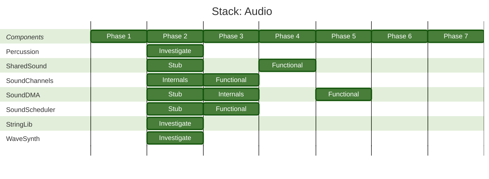

## Stack: Compatibility

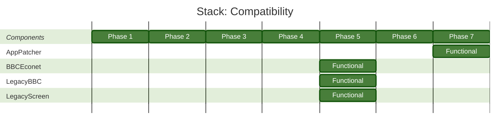

## Stack: Core

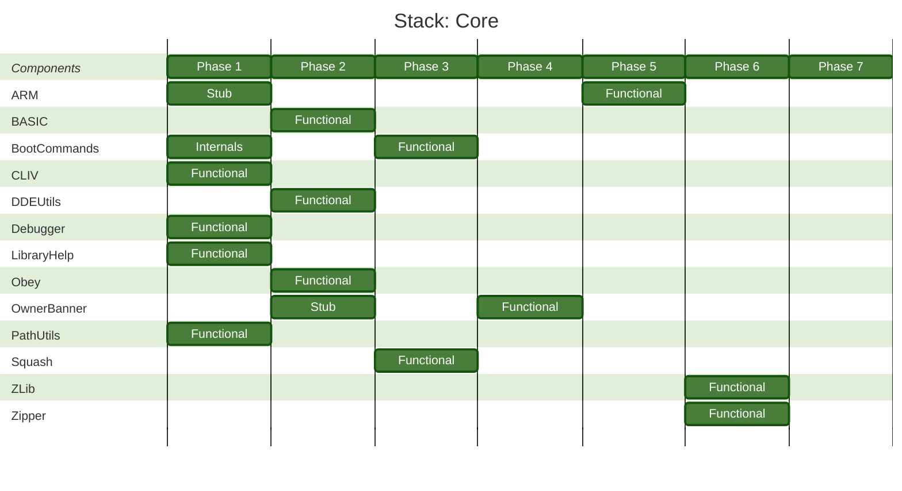

## Stack: Desktop

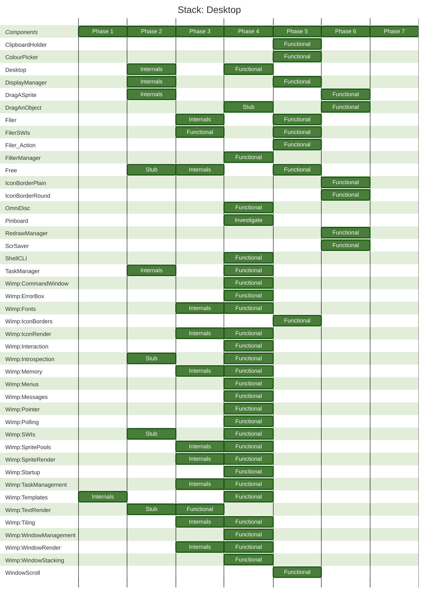

## Stack: FS

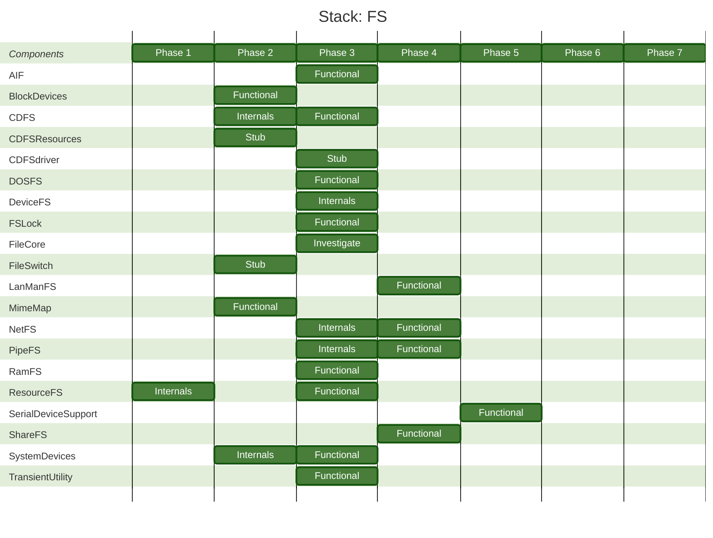

## Stack: Graphics

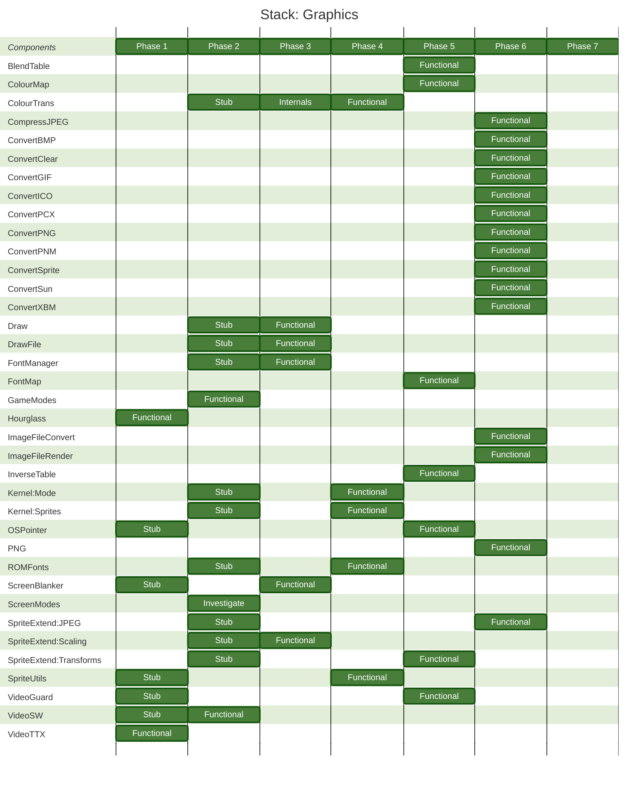

## Stack: HW

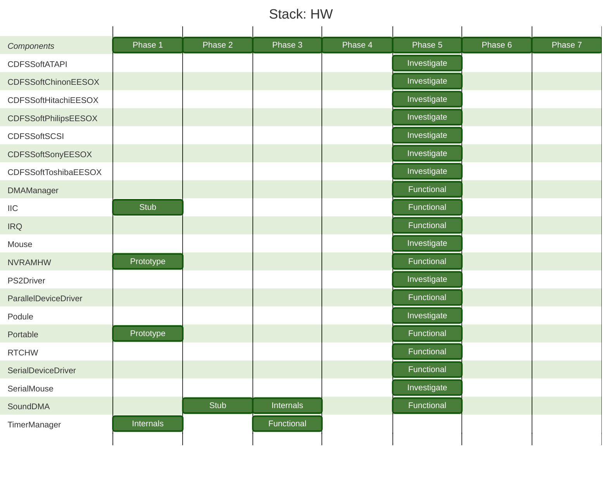

## Stack: I18N

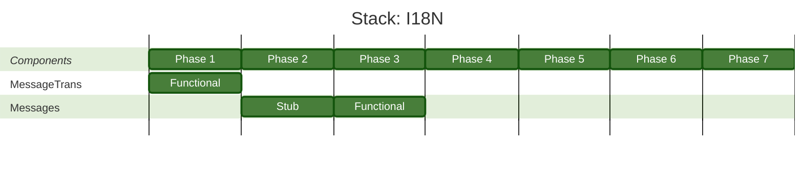

## Stack: IO

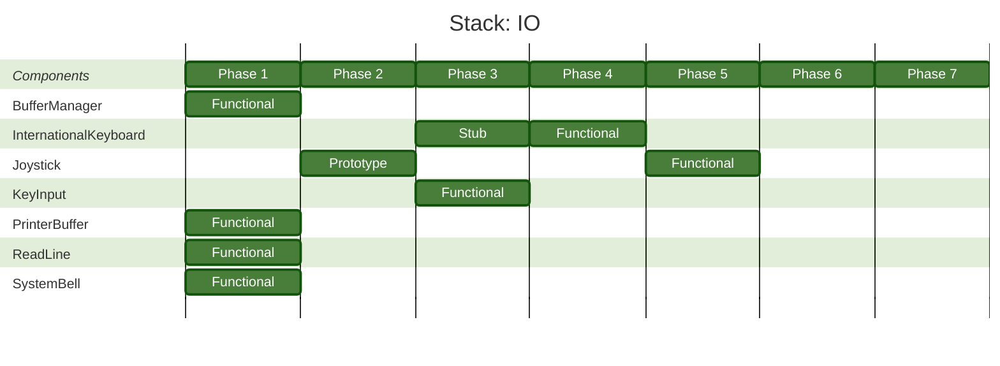

## Stack: Kernel

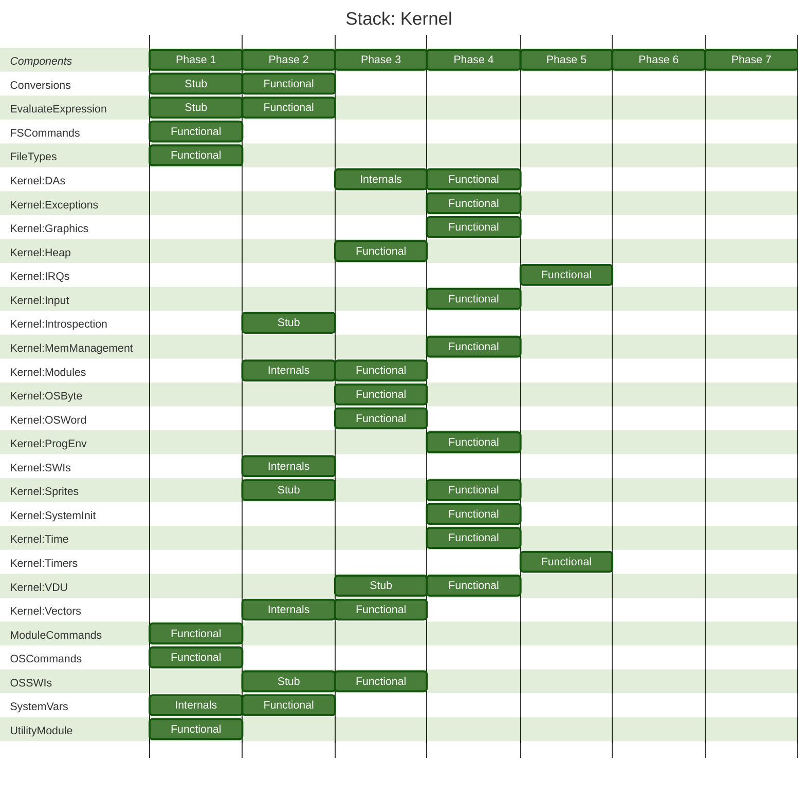

## Stack: L12N

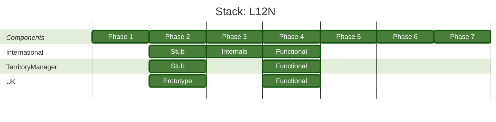

## Stack: Network

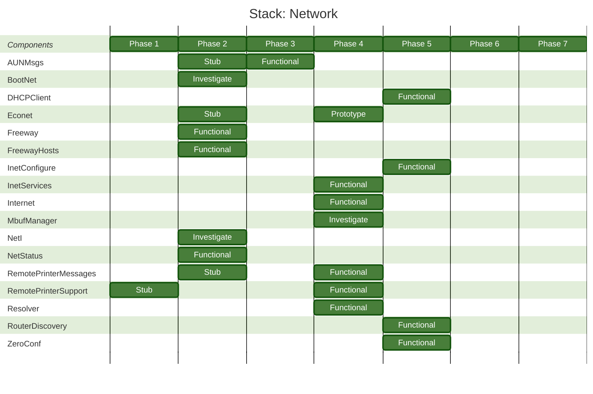

## Stack: Printing

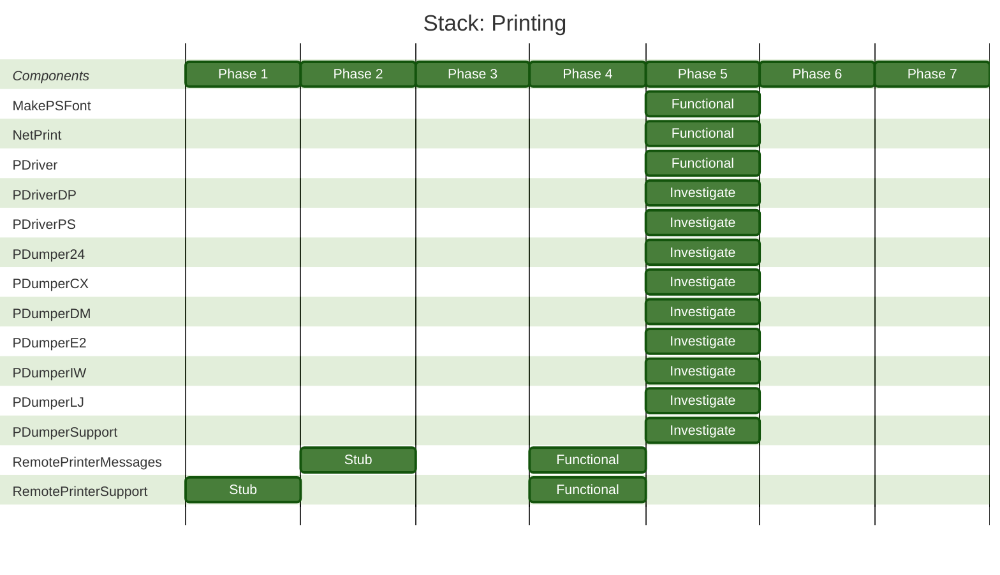

## Stack: Reporting

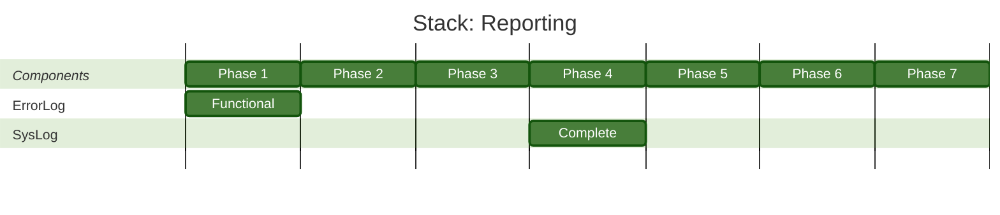

## Stack: Time

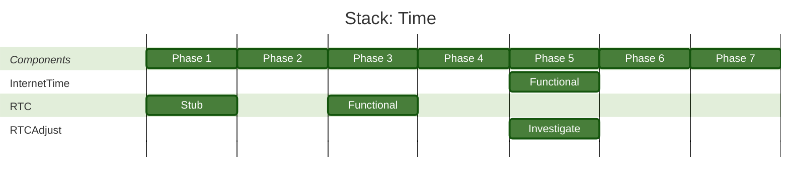

## Stack: Toolbox

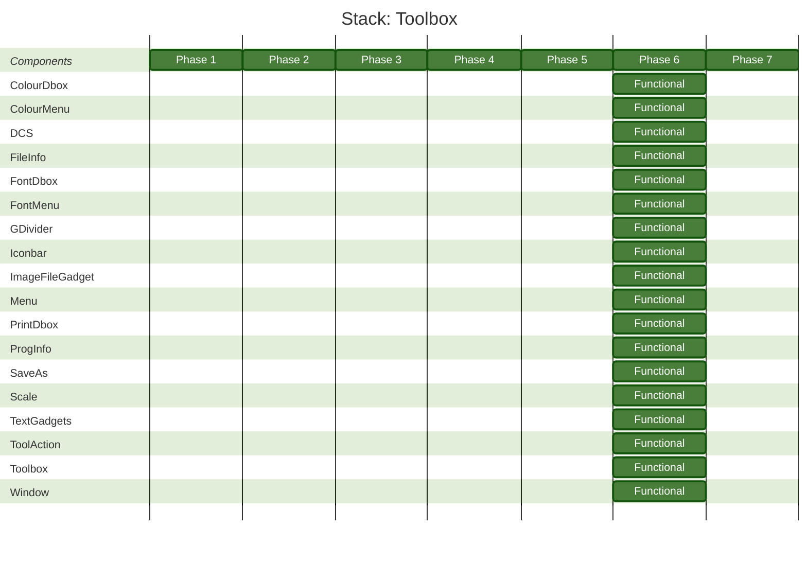

