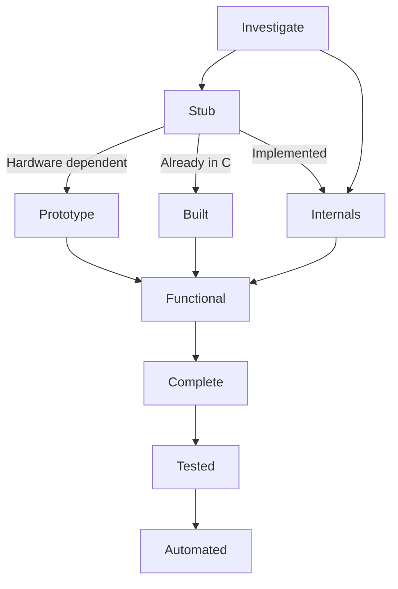

# Terminology for the RISC OS 64 status

## General

* `Phase` - The development of RISC OS components has been broken down into phases, to allow progress to be described usefully to developers and users. There are multiple phases and they may change as dependencies and requirements are better understood.
* `Functionality` - A description of how functional a given component is. See the section on Functionality, below.
* `Stacks` - Within RISC OS there are a many components which make up distinct parts of the system. See the section on Stacks, below.

## Functionality

The state of each component can be described in terms of how far developed it is.
Whilst there will always be caveats on some components, using terminology that is
understood will give a useful picture of the progress of the project.

* `Investigate` - decide how to proceed
* `Stub` - just the interface to the OS; no implementation.
* `Prototype` - largely functional, but hardware implementation missing.
* `Built` - component has been built into a binary, but it's not understooed whether it is working, or even useful.
* `Internals` - internal implementation, but no OS wiring.
* `Functional` - wired from OS interface to internals, but may be missing less used features, including I18N.
* `Complete` - implemented completely.
* `Tested` - implemented and tested manually.
* `Automated` - testing has been automated.

Although the functionality key covers `Complete`, `Tested`, and `Automated`, these stages are not part of the current phasing. These states are expected to be developed on an as-needed basis, as `Complete` would require a complete agreement on what was the complete functionality required, which it will be difficult to do.

Prototype implementations are useful to allow hardware developers to integrate hardware specific components into the module for their specialised environment. As such a prototype component may bifurcate - there may remain a prototype implementation, which is complete and tested, and there may be a specialisation for hardware environments.

The following diagram shows the expected flow for most components. There may be deviation in some cases, but in general many will follow this pattern.

## Stacks

There are multiple stacks within RISC OS, being a highly modular system, which
allows the functionality of the system to be tailored for different purposes.
Whilst not all of the components are necessary for a complete system, they
build up to make a system that users are familiar with.

The stack areas are somewhat arbitrary for some components, as they may straddle
multiple stacks. However, for simplicity, I have selected a single stack to
assign each component to. This allows progress within the stacks to be tracked
independent of the phases, and to allow better reasoning about system
functionality and completeness.

The stacks defined are:

* `Audio` - The sound system.
* `Compatibility` - Support for legacy systems and future-proofing for later changes.
* `Core` - Components upon which the system is based.
* `Desktop` - User interfaces components for the windowing system.
* `FS` - File system interfaces and drivers.
* `Graphics` - Graphical I/O system.
* `HW` - Hardware drivers and interfacing.
* `I/O` - Keyboard, mouse, joystick, touchpad, VDU, serial, parallel, GPIO.
* `I18N` - Internationalisation features, such as translation of text to other languages.
* `Kernel` - Components which are, or were, core kernel functions in older systems.
* `L12N` - Localisation features such as formatting of text.
* `Network` - Econet and IP interfaces.
* `Printing` - Printer output and support.
* `Reporting` - Diagnostics and reporting functions.
* `Time` - Date and time management.

